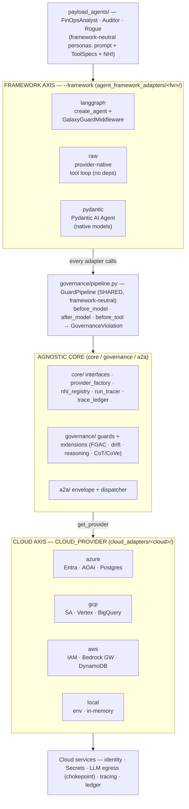
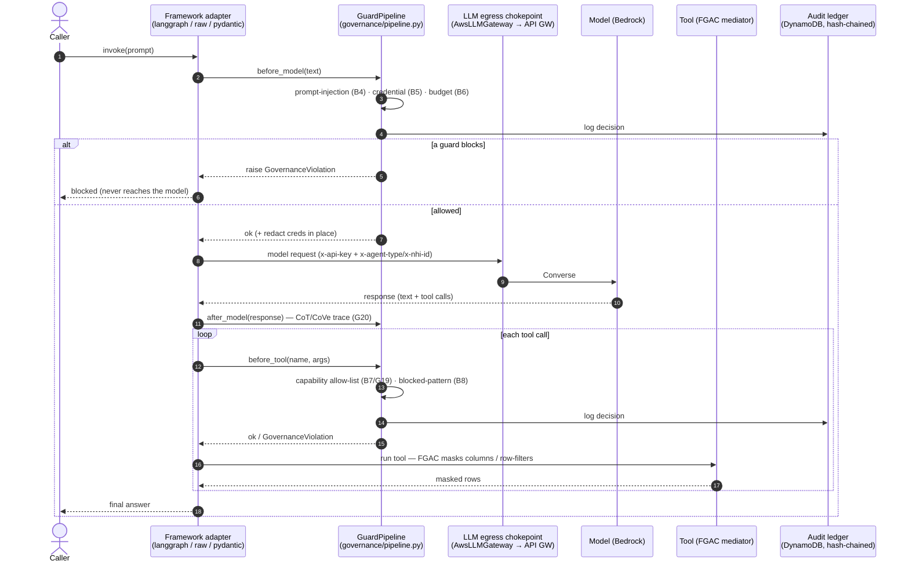

# Architecture — Framework Core & AWS

> Scope: this document covers the **cloud-agnostic framework** (the core seam, the
> governance layer, and the LangGraph agent-framework adapter) and the **AWS
> binding**. Azure and GCP implement the same interfaces and are documented
> separately — they appear here only as one-line notes where it clarifies the seam.
>
> Companion docs: [`architecture.md`](architecture.md) (all clouds), [`guardrails-inventory.md`](guardrails-inventory.md) (per-guard mapping), [`services-and-tech.md`](services-and-tech.md) (resource inventory), [`REFACTOR_AND_GAPS_PLAN.md`](REFACTOR_AND_GAPS_PLAN.md) (roadmap).

---

## 1. Overview

The platform runs **governed AI agents** behind a single controlled LLM-egress
path, with every governance decision written to a tamper-evident audit ledger. It
is built on two independent axes:

- **Framework axis** — how an agent is orchestrated, via an adapter over the shared
  `GuardPipeline`. Three are implemented and run the full demo matrix: LangGraph
  (LangChain `create_agent` + middleware), Pydantic AI (`agent_framework_adapters/pydantic_ai/`, governance
  via a model wrapper), and a raw provider-native tool loop (`agent_framework_adapters/raw/`, which imports
  no agent framework).
- **Cloud axis** — *where* identity, secrets, egress, tracing, and audit are
  resolved. Today: **AWS**, **Azure**, **GCP**, plus a cloud-neutral **local**.

Between them sits an **agnostic core** (`core/`, `governance/`, `a2a/`) that
imports neither a cloud SDK nor an agent framework. Every cloud-specific or
framework-specific concern is expressed as a `Protocol` in
[`core/interfaces.py`](../core/interfaces.py) and implemented under
`cloud_adapters/<cloud>/` or `agent_framework_adapters/<framework>/`. Selecting AWS is a one-line change
(`CLOUD_PROVIDER=aws`); no core code moves.

### Key terminology

| Term | Meaning |
|------|---------|
| **NHI** | Non-Human Identity — an agent's cloud principal. On AWS this is an **IAM role ARN**. |
| **Egress chokepoint** | The single managed path agents use to reach the LLM. On AWS: **API Gateway → Lambda → Bedrock Converse**. |
| **Guard** | A governance control that fires before/around a model or tool call (prompt-injection, credential redaction, context budget, capability, blocked-pattern, reasoning). |
| **`GovernanceViolation`** | The exception a guard raises to block a call; carries a machine `code` (`prompt_injection`, `credential_leak`, `context_budget`, `capability_violation`, `blocked_pattern`). |
| **Hash-chained ledger** | Append-only, SHA-256-linked audit trail; tamper-evident via `verify_chain()`. On AWS: a **DynamoDB** table. |
| **A2A** | Agent-to-Agent protocol — typed request/response envelopes through an audited dispatcher. |
| **FGAC** | Fine-Grained Access Control — row/column filtering + classification-based masking. |
| **VERDICT** | The demo matrix column: `PASS` / `FAIL` (deterministic mode) or `N/A` (a model-dependent scenario the live model didn't exercise). |
| **`galaxy-rp`** | The project tag stamped on all AWS resources (roles, Lambda, ledger, …). |

---

## 2. System at a glance

Two orthogonal axes meet at an agnostic core. The framework axis selects how an agent is
orchestrated; the cloud axis selects where identity, secrets, egress, tracing, and audit
resolve. The two can be combined (e.g. `--framework raw --aws`). Every framework adapter
calls the same [`GuardPipeline`](../governance/pipeline.py), so the governance behaviour is
the same regardless of which framework or cloud is selected.



Design invariant: the `core/` and `governance/` modules do not `import boto3` or
`import langchain`. Each framework adapter maps its own hooks onto `before_model` /
`after_model` / `before_tool`, so the governance logic is the same across frameworks and
clouds (LangGraph on AWS, the raw loop on GCP, and so on). All three framework adapters
are implemented and run the full demo matrix: `langgraph` (`agent_framework_adapters/langgraph/`),
`pydantic` (`agent_framework_adapters/pydantic_ai/`, model-wrapper governance), and `raw`
(`agent_framework_adapters/raw/`, a provider-native loop). Governance-parity tests:
`tests/test_pydantic_framework.py` and `tests/test_raw_framework.py`.

> **Layered view:** for the stacked "payload → framework → core → cloud-adapters →
> cloud-services" picture, open [`architecture-stack.html`](architecture-stack.html)
> (standalone HTML/SVG, with the LangGraph + AWS focus path highlighted).

---

## 3. The agnostic core (the seam)

Everything in this section is cloud- and framework-free.

### 3.1 The interface seam — [`core/interfaces.py`](../core/interfaces.py)

Six `Protocol`s define the contract each cloud implements. AWS's implementations
are named in the right column.

| Protocol | Responsibility | AWS implementation |
|----------|----------------|--------------------|
| `SecretProvider` | Resolve one API key (`get_api_key` / `invalidate`) | `SecretsManagerProvider` |
| `IdentityProvider` | `resolve_client_id` (agent → principal) + `get_credential` | `AwsIdentityProvider` |
| `TraceExporterFactory` | Build the OTel span exporter | `AwsTraceExporterFactory` |
| `LLMGateway` | `resolve()` the egress chokepoint → `EgressResolution` | `AwsLLMGateway` |
| `AgentRuntimeAdapter` | Let a framework own OTel setup | `None` (AWS uses the LangGraph adapter) |
| `CloudProvider` | Umbrella: all of the above + `audit_backend` + `egress_config_path` | `AwsProvider` |

`EgressResolution` is the resolved chokepoint — `endpoint`, `mode`, `api_key`,
`default_headers`. `AuditBackend` is **re-exported from MSGK
(`agent_os.audit_logger`)** so every cloud backend implements the upstream
contract directly.

### 3.2 Provider selection — [`core/provider_factory.py`](../core/provider_factory.py)

`get_provider(name)` reads `CLOUD_PROVIDER` (default `azure`), then **lazy-imports
only the selected adapter package** so an AWS run never loads Azure SDKs. Each
`cloud_adapters/<cloud>/__init__.py` exposes a `PROVIDER` instance — for AWS that's
`AwsProvider`.

### 3.3 Non-Human Identity — [`core/nhi_registry.py`](../core/nhi_registry.py)

Fully generic; **no hard-coded agent list**. `NHIRegistry.get(agent_type)`:

1. asks `provider.identity_provider().resolve_client_id(agent_type)`, then
2. falls back to the `NHI_CLIENT_ID_<AGENT_TYPE>` env var.

An unregistered agent raises `ValueError` (fail-closed). New agents are added by
provisioning a cloud principal + setting an env var — never by editing `core/`.

### 3.4 Tracing — [`core/run_tracer.py`](../core/run_tracer.py)

`configure_tracing()` builds the OTel SDK with no cloud imports, resolving the
exporter through `provider.trace_exporter_factory()`. `pipeline_span(run_id,
module)` opens the root span under which all agent/guard spans nest;
`governance.agent_id` (the NHI id) is attached for attribution.

### 3.5 Hash-chained ledger schema — [`core/trace_ledger.py`](../core/trace_ledger.py)

Defines the canonical entry shape and the chain rule, shared by every cloud
backend:

```
entry_hash = SHA-256( run_id | module_id | agent_type | action | outcome | attempt | prev_hash )
```

The first link uses a fixed genesis hash. `verify_chain()` re-derives each hash in
order; any tampered field breaks every downstream link.

> **Other clouds:** Azure implements these six Protocols with Entra / Key Vault /
> Azure Monitor / APIM / Postgres; GCP with Service Accounts / Secret Manager /
> Cloud Trace / Apigee / BigQuery. Same seam, different bindings.

---

## 4. Governance layer

All governance orchestration is cloud- **and** framework-neutral. It lives in one
place — `GuardPipeline` — and every framework adapter is a thin shim that maps its
own hooks onto it. No governance *logic* lives in any adapter.

### 4.1 The shared guard pipeline — [`governance/pipeline.py`](../governance/pipeline.py)

`GuardPipeline` composes the **same `agent_os` primitives** the MAF guards use
(`PromptInjectionDetector`, `CredentialRedactor`, `ContextScheduler`) plus this
repo's WS7 extensions, and runs the fixed governance sequence at **three
framework-agnostic hooks**:

| Hook | Guards (in order) | Block code(s) |
|------|-------------------|---------------|
| `before_model(text) -> bool` | prompt-injection (B4) → credential redactor (B5) → context budget (B6). Returns `True` when the caller should redact credentials in the outgoing messages in place. | `prompt_injection`, `credential_leak`, `context_budget` |
| `after_model(response_text)` | reasoning-trace capture (CoT/CoVe, G20) with mandatory redaction → ledger | — |
| `before_tool(name, args)` | capability / reasoning-step check (B7/G19) → blocked-pattern scan (B8) | `capability_violation`, `blocked_pattern` |

Data-scope authorization + masking + drift are enforced **inside the data tool
itself** via the shared `DataAccessMediator`, so the `before_tool` guard is
capability-only — one decision point per concern, no double-counting.

Every decision (`allow` / `audit` / `deny`) is written through the shared
`GovernanceAuditLogger`. Blocks raise `GovernanceViolation(code, message)`, which
the agent runner / demo catches to assert *which* control fired.

### 4.2 How each framework adapter binds to the pipeline

A framework adapter only translates its own request/response objects to/from plain
text and calls the three hooks around model/tool execution:

| Framework | Binding | Maps to |
|-----------|---------|---------|
| **langgraph** *(implemented)* | `GalaxyGuardMiddleware` (LangChain `AgentMiddleware`) — [`agent_framework_adapters/langgraph/governance.py`](../agent_framework_adapters/langgraph/governance.py) | `wrap_model_call` → `before_model` + `after_model`; `wrap_tool_call` → `before_tool` |
| **raw** *(implemented)* | provider-native tool loop wrapping the same hooks | the same three calls |
| **pydantic** *(planned)* | Pydantic AI agent hooks | the same three calls |

`GalaxyGuardMiddleware` is intentionally thin: it extracts the prompt text, calls
`before_model` (redacting in place if it returns `True`), runs the model, calls
`after_model`, and on each tool call invokes `before_tool`. Because the logic is in
the pipeline, the raw and Pydantic AI adapters inherit identical governance for
free. `GovernanceViolation` is defined in `governance.pipeline` and re-exported
from the LangGraph module for backward-compatible imports.

### 4.3 Audit fan-out — `build_guard_pipeline(...)`

The factory in [`governance/pipeline.py`](../governance/pipeline.py) assembles the
pipeline and wires the audit logger to four backends:

- `InMemoryBackend` — introspection for demo/tests
- `LoggingBackend` — stdout
- `OtelAuditBackend` — span events (CloudWatch / App Insights / Cloud Logging)
- the **cloud ledger**, resolved via `get_provider().audit_backend(run_id)` — so
  `CLOUD_PROVIDER=aws` selects the DynamoDB backend with no cloud hard-coded here.

It returns `(pipeline, ledger, audit_logger, mediator)`. The LangGraph wrapper
`build_langgraph_governance(...)` simply calls this and wraps the pipeline in a
single `GalaxyGuardMiddleware`, preserving its original return surface.

### 4.4 Agnostic guards & extensions

- [`governance/guards/egress.py`](../governance/guards/egress.py) — framework-free
  egress allow-list. `load_egress_policy()` defaults to
  `get_provider().egress_config_path()` (for AWS, [`cloud_adapters/aws/egress.yaml`](../cloud_adapters/aws/egress.yaml));
  `check_outbound(policy, url)` returns allow/deny.
- `governance/extensions/` (WS7, feature-flagged, off by default) — FGAC
  (`data_fgac.py`), data classification, data-access drift (`data_drift.py`),
  reasoning-step validation (`reasoning_guard.py`), and CoT/CoVe trace
  (`reasoning_trace.py`).

---

## 5. The framework axis & the LangGraph adapter

The framework axis is selected with `--framework langgraph|raw|pydantic`. All three are
implemented and unit-tested, and each runs the full demo matrix (37/37 in deterministic
mode): `langgraph` (LangChain middleware), `pydantic` (model-wrapper governance), and `raw`
(provider-native loop). Each adapter returns the same neutral result shape, so the demo and
tests do not depend on which framework ran.

### 5.1 The neutral agent contract — [`agent_framework_adapters/contract.py`](../agent_framework_adapters/contract.py)

Pure dataclasses, no framework imports — the shape every framework adapter speaks:

- **`ToolSpec`** — a tool defined once (`name`, `description`, JSON-schema
  `parameters`, `fn`); each adapter renders it natively (LangChain `@tool`, an
  OpenAI tools array, a Pydantic AI tool).
- **`ToolCall` / `Turn` / `RunResult`** — the normalized transcript that
  `AgentBundle.invoke(prompt)` returns, so the narrator + assertions are
  framework-blind. `RunResult` exposes `ai_texts()`, `tool_calls()`,
  `first_tool_result()`.
- **`ScriptStep` / `AgentScript`** — a deterministic, framework-neutral script for
  `--fake` runs (the counterpart to LangGraph's scripted `AIMessage` list).
- **`AgentBundle`** *(Protocol)* — what every adapter's `build_agent` returns:
  `agent_id`, `nhi_id`, `egress`, `config`, `mediator`, `pg_backend`, and a neutral
  `invoke(prompt) -> RunResult`.

### 5.2 The LangGraph factory — [`agent_framework_adapters/langgraph/_base.py`](../agent_framework_adapters/langgraph/_base.py)

`build_langgraph_agent(agent_name, run_id, *, model, tools, …)` wires the full
governance posture around a LangGraph `create_agent`, driven entirely by the
per-agent YAML (`payload_agents/config/<name>.yaml`) — no per-agent branching:

1. **Identity (A1)** — `NHIRegistry.get(cfg.agent_type)` (raises for an
   unregistered type).
2. **Egress (A2)** — consults the cloud LLM gateway; offline it returns
   `offline-no-egress` (the chokepoint refusing to hand back a key), and the
   supplied offline model is used.
3. **Governance (B–G)** — `build_langgraph_governance(...)` → the shared
   `GuardPipeline` wrapped in `GalaxyGuardMiddleware`.
4. **Audit ledger (H)** — the cloud hash-chain backend is returned in the bundle
   for end-of-run flush + verify.

It returns a `LangGraphAgentBundle` whose `invoke(prompt)` normalizes the
LangGraph result dict into a `RunResult`.

### 5.3 Model factory — [`agent_framework_adapters/langgraph/runtime.py`](../agent_framework_adapters/langgraph/runtime.py)

Two model sources, offline-first:

- **`FakeToolCallingModel`** (`scripted_model(...)`) — replays a scripted list of
  `AIMessage` turns (including `tool_calls`), with a no-op `bind_tools`. This drives
  the full plan→tool→observe→answer loop deterministically in tests, CI, and the
  offline demo.
- **`build_bedrock_model(...)`** — returns a `BedrockGatewayChatModel` when the
  gateway endpoint **and** key resolve; otherwise the offline fallback. (The Azure
  and GCP counterparts, `build_chat_model` / `build_gemini_model`, live in the same
  file.)

### 5.4 Bedrock client model — [`agent_framework_adapters/langgraph/bedrock_gateway.py`](../agent_framework_adapters/langgraph/bedrock_gateway.py)

`BedrockGatewayChatModel` is a LangChain `BaseChatModel` that reaches Bedrock
**through the API Gateway chokepoint**, not `bedrock-runtime` directly. (It can't
use `langchain-aws`'s `ChatBedrockConverse`, which would SigV4-sign directly to
Bedrock and bypass the governed path.)

- **`bind_tools`** converts LangChain tools → a Converse `toolConfig` (`toolSpec`
  with `inputSchema.json`).
- **`_generate`** maps messages → a Converse body and POSTs it.
- **`_post`** sends `x-api-key` + the attribution headers; a `{"error": ...}`
  body is raised as a `RuntimeError` so the failure is narrated, not swallowed.

Message mapping (`_to_converse` / `_from_converse`):

| LangChain | Bedrock Converse |
|-----------|------------------|
| `SystemMessage` | `system` blocks |
| `HumanMessage` | `{"role":"user","content":[{"text":…}]}` |
| `AIMessage` (+ `tool_calls`) | `{"role":"assistant","content":[{"text":…},{"toolUse":…}]}` |
| `ToolMessage` | `{"role":"user","content":[{"toolResult":…}]}` |

Consecutive same-role turns are merged (Bedrock requires strictly alternating
roles).

---

## 6. The AWS adapter

`AwsProvider` ([`cloud_adapters/aws/__init__.py`](../cloud_adapters/aws/__init__.py)) is the
`CloudProvider` for AWS. Its bindings:

| Concern | Class / file | AWS service |
|---------|--------------|-------------|
| Identity | `AwsIdentityProvider` — [`identity.py`](../cloud_adapters/aws/identity.py) | IAM + STS |
| Secrets | `SecretsManagerProvider` — [`secrets.py`](../cloud_adapters/aws/secrets.py) | Secrets Manager / SSM |
| Egress | `AwsLLMGateway` — [`gateway.py`](../cloud_adapters/aws/gateway.py) | API Gateway → Bedrock |
| Tracing | `AwsTraceExporterFactory` — [`tracing.py`](../cloud_adapters/aws/tracing.py) | OTLP → ADOT → X-Ray |
| Audit | `DynamoDbHashChainBackend` — [`audit.py`](../cloud_adapters/aws/audit.py) | DynamoDB |

A consistent resilience pattern runs through all of them: **`boto3` is imported
lazily and guarded**, so importing the adapter without the AWS SDK (or without
credentials) degrades gracefully to env-var / stdout mode instead of failing.

### 6.1 Identity — `AwsIdentityProvider`

- `resolve_client_id(agent_type)` → an **IAM role ARN**, read from
  `NHI_CLIENT_ID_<AGENT_TYPE>` (populated by Terraform). Optionally derived as
  `arn:aws:iam::<acct>:role/galaxy-<agent>` when `NHI_DERIVE_FROM_CONVENTION=true`.
  Unknown agents → `None` (fail-closed).
- `get_credential(client_id, agent_type)` → `sts.assume_role(RoleArn=client_id,
  …)`, returning temporary credentials.

### 6.2 Secrets — `SecretsManagerProvider`

`get_api_key()` reads from Secrets Manager (default) or SSM Parameter Store, with a
**5-minute TTL cache** (`_TTL_SECONDS = 300`) and an env-var fallback
(`AWS_LLM_API_KEY`, or `AWS_BEDROCK_GATEWAY_KEY` for the gateway key). In ECS/EKS
the task/pod role (IRSA) grants `secretsmanager:GetSecretValue`; boto3's default
chain picks up the role with no static keys. `invalidate()` forces a refresh on
the next call (e.g. after a 401).

### 6.3 Egress — `AwsLLMGateway` (the chokepoint)

`resolve(agent_type, client_id, secret_provider=None)` returns one of two modes:

- **`apigw-bedrock`** — when `AWS_BEDROCK_GATEWAY_ENDPOINT` is set. Fetches the
  API key from Secrets Manager (`galaxy/bedrock-gateway-key`) and returns headers
  `x-api-key`, `x-agent-type`, `x-nhi-id`. **This is the governed path.**
- **`bedrock-direct`** — fallback to the regional `bedrock-runtime` host,
  SigV4-signed by the agent's IAM credentials (no static key changes hands).

Pairs with [`cloud_adapters/aws/egress.yaml`](../cloud_adapters/aws/egress.yaml), which lists
the API-Gateway/Bedrock hosts as the only permitted LLM destinations.

### 6.4 Audit — `DynamoDbHashChainBackend`

The AWS `AuditBackend`. `write()` is synchronous: it computes the SHA-256 link and
queues the entry. `flush_async()` (called by the runner at end of run) does the
batched DynamoDB write via `batch_writer()`, run in a thread to avoid blocking the
event loop. `verify_chain()` queries all rows for the `run_id` and re-derives the
chain. With no boto3 / no table it runs in **stdout mode** — full chain logic,
no persistence — so the platform never hard-fails on a missing ledger.

DynamoDB item shape: partition key `run_id`, sort key `entry_seq`, plus
`module_id`, `agent_type`, `nhi_id`, `action`, `outcome`, `entry_hash`,
`prev_hash`, `recorded_at` (and summaries / token counts).

### 6.5 Tracing — `AwsTraceExporterFactory`

Builds an OTLP span exporter pointed at an **ADOT collector**, which forwards to
**X-Ray / CloudWatch**. Returns `None` when no endpoint is configured (tracing
no-ops rather than failing).

---

## 7. The egress chokepoint, end to end

The reason agents never hold Bedrock credentials and never choose a model.

```
 Agent (ECS/EKS)
   │  BedrockGatewayChatModel._post()
   │  headers: x-api-key, x-agent-type, x-nhi-id
   │  body:    { messages, system?, toolConfig?, inferenceConfig }   ← no modelId
   ▼
 API Gateway (REST, stage "prod", resource POST /invoke)
   │  api_key_required = true  → validates x-api-key against the usage plan
   │  AWS_PROXY integration
   ▼
 Lambda  galaxy-rp-bedrock-proxy   (bedrock_proxy.handler)
   │  modelId injected server-side from BEDROCK_MODEL_ID  (e.g. us.anthropic.claude-sonnet-4-6)
   │  whitelists body to: messages, system, toolConfig, inferenceConfig,
   │                      additionalModelRequestFields
   │  boto3 bedrock-runtime.converse(**kwargs)
   ▼
 Amazon Bedrock — Converse API
   │  credentials = Lambda execution role (bedrock:InvokeModel) — never leave AWS
   ▼
 Response { output, stopReason, usage }  →  Lambda  →  API Gateway  →  AIMessage
```

Key properties — see
[`bedrock_proxy.py`](../cloud_adapters/aws/infra/lambda/bedrock_proxy.py):

- **Model is server-side only.** The caller cannot pick an arbitrary model; the
  Lambda injects `modelId` from its `BEDROCK_MODEL_ID` env var.
- **Credentials stay in AWS.** The agent only ever holds the gateway API key;
  Bedrock is invoked by the Lambda execution role.
- **The body is whitelisted** to the Converse subset the agents need.
- **Errors are surfaced**, not hidden: a Bedrock error returns `502` with
  `{"error": "<Type>: <message>"}` so the client narrates it.

> The endpoint URL already includes the `/invoke` path — `AWS_BEDROCK_GATEWAY_ENDPOINT`
> is set to the full `…/prod/invoke` URL from the Terraform output.

---

## 8. AWS infrastructure (Terraform)

[`cloud_adapters/aws/infra/main.tf`](../cloud_adapters/aws/infra/main.tf) is the reference
topology — everything `demo_agents.py --aws` needs to run against a real model
through the governed chokepoint. All resources carry `project = galaxy-rp` (via
`default_tags`) so they can be found and torn down by tag.

| Resource | Name | Purpose |
|----------|------|---------|
| IAM role (per agent) | `galaxy-rp-<agent>` | The agent's NHI; ECS-assumable, scoped to `bedrock:InvokeModel` + read `galaxy/*` secrets + write the ledger. The ARN becomes `NHI_CLIENT_ID_<AGENT>`. |
| DynamoDB table | `galaxy-trace-ledger` | The hash-chain ledger (PK `run_id`, SK `entry_seq`, pay-per-request). |
| S3 bucket | `galaxy-rp-runs-<acct>-<region>` | Per-run artifact store. |
| Secrets Manager secret | `galaxy/bedrock-gateway-key` | The `x-api-key` value (auto-generated 40-char). |
| Lambda | `galaxy-rp-bedrock-proxy` | The Bedrock Converse proxy (`python3.12`, `BEDROCK_MODEL_ID` env). |
| API Gateway (REST) | `galaxy-rp-bedrock-gw` | `POST /invoke`, `api_key_required`, AWS_PROXY → Lambda. |
| Usage plan + API key | `galaxy-rp-usage-plan` / `galaxy-rp-agent-key` | Enforces the API key; same value stored in Secrets Manager. |

**Outputs → `.env`** (after `terraform apply`, see `terraform output`):

```
agent_role_arns      → NHI_CLIENT_ID_FINOPS / _AUDITOR / _ROGUE
ledger_table         → GALAXY_LEDGER_TABLE   (galaxy-trace-ledger)
bedrock_gateway_url  → AWS_BEDROCK_GATEWAY_ENDPOINT  (…/prod/invoke)
gateway_key_secret   → galaxy/bedrock-gateway-key (Secrets Manager)
bedrock_model_id     → AWS_BEDROCK_MODEL_ID
```

> Bedrock model access must be enabled in the console first; apply against your own
> account/region: `terraform init && terraform apply -var="region=us-east-1"`.

---

## 9. Data-flow walkthrough — one governed request

1. **Resolve identity.** `NHIRegistry.get("FinOps")` → `AwsIdentityProvider`
   returns the IAM role ARN (the NHI id).
2. **Resolve egress.** `AwsLLMGateway.resolve(...)` → `apigw-bedrock` with the
   endpoint + `x-api-key` (from Secrets Manager) + `x-agent-type` / `x-nhi-id`.
3. **Build the agent.** `build_bedrock_model(...)` returns a
   `BedrockGatewayChatModel`; `GalaxyGuardMiddleware` is layered on via
   `create_agent`. The audit logger fans out to in-memory + stdout + OTel + the
   DynamoDB ledger.
4. **Model call.** `wrap_model_call` runs prompt-injection → credential redaction
   → context-budget. If a guard blocks, it raises `GovernanceViolation` and the
   call never reaches Bedrock. Otherwise the request is POSTed to API Gateway →
   Lambda → Bedrock, and the reasoning trace is captured.
5. **Tool call.** `wrap_tool_call` checks the capability allow-list and blocked
   patterns; the data tool itself applies FGAC masking/row-filtering via the
   mediator.
6. **Audit.** Every decision is written and hash-chained; `verify_chain()` confirms
   integrity at end of run. Spans export to X-Ray via ADOT.

The same flow as a sequence — note every guard call goes through the shared
`GuardPipeline`, regardless of which framework adapter drives it:



---

## 10. Demo & verification — [`scripts/demo_agents.py`](../scripts/demo_agents.py)

Drives the success **and** failure path of every wired control across three
personas:

- **FinOpsAnalyst** — scoped data reader (happy path + legitimate masking/filter)
- **Auditor** — privileged cross-dataset reader + A2A callee
- **Rogue** — untrusted agent that trips every guard

The run prints a **VERDICT matrix** over sections A (identity/egress), B (per-call
guards), D (data/FGAC), F (drift), G (reasoning), C (A2A), I (escalation), H (the
hash-chain ledger, including a tamper demo that must report `BROKEN`).

**Model selection:**

- `--aws` (and `--local`, `--fake`) use the deterministic `FakeToolCallingModel`
  and the **37-check assertion matrix** — outcomes are asserted exactly.
- `--aws` *with* a configured gateway resolves a **real** `BedrockGatewayChatModel`
  through the chokepoint; the matrix is then *observed* (`PASS`/`N/A`), not
  asserted. `N/A` marks a model-dependent scenario (e.g. emitting `shell_exec` or
  `DROP TABLE`) the live model simply didn't attempt — not a governance failure.

```bash
uv run python scripts/demo_agents.py --aws            # AWS adapter set, deterministic matrix
uv run python scripts/demo_agents.py --aws --verbose  # + curated narrative
```

Either way the governance is real — the same `governance/` primitives wrapping
LangGraph via `GalaxyGuardMiddleware`.

---

## 11. Appendix

### 11.1 File / responsibility map

| Path | Responsibility |
|------|----------------|
| [`core/interfaces.py`](../core/interfaces.py) | The six Protocols + `EgressResolution` |
| [`core/provider_factory.py`](../core/provider_factory.py) | `CLOUD_PROVIDER` selection, lazy adapter import |
| [`core/nhi_registry.py`](../core/nhi_registry.py) | Generic NHI resolution |
| [`core/run_tracer.py`](../core/run_tracer.py) | Agnostic OTel setup, `pipeline_span` |
| [`core/trace_ledger.py`](../core/trace_ledger.py) | Hash-chain schema + verify logic |
| [`governance/pipeline.py`](../governance/pipeline.py) | `GuardPipeline` — shared, framework-neutral guard orchestration |
| [`governance/guards/egress.py`](../governance/guards/egress.py) | Egress allow-list |
| [`agent_framework_adapters/contract.py`](../agent_framework_adapters/contract.py) | Neutral agent contract (`ToolSpec`, `RunResult`, `AgentBundle`) |
| [`agent_framework_adapters/langgraph/governance.py`](../agent_framework_adapters/langgraph/governance.py) | `GalaxyGuardMiddleware` — thin LangChain shim onto `GuardPipeline` |
| [`agent_framework_adapters/langgraph/_base.py`](../agent_framework_adapters/langgraph/_base.py) | `build_langgraph_agent` → `LangGraphAgentBundle` |
| [`agent_framework_adapters/langgraph/runtime.py`](../agent_framework_adapters/langgraph/runtime.py) | Model factory |
| [`agent_framework_adapters/langgraph/bedrock_gateway.py`](../agent_framework_adapters/langgraph/bedrock_gateway.py) | `BedrockGatewayChatModel` |
| [`cloud_adapters/aws/__init__.py`](../cloud_adapters/aws/__init__.py) | `AwsProvider` |
| [`cloud_adapters/aws/identity.py`](../cloud_adapters/aws/identity.py) | IAM role ARN + STS |
| [`cloud_adapters/aws/secrets.py`](../cloud_adapters/aws/secrets.py) | Secrets Manager / SSM |
| [`cloud_adapters/aws/gateway.py`](../cloud_adapters/aws/gateway.py) | API GW → Bedrock chokepoint |
| [`cloud_adapters/aws/tracing.py`](../cloud_adapters/aws/tracing.py) | ADOT → X-Ray |
| [`cloud_adapters/aws/audit.py`](../cloud_adapters/aws/audit.py) | DynamoDB hash-chain ledger |
| [`cloud_adapters/aws/infra/main.tf`](../cloud_adapters/aws/infra/main.tf) | Reference Terraform |
| [`cloud_adapters/aws/infra/lambda/bedrock_proxy.py`](../cloud_adapters/aws/infra/lambda/bedrock_proxy.py) | Lambda Bedrock proxy |

### 11.2 Environment variables (AWS subset)

| Var | Used by | Meaning |
|-----|---------|---------|
| `CLOUD_PROVIDER=aws` | `provider_factory` | Selects the AWS adapter set |
| `NHI_CLIENT_ID_<AGENT>` | `AwsIdentityProvider` | The agent's IAM role ARN |
| `NHI_DERIVE_FROM_CONVENTION` / `AWS_ACCOUNT_ID` | `AwsIdentityProvider` | Optional ARN derivation |
| `AWS_BEDROCK_GATEWAY_ENDPOINT` | `AwsLLMGateway` | The `…/prod/invoke` URL; presence selects `apigw-bedrock` mode |
| `AWS_BEDROCK_GATEWAY_KEY` | `SecretsManagerProvider` | Env fallback for the gateway key |
| `AWS_BEDROCK_MODEL_ID` | demo / client | Client-side model id label (server enforces its own) |
| `BEDROCK_MODEL_ID` | Lambda | **Server-side** model id (the authoritative one) |
| `BEDROCK_REGION` / `AWS_REGION` | Lambda / boto3 | Region |
| `GALAXY_LEDGER_TABLE` | `DynamoDbHashChainBackend` | Ledger table name (default `galaxy-trace-ledger`) |
| `OTEL_EXPORTER_OTLP_ENDPOINT` | `AwsTraceExporterFactory` | ADOT collector endpoint |
```
