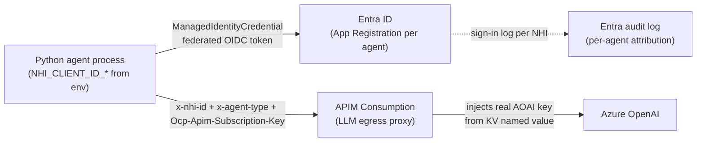
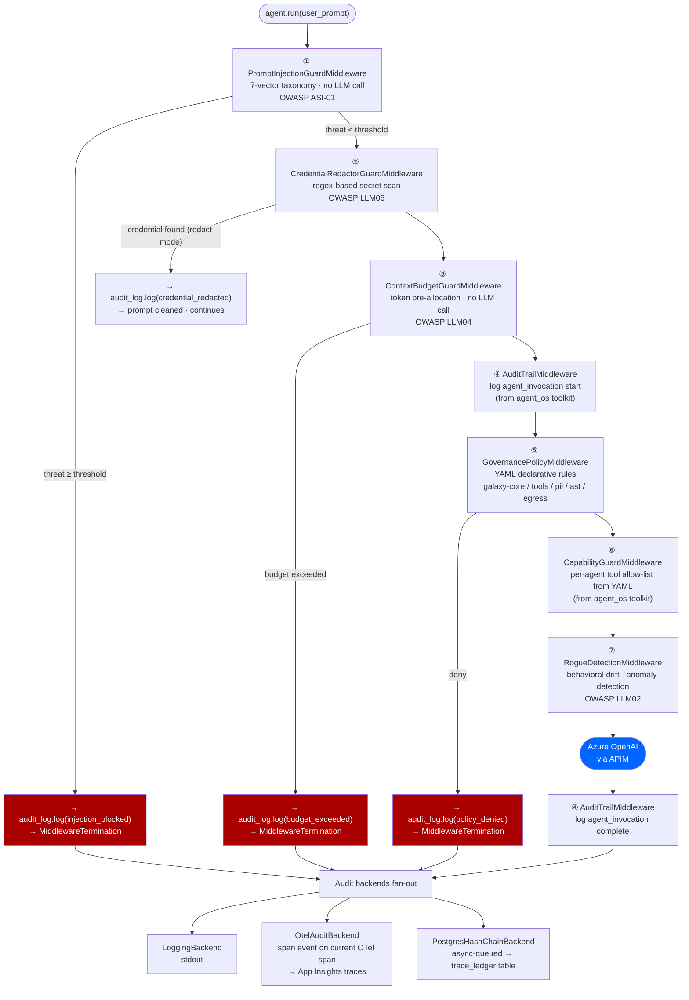
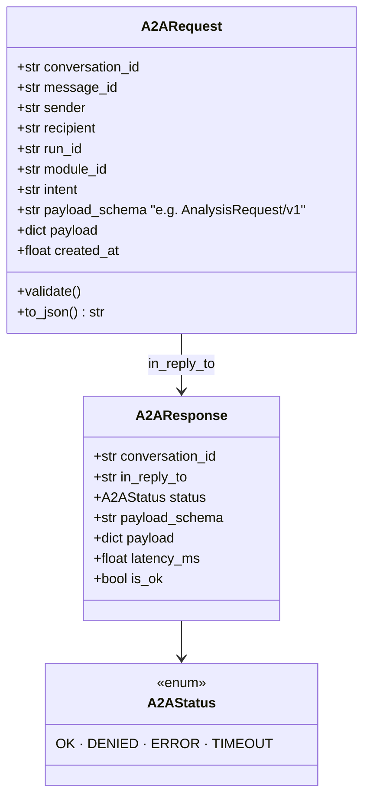
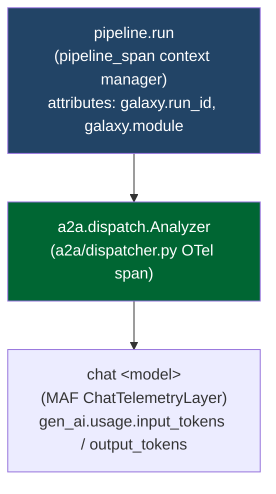
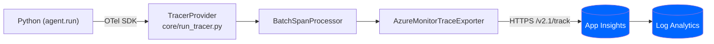
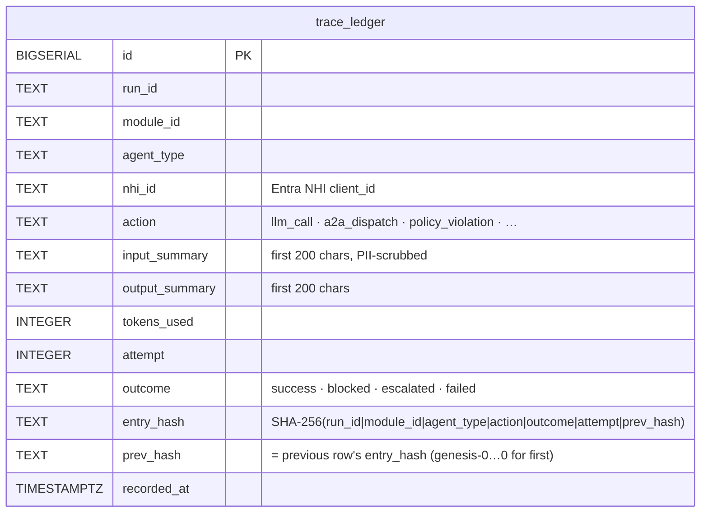
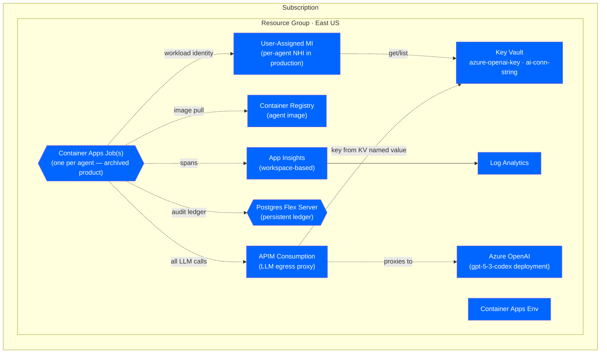
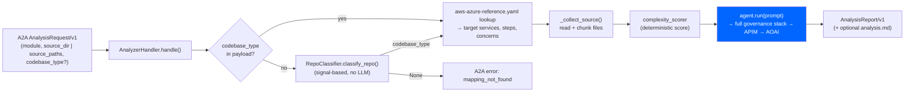
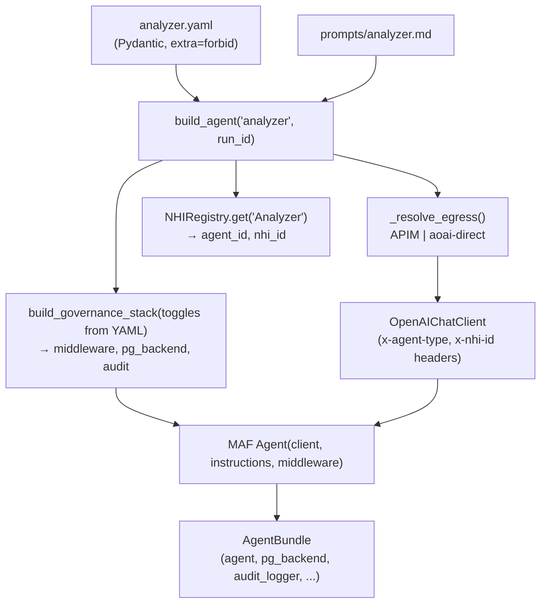

# Galaxy Agentic Governance Platform — Architecture

**Last updated:** 2026-06-09

**What this repo is.** This repository is a **runtime governance & security platform** for multi-agent systems, built on the **Microsoft Agent Governance Toolkit (MSGK / `agent_os`)** and the **Microsoft Agent Framework (MAF)**. It provides per-agent identity, a layered guard middleware stack, A2A governance, OpenTelemetry tracing, and a hash-chained audit ledger — independent of the agents it governs. The repo's value is the **bindings** (cloud + framework) and **composition** on top of MSGK primitives, not the governance logic itself.

**Repo focus / payload.** The agents shipped here are a **minimal demonstration payload** (`payload_agents/`) — a single MAF `Analyzer` agent and its closure, just enough to prove the governance stack wraps a real agent end-to-end. The full multi-agent AWS→Azure migration product (migration / discovery / scanner pipelines, ~18 agents, ACA deployment) has been moved to a **local-only, gitignored `archive/`** and is **not part of this repo**. Where this doc describes that product, it is labeled **(archived)** for context only — it is not a current feature.

**Roadmap.** The platform is **Azure- and MAF-coupled today**. The planned cloud- and framework-agnostic restructure (isolate Azure + MAF behind `adapters/azure/`, add `adapters/aws/` and `adapters/gcp/`, adopt MSGK's policy engine, build the gap-closing modules) is described in [`docs/REFACTOR_AND_GAPS_PLAN.md`](REFACTOR_AND_GAPS_PLAN.md). Anything described as `adapters/...` below is **planned, not done**.

**Runtime status:**
- ✅ Governance middleware stack (7 guards) — wired through `build_agent()`
- ✅ Offline governance demo (`scripts/demo_governance.py`) — no Azure / DB / LLM
- ✅ Single demonstration payload agent (`payload_agents/analyzer_agent.py`)
- ✅ OTel → Application Insights wiring (`AzureMonitorTraceExporter`, when configured)
- 🔶 Postgres ledger: stdout mode by default (set `POSTGRES_DSN` to persist)
- 🗄️ Full multi-agent migration / discovery / scanner product: **archived** (local-only `archive/`)
- 🛣️ Cloud-/framework-agnostic refactor (`adapters/azure|aws|gcp/`): **roadmap** — see `REFACTOR_AND_GAPS_PLAN.md`

---

This repo has two layers that share identity and governance infrastructure:

| Layer | Entry point | Description |
|---|---|---|
| **Part 1 — Governance Platform** | `governance/`, `core/`, `a2a/` | Security middleware, NHI registry, OTel tracing, hash-chained audit ledger, Azure connectivity. **The product.** |
| **Part 2 — Payload App** | `payload_agents/`, `scripts/demo_governance.py` | A single `Analyzer` demo agent running on top of the governance platform. **Demonstration only.** |

---

## Part 1 — Agent-Governance Security Platform

> Part 1 is the platform and is fully valid today. The Azure resource map (§1.7) describes the **archived full-product deployment topology** and is retained as the target deployment shape, not current repo state.

### 1.1 Platform overview

Every agent that runs on the platform — regardless of payload — goes through the same governance stack via `build_agent()`. The platform provides:

- **Non-Human Identity (NHI):** each agent type has its own Entra App Registration; no shared credentials
- **Governance middleware stack:** 7 ordered guards applied on every `agent.run()` call
- **A2A protocol:** typed, audited message envelopes for all inter-agent communication
- **OpenTelemetry tracing:** one trace ID per run, all agent spans under the same root
- **Hash-chained audit ledger:** append-only compliance archive in Postgres (SHA-256 chained)
- **APIM egress gateway:** the only path to Azure OpenAI; real AOAI key never in agent code

Every guard *logic* primitive comes from MSGK (`agent_os`); this repo supplies the MAF-middleware wrappers, the cloud bindings, and the composition.

---

### 1.2 Non-Human Identity (NHI)

Source: [`core/nhi_identity.py`](../core/nhi_identity.py)

Every agent type has its own Entra service principal. In production (AKS / ACA), `ManagedIdentityCredential(client_id=...)` uses Workload Identity federated OIDC tokens. In local dev, placeholder strings are used — no real auth happens (`_AZURE_AVAILABLE` guards the Azure import).

The platform supports per-agent NHI generally. The `NHIRegistry` ships a registry of agent-type → client-id mappings; the **only agent in this repo** is `Analyzer`, but the registry still lists the full set of agent types the archived product used (Scanner, Coder, Tester, Reviewer, SecurityReviewer, the Discovery agents, etc.). Those extra entries are harmless — `NHIRegistry.get(agent_type)` only resolves the types you actually build.

```
NHIRegistry registry (core/nhi_identity.py)
 ─ Demonstration payload (this repo) ──────────────────────────────────
 Analyzer             NHI_CLIENT_ID_ANALYZER          ← the only agent shipped here
 ─ Other types still listed in the registry (archived product) ────────
 Scanner · ASTAnalyzer · LambdaAnalyzer · Architect · Coder · Reviewer
 Security · SecurityReviewer · Tester · IaCGen · SLOWatcher · Classifier
 DiscoveryScanner · DiscoveryGrapher · DiscoveryBRD
 DiscoveryArchitect · DiscoveryStories
```

The `client_id` is carried as:

- `x-nhi-id` header on every APIM request → logged in APIM GatewayLogs (set in `_base.py` `default_headers`)
- `governance.agent_id` on every governance audit span event → queryable in App Insights `traces`
- `nhi_id` column in the Postgres `trace_ledger` table

It is **not** a span attribute on the OTel `pipeline.run` root span (that span only has `galaxy.run_id` and `galaxy.module`).



---

### 1.3 Governance middleware pipeline

Source: [`governance/middleware.py`](../governance/middleware.py)

`build_governance_stack()` returns `(middleware_list, pg_backend, audit_logger)`. The list is passed to MAF's `Agent(middleware=...)`. Guards 1–3 are this repo's MAF wrappers around MSGK primitives; guards 4–7 come from MSGK's `agent_os.integrations.maf_adapter.create_governance_middleware`.

**Execution order — guards 1–3 run before any toolkit middleware fires:**



Guards 1–3 call `audit_log.log(...)` directly on block/redact, so all governance decisions are captured even when AuditTrailMiddleware (guard 4) never fires.

**Per-agent tuning** lives in `payload_agents/config/<agent>.yaml`. Values for the shipped `Analyzer` agent (`payload_agents/config/analyzer.yaml`):

| Tunable | YAML key | Analyzer | Platform default |
|---|---|---|---|
| Token budget | `context_budget_tokens` | 40000 | 8000 |
| Injection threshold | `prompt_injection_block_threshold` | `high` | `medium` |
| Credential mode | `credential_mode` | `redact` | `redact` |
| Rogue detection | `enable_rogue_detection` | `true` | — |
| Tool allow-list | `allowed_tools` | `[]` (Analyzer is read-only, no tools) | none |
| Output cap | `max_output_tokens` | 8000 | — |

`build_agent()` cross-checks each tool callable's name against `governance.allowed_tools` at construction time, failing fast if a tool isn't declared (the policy hand-shake between Python callables and YAML).

**YAML policy files** (loaded by `GovernancePolicyMiddleware`):

| File | Enforces |
|---|---|
| [`governance/policies/galaxy-core.yaml`](../governance/policies/galaxy-core.yaml) | Prompt-injection regex · oversized-prompt gate |
| [`governance/policies/galaxy-tools.yaml`](../governance/policies/galaxy-tools.yaml) | Per-agent tool allow-list |
| [`governance/policies/galaxy-pii.yaml`](../governance/policies/galaxy-pii.yaml) | PII rules placeholder (no-op until Presidio wired) |
| [`governance/policies/galaxy-ast.yaml`](../governance/policies/galaxy-ast.yaml) | AST-agent rules (deny outbound A2A from leaf) |
| [`governance/configs/galaxy-egress.yaml`](../governance/configs/galaxy-egress.yaml) | Outbound network egress rules |
| [`governance/configs/prompt-injection.yaml`](../governance/configs/prompt-injection.yaml) | Injection threat patterns + scoring thresholds |

Guards `escalation.py` and `egress.py` are pure `agent_os` (MAF-free); the three pre-middleware guards subclass MAF's `AgentMiddleware`. Under the refactor, the MAF-coupled guards relocate to `adapters/azure/maf/guards/` while the MAF-free guards stay in agnostic `governance/` (see WS1 in the refactor plan).

---

### 1.4 A2A protocol

Source: [`a2a/envelope.py`](../a2a/envelope.py), [`a2a/dispatcher.py`](../a2a/dispatcher.py)

All inter-agent calls use typed `A2ARequest`/`A2AResponse` envelopes. No agent module imports another agent's class directly. The shipped `Analyzer` is a **leaf** — it accepts an A2A request but never dispatches outbound (`allowed_recipients: []` in its config) — so the A2A layer is exercised on the inbound side only by the demo payload. The envelope/dispatcher machinery is the general platform contract.



**Dispatch flow** (`a2a_call()` in [`a2a/dispatcher.py`](../a2a/dispatcher.py)):

1. `request.validate()` — schema + recipient allow-list check
2. `audit_log.log(a2a_dispatch)` — sender's audit trail records outbound
3. OTel child span `a2a.dispatch.<RecipientType>` started (attributes: envelope JSON truncated to 8 KB)
4. `await handler(request)` — recipient runs its own middleware stack inside
5. `audit_log.log(a2a_reply)` — status + latency recorded
6. Span closed with `a2a.status`, `a2a.latency_ms`

**A2A schema shipped in this repo:**

| Phase | Request schema | Response schema |
|---|---|---|
| Analysis | `AnalysisRequest/v1` | `AnalysisReport/v1` |

> **(Archived)** The full migration product defined additional schemas — `CodingRequest`/`CodingReport`, `TestRequest`/`TestReport`, `ReviewRequest`/`ReviewReport`, `SecurityReviewRequest`/`SecurityReviewReport`, `ASTRequest`/`ASTReport`, plus five `Discovery*` request/response pairs. Those live in `archive/` and are not part of this repo.

---

### 1.5 OTel tracing → Application Insights

Source: [`core/run_tracer.py`](../core/run_tracer.py)

`configure_tracing()` is called once at process startup. Routing:
- `APPLICATIONINSIGHTS_CONNECTION_STRING` set → `AzureMonitorTraceExporter` (direct, no collector)
- `OTEL_EXPORTER_OTLP_ENDPOINT` set → gRPC OTLP exporter (collector sidecar / AKS)
- Neither → no-op (safe for unit tests and the offline demo)

**Root span:** `pipeline_span(run_id, module)` creates a single `pipeline.run` span. All MAF `AgentTelemetryLayer` child spans land under it — one `operation_Id` in App Insights covers the full agent chain. The `Analyzer` LLM call automatically gets a `chat <model>` child span from MAF's telemetry layer.



> **(Archived)** In the full product this tree fanned out to `a2a.dispatch.Coder`, `.Tester`, `.Reviewer`, `.SecurityReviewer` (and the Discovery agents) under the same root. That topology is part of the archived product.

**Span attribute vocabulary** (queryable in App Insights `customDimensions`):

| Attribute key | Source | What it contains |
|---|---|---|
| `galaxy.run_id` | `pipeline_span()` root span | Pipeline run identifier |
| `galaxy.module` | `pipeline_span()` root span | Source module/repo name |
| `gen_ai.usage.input_tokens` | MAF `ChatTelemetryLayer` | Tokens consumed (input) |
| `gen_ai.usage.output_tokens` | MAF `ChatTelemetryLayer` | Tokens consumed (output) |
| `gen_ai.request.model` | MAF `ChatTelemetryLayer` | Model deployment name |
| `gen_ai.agent.name` | MAF `AgentTelemetryLayer` | Agent type |
| `a2a.sender` / `a2a.recipient` | `a2a/dispatcher.py` | Agent hop attribution |
| `a2a.intent` / `a2a.payload_schema` | `a2a/dispatcher.py` | A2A message metadata |
| `a2a.status` / `a2a.latency_ms` | `a2a/dispatcher.py` | Dispatch outcome |
| `governance.agent_id` | `OtelAuditBackend` → span event | NHI principal ID (e.g. `Analyzer-<client-id>`) |
| `governance.event_type` | `OtelAuditBackend` → span event | e.g. `prompt_injection_blocked`, `credential_redacted` |
| `governance.decision` | `OtelAuditBackend` → span event | `allow` / `deny` / `audit` |
| `governance.reason` | `OtelAuditBackend` → span event | Human-readable guard reason |

**NHI attribution** (`governance.agent_id`) rides on governance audit *span events* (added via `span.add_event(...)` in `OtelAuditBackend`), not on span attributes. Span events land in App Insights `traces`, and the event name is `governance.<event_type>` (e.g. `governance.prompt_injection_blocked`) — there is no literal `governance.audit_entry` event. Query them from `traces`:

```kql
-- All governance blocks in last 24h
traces
| where timestamp > ago(24h)
| where message startswith "governance."
| where customDimensions["governance.decision"] == "deny"
| project timestamp,
          customDimensions["governance.event_type"],
          customDimensions["governance.agent_id"],
          customDimensions["governance.reason"]
| order by timestamp desc
```

**Ingestion path:**



Under the refactor, the OTel SDK setup stays agnostic in `core/`; only `AzureMonitorTraceExporter` moves to `adapters/azure/tracing.py` behind a `TraceExporterFactory` (with X-Ray / Cloud Trace siblings for AWS/GCP).

---

### 1.6 Hash-chained audit ledger

Source: [`core/trace_ledger.py`](../core/trace_ledger.py), [`governance/adapters/postgres_audit_backend.py`](../governance/adapters/postgres_audit_backend.py)



**Hash formula:** `entry_hash = SHA-256(run_id | module_id | agent_type | action | outcome | attempt | prev_hash)`

Each agent type has its own ledger chain keyed by `nhi_id`. Cross-agent correlation uses `run_id` + `conversation_id` — chains are never shared between agents.

**Current state:** `POSTGRES_DSN` unset → `PostgresHashChainBackend` operates in stdout mode (in-memory chain, logged to console). Chain logic is fully implemented; provisioning a Postgres server and setting `POSTGRES_DSN` activates persistence. The offline demo (`scripts/demo_governance.py`) reproduces this exact chain logic in-process and verifies it.

Schema: [`infra/ledger_schema.sql`](../infra/ledger_schema.sql)

Under the refactor, `OtelAuditBackend` / `PostgresHashChainBackend` (which already implement MSGK's `AuditBackend` interface) relocate to `adapters/azure/audit.py`, with DynamoDB/QLDB (AWS) and BigQuery/Spanner (GCP) siblings planned.

---

### 1.7 Azure resource map — (archived full-product deployment topology)

> **This diagram describes the archived full-product deployment**, where ~18 agents ran as ACA jobs. It is retained as the **target / reference deployment topology**. This repo today ships only the offline demo and a single payload agent; the Bicep that provisioned this topology lives at [`infra/aca_jobs.bicep`](../infra/aca_jobs.bicep) and is slated to move to `adapters/azure/infra/` under the refactor.



**APIM egress policy (reference):**
- Validates `Ocp-Apim-Subscription-Key` (subscription-level auth)
- Rejects requests missing `x-agent-type` or `x-galaxy-run-id` (returns HTTP 400)
- Rate-limits per subscription key
- Injects real AOAI key from Key Vault named value before forwarding
- Stub `validate-jwt` policy in place; JWT enforcement not yet activated

The `_base.py` agent factory still stamps `x-agent-type` / `x-nhi-id` on every request and `x-galaxy-run-id` / `x-module-id` per call, so the egress contract is honored whenever an agent runs against a live APIM endpoint.

---

## Part 2 — Payload App (demonstration only)

The payload app is what runs **on top of** the governance platform to prove it governs a real agent. In this repo it is a **single MAF `Analyzer` agent** and the closure it needs. It is a demonstration, not a product.

> **(Archived)** The repo previously contained a full multi-agent AWS→Azure migration product: a 5-stage migration pipeline (Analyzer → Coder → Tester → Reviewer → SecurityReviewer with a self-healing retry loop), a 5-agent Discovery pipeline (inventory → dependency graph → BRD → architecture → wave-scheduled backlog), and a Scanner + ASTAnalyzer pre-migration pipeline. All of that — ~18 agents, the per-stack Coder prompts, the orchestrator scripts (`run_migration`, `run_pipeline`, `run_discovery`, `run_scanner`, `run_agent_job`, `run_pipeline_aca`), the Dockerfile, and the `legacy/` AWS sample — has been moved to the **local-only, gitignored `archive/`** folder. See §2.5 for a one-paragraph summary and [`docs/REFACTOR_AND_GAPS_PLAN.md`](REFACTOR_AND_GAPS_PLAN.md) for direction.

---

### 2.1 The Analyzer demo agent

Source: [`payload_agents/analyzer_agent.py`](../payload_agents/analyzer_agent.py), config [`payload_agents/config/analyzer.yaml`](../payload_agents/config/analyzer.yaml), prompt [`payload_agents/prompts/analyzer.md`](../payload_agents/prompts/analyzer.md)

The `Analyzer` is a **read-only AWS→Azure migration analyst**. Given a source repo, it:

1. **Determines `codebase_type`** — either taken from the A2A request payload, or auto-detected by running `RepoClassifier` (`payload_agents/_lib/repo_classifier.py`) over `source_dir`. The classifier is signal-based, no LLM.
2. **Looks up the canonical mapping** for that type in [`governance/mappings/aws-azure-reference.yaml`](../governance/mappings/aws-azure-reference.yaml) — target Azure services, source/target runtimes, standard migration steps, and key concerns. If the type has no mapping entry, it returns a `mapping_not_found` A2A error rather than hallucinating advice.
3. **Assembles source** (`_collect_source`) — reads up to `max_files_per_dispatch` (60) files, chunking large files via `payload_agents/_lib/chunker.py`, and appends any read-only `context_paths` behind an anti-corruption boundary.
4. **Pre-computes a deterministic complexity score** (`payload_agents/_lib/complexity_scorer.py`) and injects it into the prompt so the LLM cannot contradict the counts.
5. **Calls the LLM once** via `self._agent.run(...)` — which fires the full governance middleware stack — passing `x-galaxy-run-id` / `x-module-id` per-call headers.
6. **Returns an `AnalysisReport`** (`AnalysisReport/v1`): module, language, codebase_type, complexity score/level, target services, files included/chunked/skipped, the analysis markdown, and classifier confidence. Optionally writes `analysis.md` to `output_dir`.

The handler validates the inbound schema (`AnalysisRequest/v1`), requires `module` plus at least one of `source_paths` / `source_dir`, and is a **leaf** in the A2A graph (`allowed_recipients: []`).



---

### 2.2 How `build_agent()` wraps the agent in the governance stack

Source: [`payload_agents/_base.py`](../payload_agents/_base.py)

`build_agent(agent_name, run_id, ...)` is the single, agent-agnostic factory. For the Analyzer, `build_analyzer_agent(run_id)` just calls `build_agent("analyzer", run_id)`. The factory:

1. Loads `payload_agents/config/<name>.yaml` via `load_agent_config_cached` (Pydantic `extra="forbid"` — typos raise at load time).
2. Resolves the system prompt from the YAML's `prompt_file` (plus any `shared_prompt_files`, concatenated first).
3. Cross-checks any `tools=[...]` callables against `governance.allowed_tools` and fails fast on a mismatch.
4. Resolves egress (`_resolve_egress`): **APIM** if `APIM_ENDPOINT` is set (subscription key via `TokenProvider`), else **direct Azure OpenAI**. Builds an `OpenAIChatClient` with `x-agent-type` and `x-nhi-id` default headers (and `Ocp-Apim-Subscription-Key` in APIM mode).
5. Resolves the agent's NHI via `NHIRegistry.get(cfg.agent_type)` → `agent_id = "<AgentType>-<client_id>"`.
6. Calls `build_governance_stack(...)` with every governance toggle taken from YAML, then constructs the MAF `Agent(client, instructions, middleware=..., tools=..., default_options=...)`.

It returns an `AgentBundle` (agent + `pg_backend` + `audit_logger` + config + `agent_id` + `nhi_id` + `egress`). **The caller owns lifecycle**: at end of run, `flush_async()` / `verify_chain()` / `close()` on the pg_backend and `flush()` on the audit logger.



---

### 2.3 Code package map

#### Governance & core (Part 1 — the platform)

| Module | Role | Key entry points |
|---|---|---|
| [`core/run_tracer.py`](../core/run_tracer.py) | OTel root span factory | `configure_tracing()`, `pipeline_span(run_id, module)` |
| [`core/token_provider.py`](../core/token_provider.py) | Key Vault / env-var credential provider (5-min TTL cache) | `TokenProvider.get_api_key()` |
| [`core/nhi_identity.py`](../core/nhi_identity.py) | NHI registry — agent principals | `NHIRegistry.get(agent_type) → AgentIdentity` |
| [`core/trace_ledger.py`](../core/trace_ledger.py) | Hash-chained Postgres ledger schema/logic | `TraceLedger.record()`, `verify_chain()` |
| [`core/discovery_artifacts.py`](../core/discovery_artifacts.py) | Pydantic models (used by the archived discovery pipeline; kept) | `Inventory`, `DependencyGraph`, `ModuleBRD`, `SystemBRD`, `Story`, `Backlog` |
| [`governance/middleware.py`](../governance/middleware.py) | Governance stack factory | `build_governance_stack(agent_id, run_id, ...)` |
| [`governance/guards/`](../governance/guards/) | Guard impls (MAF wrappers + MAF-free guards) | `PromptInjectionGuardMiddleware`, `CredentialRedactorGuardMiddleware`, `ContextBudgetGuardMiddleware`, `escalation`, `egress` |
| [`governance/adapters/otel_audit_backend.py`](../governance/adapters/otel_audit_backend.py) | OTel audit event emitter | `OtelAuditBackend.write()` |
| [`governance/adapters/postgres_audit_backend.py`](../governance/adapters/postgres_audit_backend.py) | Postgres hash-chain backend | `PostgresHashChainBackend.create()`, `verify_chain()` |
| [`a2a/envelope.py`](../a2a/envelope.py) | Typed A2A message envelopes | `A2ARequest.new()`, `A2AResponse.ok()` |
| [`a2a/dispatcher.py`](../a2a/dispatcher.py) | A2A dispatch with audit + OTel | `a2a_call(request, handler, sender_audit, allowed_recipients)` |

#### Payload (Part 2 — demonstration)

| Module | Role | Key entry points |
|---|---|---|
| [`payload_agents/_base.py`](../payload_agents/_base.py) | Universal MAF agent builder | `build_agent(name, run_id, tools=..., prompt_file_override=...) → AgentBundle` |
| [`payload_agents/config.py`](../payload_agents/config.py) | Pydantic v2 schema for agent YAML configs | `AgentConfigModel`, `load_agent_config_cached(name)` |
| [`payload_agents/analyzer_agent.py`](../payload_agents/analyzer_agent.py) | The demo agent — codebase-type-aware read-only migration analysis | `AnalyzerHandler.handle()`, `build_analyzer_agent(run_id)` |
| [`payload_agents/config/analyzer.yaml`](../payload_agents/config/analyzer.yaml) | Analyzer config (governance toggles, budgets, prompt path) | — |
| [`payload_agents/prompts/analyzer.md`](../payload_agents/prompts/analyzer.md) | Analyzer system prompt | — |

#### Supporting libraries (`payload_agents/_lib/`)

| Module | Role |
|---|---|
| [`payload_agents/_lib/repo_classifier.py`](../payload_agents/_lib/repo_classifier.py) | Signal-based `codebase_type` detection — no LLM, < 100 ms |
| [`payload_agents/_lib/complexity_scorer.py`](../payload_agents/_lib/complexity_scorer.py) | Heuristic migration difficulty scorer |
| [`payload_agents/_lib/chunker.py`](../payload_agents/_lib/chunker.py) | File chunker for large-source prompts |
| [`payload_agents/_lib/run_logger.py`](../payload_agents/_lib/run_logger.py) | Contextvar-based JSONL logger, 3 channels |
| [`payload_agents/_lib/file_tools.py`](../payload_agents/_lib/file_tools.py) | Closure-bound sandboxed `write_file` / `apply_patch` (available; unused by the read-only Analyzer) |

#### Scripts

| Script | Purpose |
|---|---|
| [`scripts/demo_governance.py`](../scripts/demo_governance.py) | Offline governance demo — no Azure / DB / LLM. The only runnable script in the repo. |

> **(Archived)** The orchestrator scripts (`run_migration`, `run_pipeline`, `run_discovery`, `run_scanner`, `run_agent_job`, `run_pipeline_aca`) and the other 17 agents, the AST/scanner pipeline, the per-stack Coder prompts, the Dockerfile, and the `legacy/aws_legacy` sample are in the local-only `archive/`.

---

### 2.4 Structured logging (3 JSONL channels)

Source: [`payload_agents/_lib/run_logger.py`](../payload_agents/_lib/run_logger.py)

`RunLogger` is a contextvar-based, thread-safe JSONL writer. Set once via `set_run_logger(rl)`, retrieved anywhere via `get_run_logger()` (returns `None` when unset — callers guard with `if rl:`). It writes three channels under `logs/<run_id>/` (or an override root):

```
logs/<run_id>/
├── orchestration.jsonl   pipeline phase start/end events   (RunLogger.log_phase)
├── agents.jsonl          per-LLM-call metrics              (RunLogger.log_agent)
└── a2a.jsonl             A2A dispatch events               (RunLogger.log_a2a)
```

The Analyzer emits an `agents.jsonl` record per LLM call (`rl.log_agent(agent="Analyzer", attempt=1, latency_ms, tokens_in, tokens_out, codebase_type, ...)`). Each record carries `cost_usd`, computed from token counts using GPT-4o public list pricing (`$2.50/1M` input, `$10.00/1M` output) — token counts are authoritative; `cost_usd` is an estimate.

**Sample records:**

```json
// agents.jsonl
{"ts":"...","run_id":"...","event":"agent_call","agent":"Analyzer","attempt":1,"module":"aws_legacy","codebase_type":"python_serverless","latency_ms":8900,"tokens_in":22000,"tokens_out":4100,"cost_usd":0.096,"status":"success"}

// a2a.jsonl
{"ts":"...","run_id":"...","event":"a2a_call","sender":"Orchestrator","recipient":"Analyzer","intent":"analyze_module","payload_schema":"AnalysisRequest/v1","latency_ms":6540,"status":"ok"}
```

---

### 2.5 Archived: the full multi-agent product (context only)

The repo was built as an AWS→Azure migration platform. That product — **not** part of this repo, in local-only `archive/` — comprised:

- **Migration pipeline (5 stages):** Analyzer → Coder → Tester → Reviewer → SecurityReviewer, with a Coder↔Tester self-healing retry loop (up to 3 attempts) and a terminal `BLOCKED` from SecurityReviewer's two-phase (deterministic OWASP scan + LLM) review. Output was versioned (`migrated/<repo>/vN/`) and immutable.
- **Discovery pipeline (5 agents):** DiscoveryScanner → DiscoveryGrapher → DiscoveryBRD → DiscoveryArchitect → DiscoveryStories, producing an inventory, dependency graph, BRDs, target architecture, and a wave-scheduled backlog (Pydantic models in `core/discovery_artifacts.py`, kept).
- **Scanner + ASTAnalyzer:** a pre-migration repo-traversal + tree-sitter extraction pipeline.
- **`codebase_type` classification table:** RepoClassifier supported ~10 source stacks (python/typescript/node/java/dotnet serverless, Java Spring Boot, ECS Docker, PHP web app, frontend SPA, Terraform IaC), each mapped to a target Azure service and a per-stack Coder prompt.

`RepoClassifier`, `complexity_scorer`, `chunker`, the `Analyzer` agent, and `aws-azure-reference.yaml` survive in this repo because the demo Analyzer reuses them. Everything else above is archived. The forward direction is **not** to rebuild this product but to make the governance platform cloud-/framework-agnostic — see [`docs/REFACTOR_AND_GAPS_PLAN.md`](REFACTOR_AND_GAPS_PLAN.md).

---

## Appendix A — Architectural rules

These rules describe the platform's invariants. Rules that only applied to the archived multi-agent pipeline are marked **(archived)**.

1. **Single LLM-egress per agent.** Every LLM call goes through `agent.run()` — middleware fires automatically. Never construct an `OpenAIChatClient` outside the `build_agent()` factory.

2. **A2A is the only inter-agent path.** No agent module imports another agent's class. `a2a_call(...)` is the boundary; typed payload schemas (`*Request/v1`, `*Report/v1`) are the contract. The shipped Analyzer is a leaf (`allowed_recipients: []`).

3. **Tunables in YAML, code in Python.** Timeouts, token budgets, max files, injection thresholds, `allowed_tools` — all in `payload_agents/config/<agent>.yaml`. The factory never branches on agent name.

4. **Sandbox at construction, not at call time.** Tool callables (`write_file`, `apply_patch`) are closure-bound to an output root when built; the allow-list is cross-checked at construction. (The read-only Analyzer ships with no tools.)

5. **`codebase_type` drives downstream behavior.** One string from `RepoClassifier` selects the YAML mapping the Analyzer grounds its analysis in. Never hard-code a codebase type in handler logic.

6. **Hash-chain integrity per agent.** Each NHI has its own ledger chain. Cross-agent correlation is by `run_id` + `conversation_id`. Do not share a `PostgresHashChainBackend` between agents.

7. **(archived) BLOCKED is terminal.** When `SecurityReviewer` returned `recommendation=BLOCKED`, the orchestrator exited non-zero with no downstream call. Applied to the archived migration pipeline.

8. **(archived) Versioned output is immutable.** `migrated/<repo>/vN/` was never overwritten; each run incremented N. Applied to the archived pipeline.

9. **Loud over silent.** Pydantic `extra="forbid"` on all config models; Postgres errors at ERROR not swallowed; missing required env vars fail at startup; classification failures surface per-type scores.

10. **Use the framework.** No custom retry decorators, no custom span boilerplate, no custom governance primitives when MSGK (`agent_os`) already provides them. This repo's job is bindings + composition, not reimplementation.

---

## Appendix B — Status snapshot

| Area | Status | Where |
|---|---|---|
| Governance middleware stack (7 guards) | ✅ Working | [`governance/middleware.py`](../governance/middleware.py) |
| `build_agent()` factory | ✅ Working | [`payload_agents/_base.py`](../payload_agents/_base.py) |
| Analyzer demo agent (codebase-type-aware, read-only) | ✅ Working | [`payload_agents/analyzer_agent.py`](../payload_agents/analyzer_agent.py) |
| RepoClassifier (signal-based, no LLM) | ✅ Working | [`payload_agents/_lib/repo_classifier.py`](../payload_agents/_lib/repo_classifier.py) |
| AWS→Azure reference mapping | ✅ Present | [`governance/mappings/aws-azure-reference.yaml`](../governance/mappings/aws-azure-reference.yaml) |
| A2A envelope + audited dispatcher | ✅ Working | [`a2a/`](../a2a/) |
| NHI registry | ✅ Working | [`core/nhi_identity.py`](../core/nhi_identity.py) |
| Structured JSONL logging (3 channels) | ✅ Working | [`payload_agents/_lib/run_logger.py`](../payload_agents/_lib/run_logger.py) |
| YAML policy enforcement | ✅ Working | [`governance/policies/`](../governance/policies/) |
| OTel → Application Insights wiring | ✅ Working (when configured) | `AzureMonitorTraceExporter` direct export |
| Hash-chained audit logic | ✅ Working (stdout mode) | [`governance/adapters/postgres_audit_backend.py`](../governance/adapters/postgres_audit_backend.py) |
| Offline governance demo | ✅ Working | `python scripts/demo_governance.py` |
| Persistent Postgres ledger | 🔶 Opt-in | set `POSTGRES_DSN`; apply [`infra/ledger_schema.sql`](../infra/ledger_schema.sql) |
| Full multi-agent migration / discovery / scanner product | 🗄️ Archived | local-only `archive/` (gitignored) |
| Cloud-/framework-agnostic refactor (`adapters/azure\|aws\|gcp/`) | 🛣️ Roadmap | [`docs/REFACTOR_AND_GAPS_PLAN.md`](REFACTOR_AND_GAPS_PLAN.md) (WS1) |
| MSGK v4 re-baseline | 🛣️ Roadmap | REFACTOR_AND_GAPS_PLAN.md (WS3) |
| Gap-closing modules (data FGAC, drift, reasoning guards) | 🛣️ Roadmap | REFACTOR_AND_GAPS_PLAN.md (WS7) |

---

*Update the status table as items land. Last updated: 2026-06-09.*
</content>
</invoke>
