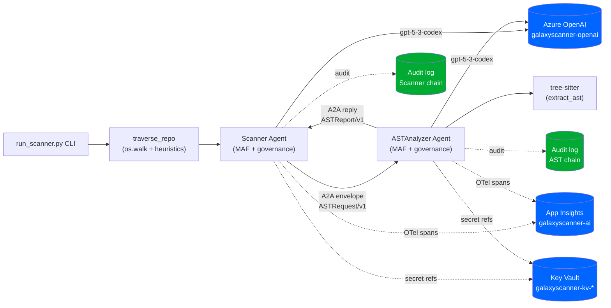
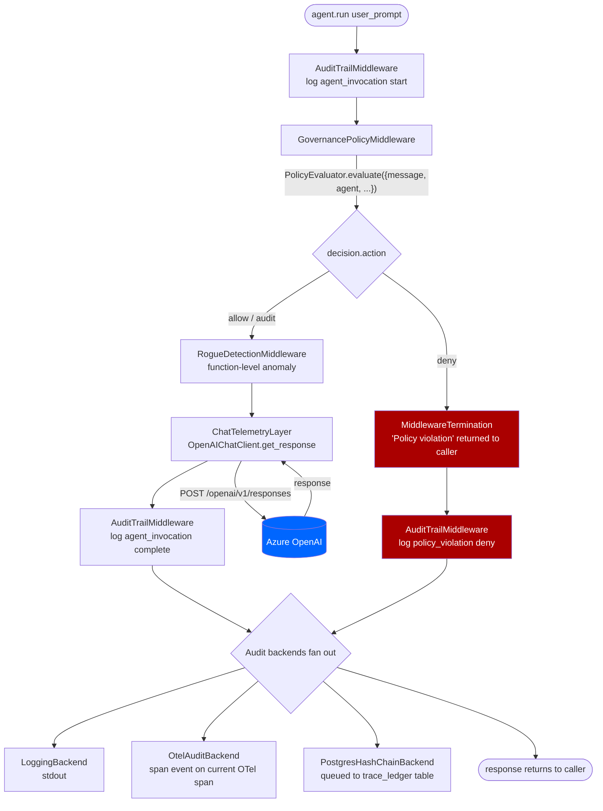
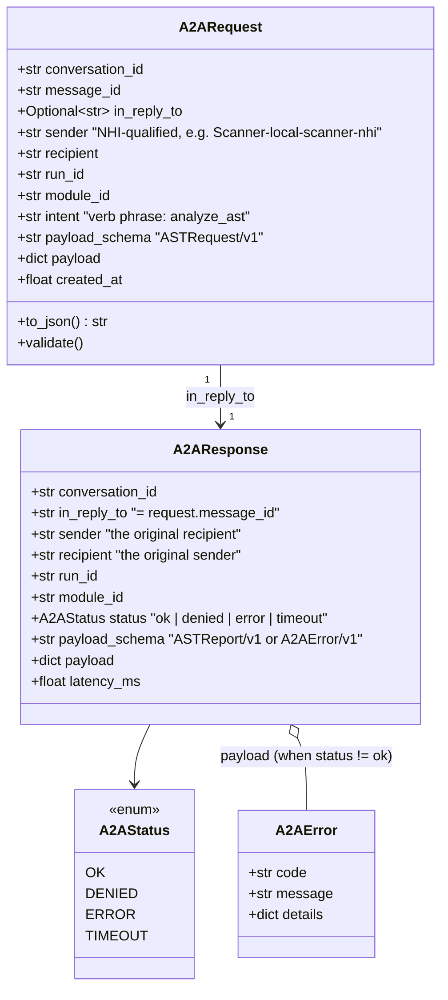
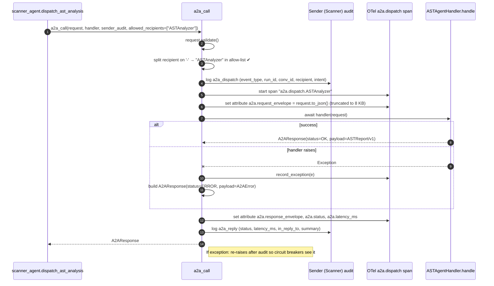
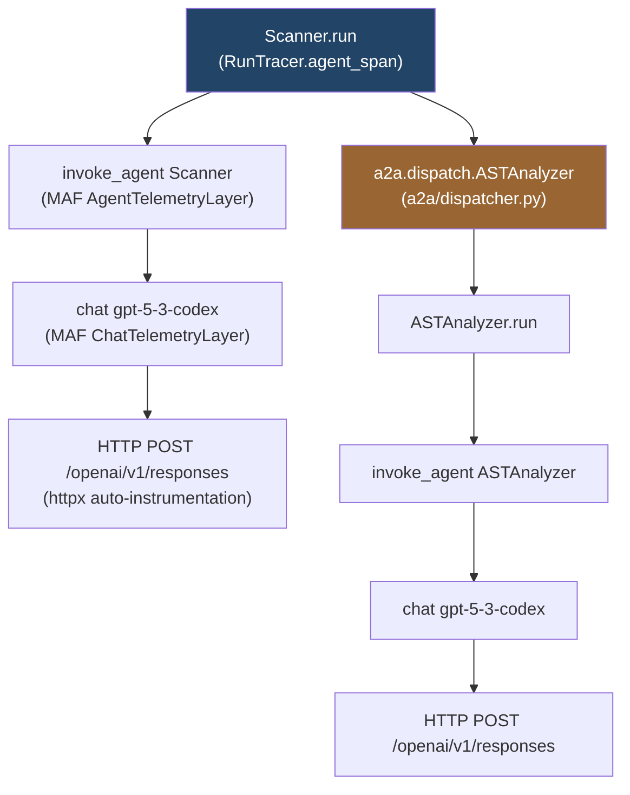
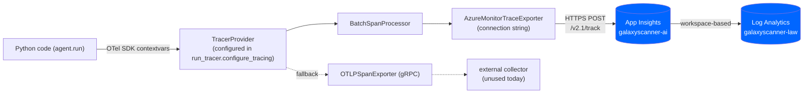
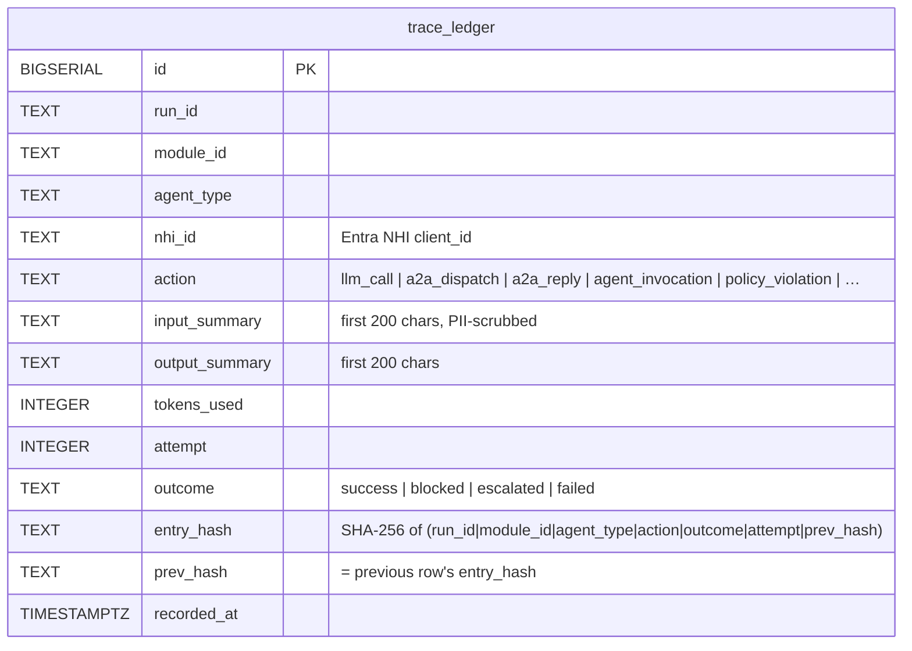
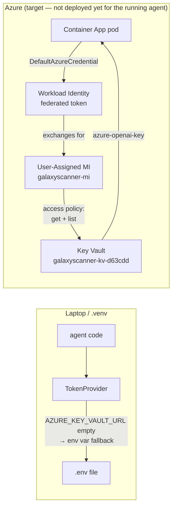
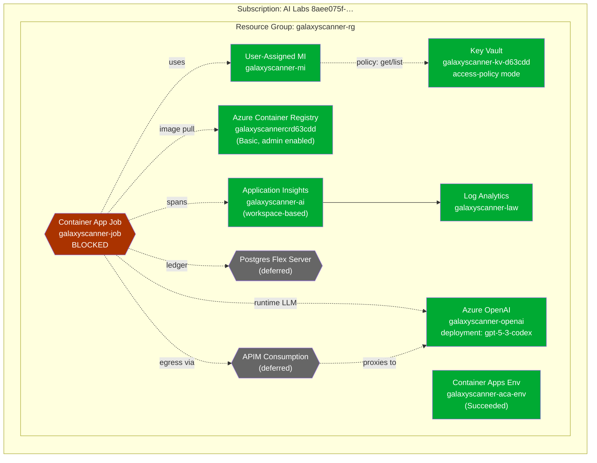
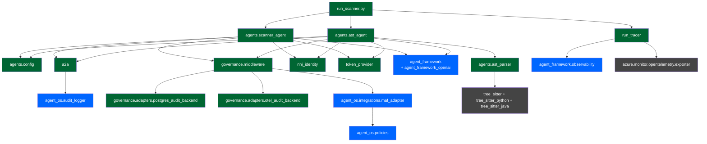

# Galaxy Scanner — Architecture & Design

**Last updated:** 2026-04-26
**Branch / commit:** `main` @ `0e8a68e`
**Runtime status:**
- ✅ Local end-to-end run works (`run_scanner.py`)
- ✅ Telemetry → Azure Application Insights (`galaxyscanner-ai`)
- ✅ Container image `galaxy-scanner:0.2.1` built + pushed to `galaxyscannercrd63cdd.azurecr.io`
- 🔶 Postgres ledger: stdout mode (Postgres Flex Server deferred)
- 🔶 Container Apps Job: blocked on Azure private-registry-creds API hiccup
- 🔶 APIM Consumption tier in front of Foundry: deferred

---

## 1. Goal in one sentence

A multi-agent **code-discovery pipeline** for the Galaxy migration platform: a `Scanner` walks a legacy repo, an `ASTAnalyzer` (called over a typed agent-to-agent envelope) performs deterministic tree-sitter extraction plus an LLM-grounded architecture summary, and every cross-call is governed by Microsoft Agent Framework + the agent_os middleware stack — with two independent hash-chained audit ledgers and full OpenTelemetry traces emitted to Application Insights.

---

## 2. System overview



---

## 3. Code package map

| Package / module | Role | Key entry points |
|---|---|---|
| [`run_scanner.py`](../run_scanner.py) | CLI entry; orchestrates one scan | `main(repo_path, run_id, module_id, attempt)` |
| [`agents/scanner_agent.py`](../agents/scanner_agent.py) | Scanner: traversal + LLM analysis + A2A dispatch | `traverse_repo`, `build_scanner_agent`, `dispatch_ast_analysis` |
| [`agents/ast_agent.py`](../agents/ast_agent.py) | ASTAnalyzer: handler that parses code + LLM summarises | `build_ast_agent`, `ASTAgentHandler.handle` |
| [`agents/ast_parser/`](../agents/ast_parser/) | Deterministic tree-sitter extractor (no LLM, no network) | `extract_ast(repo_root, files) -> ASTFindings` |
| [`agents/config.py`](../agents/config.py) | YAML → Pydantic config loader | `load_agent_config_cached(name)` |
| [`agents/config/*.yaml`](../agents/config/) | Per-agent tunables (file caps, A2A allow-list, governance toggles) | `scanner.yaml`, `ast_analyzer.yaml` |
| [`a2a/envelope.py`](../a2a/envelope.py) | Typed `A2ARequest` / `A2AResponse` dataclasses + `A2AStatus` enum | `A2ARequest.new(...)`, `A2AResponse.ok(...)` |
| [`a2a/dispatcher.py`](../a2a/dispatcher.py) | Single A2A entrypoint: validate, audit, span, hand to handler | `a2a_call(request, handler, sender_audit, allowed_recipients)` |
| [`governance/middleware.py`](../governance/middleware.py) | Factory wiring `agent_os.integrations.maf_adapter` middleware + audit backends | `build_governance_stack(agent_id, run_id)` |
| [`governance/policies/*.yaml`](../governance/policies/) | YAML policies enforced by `GovernancePolicyMiddleware` | `galaxy-core.yaml`, `galaxy-tools.yaml`, `galaxy-pii.yaml`, `galaxy-ast.yaml` |
| [`governance/adapters/postgres_audit_backend.py`](../governance/adapters/postgres_audit_backend.py) | Hash-chained Postgres `AuditBackend` | `PostgresHashChainBackend.write/.flush_async/.verify_chain` |
| [`governance/adapters/otel_audit_backend.py`](../governance/adapters/otel_audit_backend.py) | OTel-event-on-current-span `AuditBackend` | `OtelAuditBackend.write` |
| [`run_tracer.py`](../run_tracer.py) | `configure_tracing` (delegates to MAF) + `RunTracer.agent_span` | `configure_tracing()`, `RunTracer.inject_headers()` |
| [`token_provider.py`](../token_provider.py) | Key Vault → env-var fallback for the AOAI key | `TokenProvider(secret_name, env_var_fallback).get_api_key()` |
| [`nhi_identity.py`](../nhi_identity.py) | Per-agent Entra Non-Human-Identity registry | `NHIRegistry.get(agent_type) -> AgentIdentity` |
| [`infra/ledger_schema.sql`](../infra/ledger_schema.sql) | Postgres `trace_ledger` table DDL — applies to Postgres Flex when wired | — |
| [`Dockerfile`](../Dockerfile) | Container image (devcontainers-python:3.13 base, MCR-imported) | — |

---

## 4. End-to-end scan: sequence diagram

The "happy path" of `python run_scanner.py --repo … --run-id …`:

```mermaid
sequenceDiagram
  autonumber
  participant CLI as run_scanner.py
  participant Trav as traverse_repo
  participant SAg as Scanner MAF Agent
  participant SMW as Scanner middleware
  participant AOAI as Azure OpenAI
  participant Disp as a2a_call dispatcher
  participant AHand as ASTAgentHandler.handle
  participant TS as tree-sitter
  participant AAg as AST MAF Agent
  participant AMW as AST middleware

  CLI->>Trav: walk repo, classify lang, find entry-points
  Trav-->>CLI: file_map (deterministic)
  CLI->>SAg: agent.run(scanner_prompt)
  SAg->>SMW: AuditTrail / GovernancePolicy / RogueDetection
  SMW-->>SAg: allow
  SAg->>AOAI: POST /openai/v1/responses (chat span)
  AOAI-->>SAg: ScannerOutput JSON
  SAg-->>CLI: response
  CLI->>Disp: dispatch_ast_analysis()
  Disp->>Disp: request.validate(); allowed_recipients check
  Disp->>SMW: emit a2a_dispatch audit event
  Disp->>AHand: await handler(request)
  AHand->>TS: extract_ast(repo_root, files)
  TS-->>AHand: ASTFindings (symbols, edges, routes, db_calls)
  AHand->>AAg: agent.run(facts_prompt)
  AAg->>AMW: AuditTrail / GovernancePolicy / RogueDetection
  AMW-->>AAg: allow
  AAg->>AOAI: POST /openai/v1/responses (2nd chat span)
  AOAI-->>AAg: architecture summary + risks
  AAg-->>AHand: response_text
  AHand-->>Disp: A2AResponse.ok(ASTReport/v1)
  Disp->>SMW: emit a2a_reply audit event
  Disp-->>CLI: response
  CLI->>CLI: merge ast_report into ScannerOutput
  CLI->>SMW: pg.flush_async(); verify_chain()
  CLI->>AMW: pg.flush_async(); verify_chain()
```

Two things worth highlighting:

- The Scanner LLM call (step 6) and the AST LLM call (step 16) are **independent** invocations through MAF — each goes through its own middleware stack, its own NHI, its own audit log. Two policy evaluations, two sets of OTel spans, two ledger chains.
- The A2A dispatcher (step 9) is the *only* code path between agents. It's where allow-list, audit, and tracing all clip in. Anything that bypasses `a2a_call` would silently bypass governance — see [a2a/dispatcher.py:46-150](../a2a/dispatcher.py#L46-L150).

---

## 5. Governance middleware pipeline (per `agent.run()`)

`build_governance_stack` at [governance/middleware.py:71-110](../governance/middleware.py#L71-L110) returns an ordered list passed straight to MAF's `Agent(middleware=...)`. The MAF runtime composes them around every `agent.run(...)`:



- The YAML policies that drive `GovernancePolicyMiddleware` are at [governance/policies/galaxy-core.yaml](../governance/policies/galaxy-core.yaml) (prompt-injection regex, oversized-prompt gate) and [governance/policies/galaxy-tools.yaml](../governance/policies/galaxy-tools.yaml) (per-agent tool allow-list).
- `AuditTrailMiddleware` calls our `_CompatAuditLogger` ([governance/middleware.py:25-67](../governance/middleware.py#L25-L67)) which bridges the maf_adapter's legacy `log(event_type=...)` kwargs to the current `log(entry: AuditEntry)` shape and stamps a uuid `entry_id` so start/end pairs correlate.

---

## 6. A2A protocol: envelope structure + dispatch flow

### Envelope structure



Source of truth: [a2a/envelope.py:43-195](../a2a/envelope.py#L43-L195).

### Dispatch flow



Notes:
- `allowed_recipients` is an explicit allow-list passed by the caller, layered on top of the YAML policy stack — see [a2a/dispatcher.py:77-93](../a2a/dispatcher.py#L77-L93). Belt and braces.
- The full envelope JSON is now stamped on the dispatch span as `a2a.request_envelope` / `a2a.response_envelope` since [a2a/dispatcher.py:120-149](../a2a/dispatcher.py#L120-L149) — both queryable from App Insights.

### What the envelope does NOT carry

- **No signature, no JWT, no SPIFFE SVID.** Sender/recipient are declarative strings. A2A is in-process today; no trust boundary is crossed. If/when A2A goes cross-process, an `auth: AuthBlock` field with a workload-identity-issued JWT is the natural extension. See discussion thread; not implemented.

---

## 7. Observability: OTel span hierarchy + ingestion

MAF emits OTel GenAI-semantic-convention spans through three layers (`AgentTelemetryLayer`, `ChatTelemetryLayer`, function-invocation spans). Our code adds two extra wrappers (`Scanner.run` / `ASTAnalyzer.run` from [run_tracer.py:160-171](../run_tracer.py#L160-L171)) and the A2A dispatch span. One scan emits this tree under one `TraceId`:



### Ingestion path



`configure_tracing` at [run_tracer.py:51-117](../run_tracer.py#L51-L117) routes by env var:
- `APPLICATIONINSIGHTS_CONNECTION_STRING` → Azure Monitor exporter (preferred, works from laptop or ACA)
- `OTEL_EXPORTER_OTLP_ENDPOINT` → generic OTLP gRPC (collector sidecar / AKS)
- neither → no-op, safe for unit tests

Per-attribute size cap on App Insights is ~8 KB; the A2A envelope stamper at [a2a/dispatcher.py:228](../a2a/dispatcher.py#L228) truncates with a parseable suffix when needed.

---

## 8. Hash-chained audit ledger (compliance archive)



Schema: [infra/ledger_schema.sql](../infra/ledger_schema.sql).
Hash computation: [governance/adapters/postgres_audit_backend.py:213-216](../governance/adapters/postgres_audit_backend.py#L213-L216).
Verification: [governance/adapters/postgres_audit_backend.py:155-179](../governance/adapters/postgres_audit_backend.py#L155-L179) — re-computes the chain row by row; any tamper breaks the next link.

Note: the Postgres Flex Server resource isn't provisioned yet. Today the chain is computed in-memory and written to stdout via the `LoggingBackend`; the Postgres flush is a no-op until `POSTGRES_DSN` is set. **Two independent ledger chains** per run (one per agent NHI), correlated by `run_id` + `conversation_id`.

---

## 9. Identity, secrets, and trust today



- **Today (laptop):** `TokenProvider` (defaults at [token_provider.py:44-49](../token_provider.py#L44-L49)) reads `AZURE_OPENAI_KEY` from `.env`. Key Vault is bypassed because `AZURE_KEY_VAULT_URL` is blank.
- **Target (ACA):** the Container App pod has the User-Assigned Managed Identity `galaxyscanner-mi` attached. `DefaultAzureCredential` picks up the federated token, exchanges it for an AAD token bound to the MI, and uses that to call `KV.get_secret("azure-openai-key")`. No long-lived secret in the container's env.
- **NHI (Non-Human Identity):** every agent type has its own Entra service principal client_id stamped onto every audit row as `nhi_id`. Today these are placeholder strings (`local-scanner-nhi`, etc.); real Entra IDs slot in once you provision them.

---

## 10. Azure resource map



Identifiers and connection strings live in [azure-resources.md](../azure-resources.md).

---

## 11. Code package dependency graph



---

## 12. Status snapshot

| Area | Status | Where |
|---|---|---|
| Local end-to-end run | ✅ Working | `python run_scanner.py --repo . --run-id …` |
| MAF agent + middleware stack | ✅ Working | [agents/scanner_agent.py:215-258](../agents/scanner_agent.py#L215-L258) |
| YAML policy enforcement | ✅ Working | live deny verified via injection probe |
| A2A dispatch (Scanner → AST) | ✅ Working | round-trip verified `run-a2a-verify-001` |
| A2A envelope visibility in App Insights | ✅ Working | `a2a.request_envelope` / `a2a.response_envelope` span attrs |
| OTel → Application Insights | ✅ Working | direct `AzureMonitorTraceExporter` |
| GenAI-convention spans (Agents preview dashboard) | ✅ Working | via `agent_framework.observability.configure_otel_providers` |
| Pydantic+YAML config loader | ✅ Working | [agents/config.py](../agents/config.py) — 9/9 tests green |
| tree-sitter Python + Java parser | ✅ Working | [agents/ast_parser/extractor.py](../agents/ast_parser/extractor.py) |
| Hash-chained audit logic | ✅ Working in stdout mode | [governance/adapters/postgres_audit_backend.py](../governance/adapters/postgres_audit_backend.py) |
| Container image (`galaxy-scanner:0.2.1`) | ✅ Built + pushed | `galaxyscannercrd63cdd.azurecr.io` |
| Postgres Flex Server provision + DSN | 🔶 Deferred | unblocks the persistent ledger |
| ACA Job create with private-registry creds | 🔴 Blocked | Azure API returns InternalServerError; needs MS support / ACR Standard upgrade / portal create |
| APIM Consumption tier in front of Foundry | 🔶 Deferred | header-injection policies + per-`x-agent-type` rate limits |
| Cross-process A2A with workload-identity tokens | ⏸ Future | only matters once A2A is networked |
| Compliance Auditor agent (joins Scanner+AST chains by `run_id`) | ⏸ Future | tamper-evident cross-agent verify |

---

## 13. Concrete file index (for one-click navigation)

**Entrypoint and orchestration**
- [run_scanner.py](../run_scanner.py) — CLI + agent wiring + flush + chain verify
- [agents/scanner_agent.py](../agents/scanner_agent.py) — Scanner agent + traversal + dispatch
- [agents/ast_agent.py](../agents/ast_agent.py) — ASTAnalyzer agent + handler

**Domain glue**
- [agents/ast_parser/extractor.py](../agents/ast_parser/extractor.py) — tree-sitter walker
- [agents/config.py](../agents/config.py) — YAML loader + Pydantic schema
- [agents/config/scanner.yaml](../agents/config/scanner.yaml) — Scanner tunables
- [agents/config/ast_analyzer.yaml](../agents/config/ast_analyzer.yaml) — AST tunables

**A2A**
- [a2a/envelope.py](../a2a/envelope.py) — typed envelopes
- [a2a/dispatcher.py](../a2a/dispatcher.py) — `a2a_call` + envelope-stamping helper

**Governance**
- [governance/middleware.py](../governance/middleware.py) — `build_governance_stack` + compat shim
- [governance/policies/galaxy-core.yaml](../governance/policies/galaxy-core.yaml) — prompt-injection rules
- [governance/policies/galaxy-tools.yaml](../governance/policies/galaxy-tools.yaml) — tool allow-list
- [governance/policies/galaxy-pii.yaml](../governance/policies/galaxy-pii.yaml) — PII rules (placeholder)
- [governance/policies/galaxy-ast.yaml](../governance/policies/galaxy-ast.yaml) — AST-specific rules
- [governance/adapters/postgres_audit_backend.py](../governance/adapters/postgres_audit_backend.py) — hash-chained Postgres sink
- [governance/adapters/otel_audit_backend.py](../governance/adapters/otel_audit_backend.py) — OTel span-event sink

**Identity, secrets, telemetry**
- [token_provider.py](../token_provider.py) — Key Vault + env-var fallback
- [nhi_identity.py](../nhi_identity.py) — NHI registry per agent type
- [run_tracer.py](../run_tracer.py) — `configure_tracing` + `RunTracer.agent_span`

**Azure deploy**
- [Dockerfile](../Dockerfile) — slim + non-root + ACR-imported base
- [azure-resources.md](../azure-resources.md) — resource IDs + connection details
- [infra/ledger_schema.sql](../infra/ledger_schema.sql) — Postgres ledger DDL

**Reference docs**
- [docs/maf-verification.md](maf-verification.md) — MAF Phase A verification notes
- [docs/toolkit-verification.md](toolkit-verification.md) — agent_os toolkit verification notes
- [GOVERNANCE_MIGRATION_PLAN.md](../GOVERNANCE_MIGRATION_PLAN.md) — original phased migration plan

**Tests**
- [tests/test_a2a_envelope.py](../tests/test_a2a_envelope.py) — envelope schema + replies
- [tests/test_ast_extractor.py](../tests/test_ast_extractor.py) — tree-sitter extractor
- [tests/test_config.py](../tests/test_config.py) — Pydantic+YAML loader
- [tests/test_scanner_ast_a2a.py](../tests/test_scanner_ast_a2a.py) — Scanner→AST round-trip
- [tests/test_security_traceability.py](../tests/test_security_traceability.py) — TokenProvider, NHI, governance stack, traverse_repo

---

## 14. Architectural rules (the contract)

1. **Single LLM-egress per agent.** Every LLM call goes through `agent.run()` — middleware fires automatically. Never construct an `OpenAIChatClient` and call it directly outside an `Agent`.
2. **A2A is the only inter-agent path.** No agent imports another agent's class. `a2a_call(...)` is the boundary; envelope schemas (`*Request/v1`, `*Report/v1`) are the contract.
3. **Tunables in YAML, code in Python.** If a number is operational, it lives in `agents/config/<agent>.yaml`. Prompt-shape internals (sampling caps for the LLM prompt) stay in code.
4. **Filesystem presence is the source of truth for agent-type validity.** No Python enum of "known agent types"; the YAML on disk *is* the registry.
5. **Hash-chain integrity per agent.** Each agent has its own `nhi_id` and its own ledger chain. Cross-agent correlation is by `run_id` + `conversation_id`, not by sharing chains.
6. **Provenance over identity.** A2A envelopes carry `sender` / `recipient` as identity *labels*, not proofs. Workload Identity authenticates pods to Azure services; cross-agent identity proof is a future feature, deliberately not pretended-to today.
7. **Loud over silent.** Pydantic `extra="forbid"` on every config model; Postgres errors logged at ERROR not swallowed; missing required env vars fail at startup, not at first dispatch.
8. **Kept-as-is when MAF/agent_os already does it.** No custom retry decorators, no custom span boilerplate, no re-implementations of OWASP-Agentic-Top-10 defenses. The migration plan's guiding rule was *"use what the framework ships before writing anything custom"* — that still holds.

---

*End of architecture document. Update the **Status snapshot** when phases unblock.*
