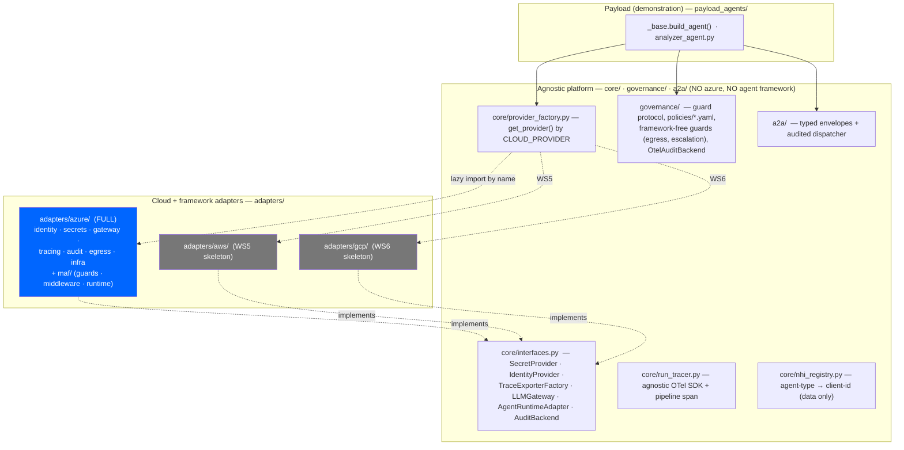
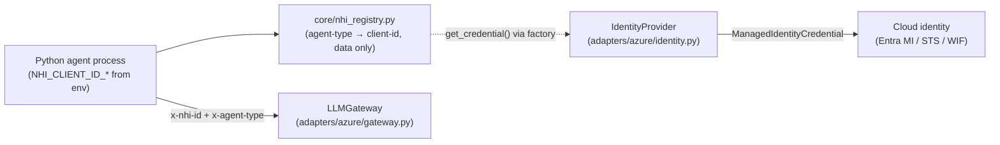
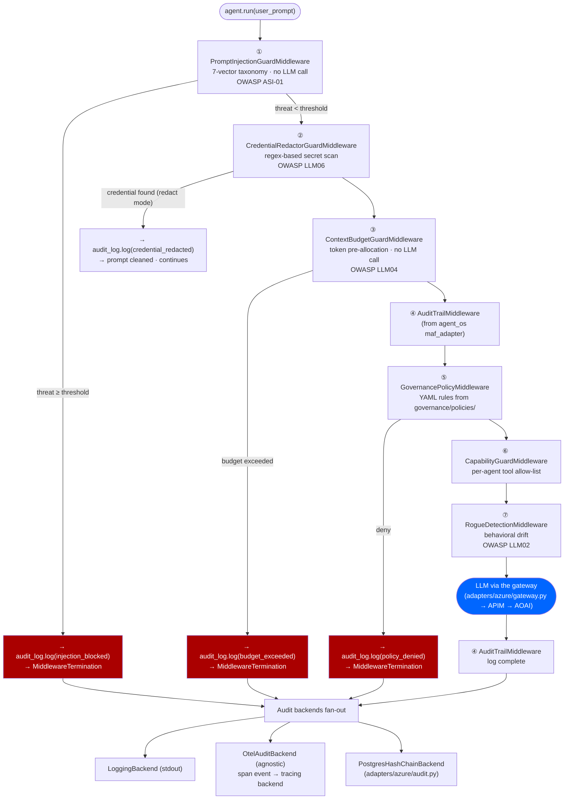
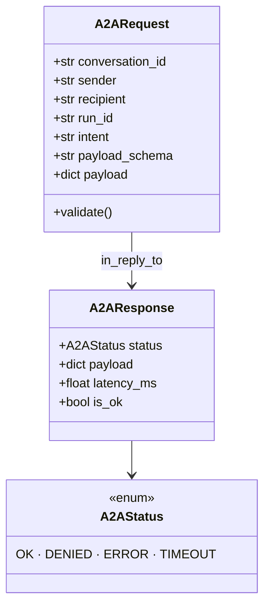
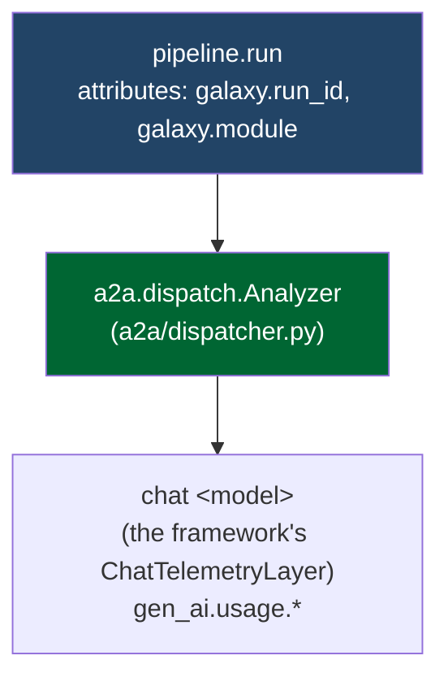
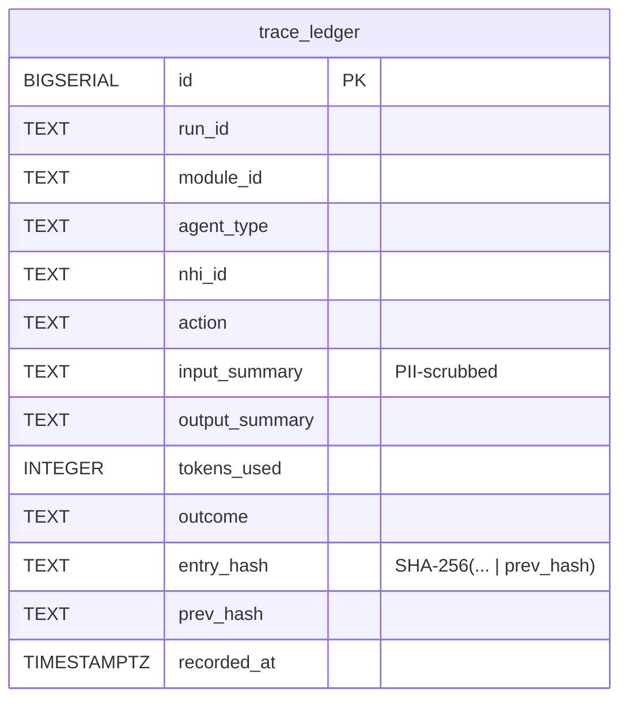
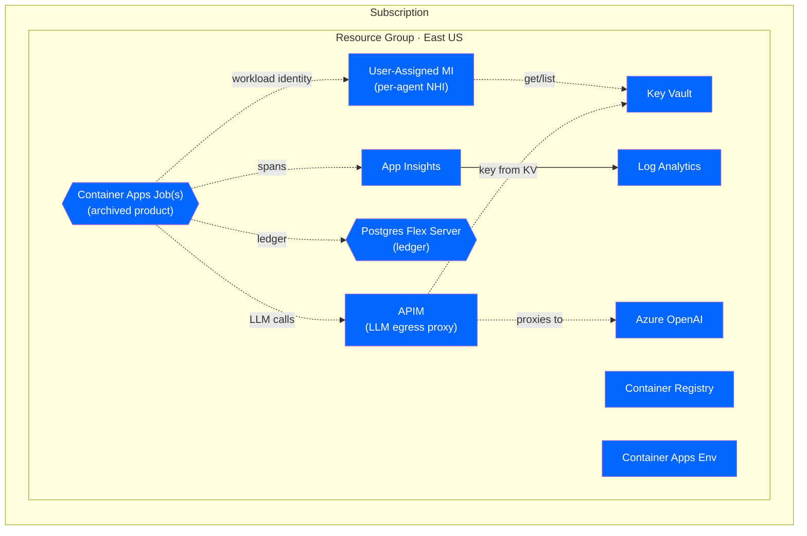
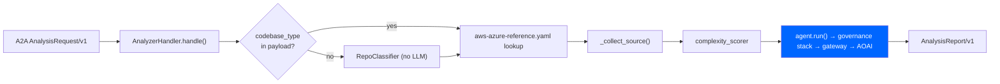
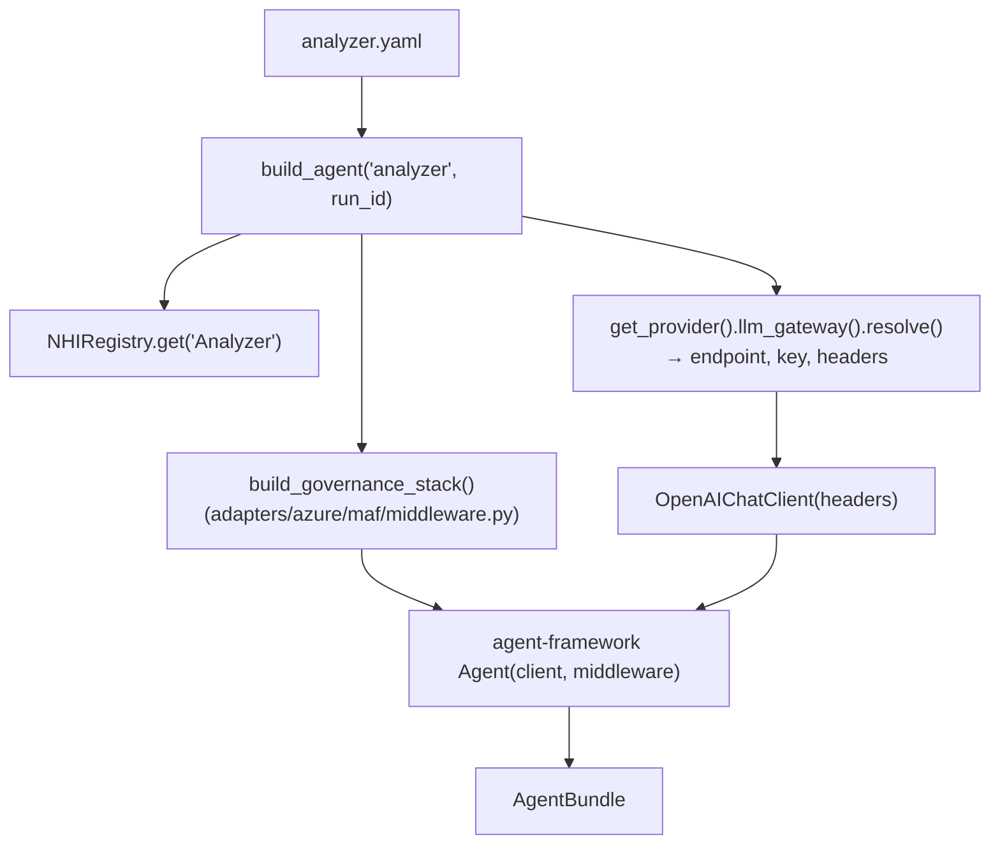

# Galaxy Agentic Governance Platform — Architecture

**Last updated:** 2026-06-09

**What this repo is.** A **cloud- and framework-agnostic runtime governance & security platform** for multi-agent systems, built on the **Microsoft Agent Governance Toolkit (MSGK / `agent_os`)**. It provides per-agent identity, a layered guard middleware stack, A2A governance, OpenTelemetry tracing, and a hash-chained audit ledger — independent of the agents it governs *and* independent of any single cloud or agent framework. The repo's value is the **interface seam + cloud/framework adapters + composition** on top of MSGK primitives, not the governance logic itself.

**The agnostic-core + adapter split (WS1 — done).** Everything cloud- or framework-specific lives behind an interface under `adapters/<cloud>/`. The agnostic core (`core/`, `governance/`, `a2a/`) imports **no** cloud SDK and **no** agent framework — this is enforced as an invariant.

Azure is the one fully-implemented provider today (and ships the Azure framework glue). AWS and GCP are interface-complete **skeletons** (`NotImplementedError` until WS5/WS6). What remains roadmap is the *fill-in* of those clouds, the MSGK v4 re-baseline (WS3), and the gap modules (WS7) — **not** the adapter structure itself, which is real and verified.

**Repo focus / payload.** The agents shipped here are a **minimal demonstration payload** (`payload_agents/`) — a single agent-framework `Analyzer` agent and its closure, just enough to prove the governance stack wraps a real agent end-to-end. The full multi-agent AWS→Azure migration product has been moved to a **local-only, gitignored `archive/`** and is **not part of this repo**. Where this doc describes that product, it is labeled **(archived)**.

**Runtime status:**
- ✅ Agnostic core imports & runs with **no** Azure SDK / agent framework installed (provider factory + interface seam)
- ✅ Provider factory resolves `azure` (full), `aws`/`gcp` (clean `NotImplementedError` skeletons)
- ✅ Governance middleware stack (7 guards) — assembled by the Azure framework adapter, wired through `build_agent()`
- ✅ Offline governance demo (`scripts/demo_governance.py`) — no Azure / DB / LLM / framework
- ✅ Single demonstration payload agent (`payload_agents/analyzer_agent.py`)
- ✅ OTel tracing: agnostic SDK setup in core; Azure Monitor exporter behind the adapter
- 🔶 Postgres ledger: stdout mode by default (set `POSTGRES_DSN` to persist)
- 🛣️ AWS / GCP adapter fill-in (WS5/WS6), MSGK v4 re-baseline (WS3), gap modules (WS7) — see [`docs/REFACTOR_AND_GAPS_PLAN.md`](REFACTOR_AND_GAPS_PLAN.md)

---

## 0. The layered architecture

Three layers, top to bottom. Dependencies point **downward only**: the payload depends on the platform; the platform's agnostic core depends only on the interface seam; adapters implement the seam. Nothing in the agnostic core knows which cloud or framework is in play.



### The interface seam — `core/interfaces.py`

Every cloud/framework touchpoint is one of these Protocols. `AuditBackend` is re-exported from MSGK so adapters implement the upstream contract directly.

| Interface | Azure impl (`adapters/azure/`) | AWS (WS5) | GCP (WS6) |
|---|---|---|---|
| `SecretProvider` | `secrets.TokenProvider` — Key Vault + Workload Identity (env fallback) | Secrets Manager / SSM | Secret Manager / ADC |
| `IdentityProvider` | `identity.AzureIdentityProvider` — ManagedIdentityCredential | STS AssumeRole / IRSA | Workload Identity Federation |
| `TraceExporterFactory` | `tracing.AzureTraceExporterFactory` — Azure Monitor | X-Ray / ADOT | Cloud Trace |
| `LLMGateway` | `gateway.AzureLLMGateway` — APIM → AOAI (direct fallback) | API Gateway → Bedrock | Apigee → Vertex AI |
| `AgentRuntimeAdapter` | `framework/runtime.AzureRuntimeAdapter` — framework OTel wiring | LangGraph / Bedrock Agents | Google ADK |
| `AuditBackend` (MSGK) | `audit.PostgresHashChainBackend` | DynamoDB / QLDB | BigQuery / Spanner |
| egress allow-list | `egress.yaml` | `egress.yaml` (WS5) | `egress.yaml` (WS6) |

The agnostic default `SecretProvider` (`core/secrets.EnvVarSecretProvider`) is env-var only — no cloud needed.

### The provider factory — `core/provider_factory.py`

`get_provider(name=None)` selects the adapter set by the `CLOUD_PROVIDER` env var (default `azure`) and **lazy-imports** the chosen `adapters/<cloud>/` package — so an `azure` run never needs the AWS/GCP SDKs, and importing the factory pulls no cloud SDK at all. Each adapter package exposes a module-level `PROVIDER` implementing `CloudProvider`. The AWS/GCP providers resolve but raise `NotImplementedError` from each accessor, locking the contract for WS5/WS6.

### Directory map

```
core/                      # agnostic platform core (no azure, no agent framework)
├── interfaces.py          #   the seam: Protocols + re-exported AuditBackend
├── provider_factory.py    #   get_provider() by CLOUD_PROVIDER (lazy import)
├── secrets.py             #   EnvVarSecretProvider (agnostic fallback)
├── nhi_registry.py        #   agent-type → client-id mapping + AgentIdentity (data)
├── run_tracer.py          #   agnostic OTel SDK setup + pipeline root span
├── trace_ledger.py        #   hash-chain ledger schema/logic (agnostic)
└── discovery_artifacts.py #   Pydantic models (kept for the demo)

governance/                # agnostic governance only
├── guards/
│   ├── egress.py          #   framework-free; allow-list path via provider factory
│   └── escalation.py      #   framework-free (pure agent_os)
├── adapters/
│   └── otel_audit_backend.py   # pure OTel span-event backend (cloud-neutral)
├── policies/*.yaml        #   declarative policy packs
└── configs/prompt-injection.yaml

a2a/                       # typed A2A envelopes + audited dispatcher (agnostic)

adapters/
├── azure/                 # FULL: the Azure framework adapter (current default)
│   ├── identity.py  secrets.py  gateway.py  tracing.py  audit.py
│   ├── egress.yaml  infra/ (aca_jobs.bicep, ledger_schema.sql)
│   └── framework/        # agent framework glue (the framework axis)
│       ├── runtime.py     #   AgentRuntimeAdapter — framework OTel wiring
│       ├── middleware.py  #   build_governance_stack() — the governance-middleware assembly
│       └── guards/        #   3 framework middleware wrappers around MSGK primitives
│           ├── prompt_injection.py  credential_redactor.py  context_budget.py
├── aws/                   # WS5 skeleton — NotImplementedError stubs
└── gcp/                   # WS6 skeleton — NotImplementedError stubs

payload_agents/            # demonstration payload (framework-coupled; the thing being governed)
scripts/demo_governance.py # offline demo — the only runnable script in the repo
```

---

## Part 1 — Agent-Governance Security Platform

Part 1 is the platform. The Azure resource map (§1.7) describes the **archived full-product deployment topology**, retained as the target deployment shape.

### 1.1 Platform overview

Every agent that runs on the platform — regardless of payload — goes through the same governance stack via `build_agent()`. The platform provides:

- **Non-Human Identity (NHI):** each agent type maps to its own cloud identity principal; no shared credentials
- **Governance middleware stack:** 7 ordered guards applied on every `agent.run()` call
- **A2A protocol:** typed, audited message envelopes for all inter-agent communication
- **OpenTelemetry tracing:** one trace ID per run, all agent spans under the same root
- **Hash-chained audit ledger:** append-only compliance archive (SHA-256 chained)
- **Managed LLM-egress gateway:** the only path to the model; the real key never sits in agent code

Every guard *logic* primitive comes from MSGK (`agent_os`); this repo supplies the agnostic composition, the cloud bindings, and (for the Azure provider) the framework-middleware wrappers.

### 1.2 Non-Human Identity (NHI)

Source: [`core/nhi_registry.py`](../core/nhi_registry.py) (agnostic), [`adapters/azure/identity.py`](../adapters/azure/identity.py) (Azure credential)

The registry is pure data: an agent-type → client-id mapping plus the attribution model. It imports no cloud SDK. Resolving an actual **credential** for an identity is delegated to the selected provider's `IdentityProvider` — on Azure, `ManagedIdentityCredential(client_id=...)` using Workload Identity federated OIDC tokens; on AWS it would be STS AssumeRole/IRSA, on GCP Workload Identity Federation. `AgentIdentity.get_credential()` routes through `core.provider_factory.get_provider().identity_provider()`, so the registry stays agnostic.

The `NHIRegistry` still lists the full set of agent types the archived product used; the **only agent in this repo** is `Analyzer`. Extra entries are harmless — `NHIRegistry.get(agent_type)` only resolves the types you actually build.

The `client_id` is carried as:
- `x-nhi-id` header on every gateway request (set by the `LLMGateway` in `default_headers`)
- `governance.agent_id` on every governance audit span event → queryable in the tracing backend
- `nhi_id` column in the `trace_ledger` table



### 1.3 Governance middleware pipeline

Source: [`adapters/azure/maf/middleware.py`](../adapters/azure/maf/middleware.py) — `build_governance_stack()`

`build_governance_stack()` returns `(middleware_list, pg_backend, audit_logger)` and is the **governance-middleware assembly** — the framework axis of the Azure bundle. It composes MSGK `agent_os` primitives into a framework middleware list. Guards 1–3 are framework wrappers (`adapters/azure/maf/guards/`) around MSGK detectors; guards 4–7 come from MSGK's framework-integration adapter (`agent_os.integrations`). The agnostic pieces it draws on stay in `governance/`: the policy YAML packs, the prompt-injection config, and `OtelAuditBackend`.

**Execution order — guards 1–3 run before any toolkit middleware fires:**



Guards 1–3 call `audit_log.log(...)` directly on block/redact, so all governance decisions are captured even when AuditTrailMiddleware (guard 4) never fires.

**Where each guard lives after WS1:**

| Guard | Module | Agnostic? |
|---|---|---|
| ① PromptInjection / ② CredentialRedactor / ③ ContextBudget | `adapters/azure/maf/guards/` | No — framework middleware wrappers |
| ④–⑦ (Audit, Policy, Capability, Rogue) | MSGK's framework-integration adapter (`agent_os.integrations`) | No — framework adapter |
| egress / escalation guards | `governance/guards/` | **Yes** — pure `agent_os`, framework-free |
| policy packs `galaxy-*.yaml` | `governance/policies/` | **Yes** |
| `OtelAuditBackend` | `governance/adapters/otel_audit_backend.py` | **Yes** — pure OTel |
| `PostgresHashChainBackend` | `adapters/azure/audit.py` | No — Azure ledger choice |

**Per-agent tuning** lives in `payload_agents/config/<agent>.yaml`. For the shipped `Analyzer`:

| Tunable | YAML key | Analyzer | Default |
|---|---|---|---|
| Token budget | `context_budget_tokens` | 40000 | 8000 |
| Injection threshold | `prompt_injection_block_threshold` | `high` | `medium` |
| Credential mode | `credential_mode` | `redact` | `redact` |
| Rogue detection | `enable_rogue_detection` | `true` | — |
| Tool allow-list | `allowed_tools` | `[]` (read-only) | none |

**YAML policy files** (loaded by `GovernancePolicyMiddleware`):

| File | Enforces |
|---|---|
| [`governance/policies/galaxy-core.yaml`](../governance/policies/galaxy-core.yaml) | Prompt-injection regex · oversized-prompt gate |
| [`governance/policies/galaxy-tools.yaml`](../governance/policies/galaxy-tools.yaml) | Per-agent tool allow-list |
| [`governance/policies/galaxy-pii.yaml`](../governance/policies/galaxy-pii.yaml) | PII rules placeholder |
| [`governance/policies/galaxy-ast.yaml`](../governance/policies/galaxy-ast.yaml) | AST-agent rules (deny outbound A2A from leaf) |
| [`adapters/azure/egress.yaml`](../adapters/azure/egress.yaml) | Outbound egress allow-list (Azure domains) |
| [`governance/configs/prompt-injection.yaml`](../governance/configs/prompt-injection.yaml) | Injection threat patterns + thresholds |

The egress allow-list moved under the Azure adapter (it lists Azure domains); the egress *guard* (`governance/guards/egress.py`) stays agnostic and resolves the path via the provider factory.

### 1.4 A2A protocol

Source: [`a2a/envelope.py`](../a2a/envelope.py), [`a2a/dispatcher.py`](../a2a/dispatcher.py) — fully agnostic (no cloud, no framework).

All inter-agent calls use typed `A2ARequest`/`A2AResponse` envelopes. No agent module imports another agent's class. The shipped `Analyzer` is a **leaf** (`allowed_recipients: []`) — it accepts inbound requests but never dispatches outbound — so the A2A layer is exercised inbound-only by the demo. The envelope/dispatcher machinery is the general platform contract.



**Dispatch flow** (`a2a_call()`): `request.validate()` (schema + recipient allow-list) → `audit_log.log(a2a_dispatch)` → OTel child span `a2a.dispatch.<Recipient>` → `await handler(request)` (recipient runs its own middleware) → `audit_log.log(a2a_reply)` → span closed with status + latency.

| Phase | Request schema | Response schema |
|---|---|---|
| Analysis | `AnalysisRequest/v1` | `AnalysisReport/v1` |

> **(Archived)** The full migration product defined `Coding*`, `Test*`, `Review*`, `SecurityReview*`, `AST*`, and five `Discovery*` schema pairs. Those live in `archive/`.

### 1.5 OTel tracing

Source: [`core/run_tracer.py`](../core/run_tracer.py) (agnostic SDK), [`adapters/azure/tracing.py`](../adapters/azure/tracing.py) (Azure exporter), [`adapters/azure/maf/runtime.py`](../adapters/azure/maf/runtime.py) (framework wiring)

`configure_tracing()` is agnostic. Routing:
1. The provider's `TraceExporterFactory` yields a span exporter (Azure → Azure Monitor when `APPLICATIONINSIGHTS_CONNECTION_STRING` is set; AWS → X-Ray; GCP → Cloud Trace).
2. Else `OTEL_EXPORTER_OTLP_ENDPOINT` → generic OTLP gRPC.
3. The provider's `AgentRuntimeAdapter` may own provider setup (the Azure framework adapter's `configure_otel_providers`, so `gen_ai.*` semantic-convention spans fire); if none handles it, a minimal agnostic `TracerProvider` is the fallback.

The core module imports **no** `azure` and **no** agent framework — both are reached only through the factory.

**Root span:** `pipeline_span(run_id, module)` creates one `pipeline.run` span; all framework `AgentTelemetryLayer` child spans land under it.



**NHI attribution** (`governance.agent_id`) rides on governance audit *span events* (`span.add_event(...)` in `OtelAuditBackend`), keyed to the agent's client-id — agnostic of which exporter ships them.

### 1.6 Hash-chained audit ledger

Source: [`core/trace_ledger.py`](../core/trace_ledger.py) (agnostic schema/logic), [`adapters/azure/audit.py`](../adapters/azure/audit.py) (Azure Postgres backend)



`PostgresHashChainBackend` implements MSGK's `AuditBackend`; AWS (DynamoDB/QLDB) and GCP (BigQuery/Spanner) ship sibling backends under their adapters. **Current state:** `POSTGRES_DSN` unset → stdout mode (in-memory chain). The offline demo reproduces this chain logic in-process and verifies it. Schema DDL: [`adapters/azure/infra/ledger_schema.sql`](../adapters/azure/infra/ledger_schema.sql).

### 1.7 Azure resource map — (archived full-product deployment topology)

> Describes the archived full-product deployment (~18 agents as ACA jobs), retained as the target topology. The provisioning Bicep is [`adapters/azure/infra/aca_jobs.bicep`](../adapters/azure/infra/aca_jobs.bicep).



**APIM egress policy (reference):** validates `Ocp-Apim-Subscription-Key`; rejects requests missing `x-agent-type` / `x-galaxy-run-id` (HTTP 400); rate-limits per subscription key; injects the real AOAI key from a Key-Vault-backed named value before forwarding. The `LLMGateway` (`adapters/azure/gateway.py`) stamps `x-agent-type` / `x-nhi-id` and the subscription key, so the egress contract is honored whenever an agent runs against a live APIM endpoint.

---

## Part 2 — Payload App (demonstration only)

The payload runs **on top of** the governance platform to prove it governs a real agent. It is a **single agent-framework `Analyzer` agent** and the closure it needs — a demonstration, not a product. Being an agent-framework agent, the payload legitimately depends on the Azure framework adapter; it reaches cloud bindings through the provider factory.

> **(Archived)** The repo previously contained a full multi-agent AWS→Azure migration product (5-stage migration pipeline, 5-agent Discovery pipeline, Scanner + ASTAnalyzer), ~18 agents, the orchestrator scripts, the Dockerfile, and the `legacy/` AWS sample — all moved to the local-only `archive/`. See §2.5 and [`docs/REFACTOR_AND_GAPS_PLAN.md`](REFACTOR_AND_GAPS_PLAN.md).

### 2.1 The Analyzer demo agent

Source: [`payload_agents/analyzer_agent.py`](../payload_agents/analyzer_agent.py)

The `Analyzer` is a **read-only AWS→Azure migration analyst**. Given a source repo it:

1. **Determines `codebase_type`** — from the A2A payload, or auto-detected by `RepoClassifier` (signal-based, no LLM).
2. **Looks up the canonical mapping** in [`governance/mappings/aws-azure-reference.yaml`](../governance/mappings/aws-azure-reference.yaml); returns a `mapping_not_found` A2A error rather than hallucinating.
3. **Assembles source** (`_collect_source`) — reads up to `max_files_per_dispatch` files, chunking large files.
4. **Pre-computes a deterministic complexity score** and injects it into the prompt.
5. **Calls the LLM once** via `self._agent.run(...)` — firing the full governance stack through the gateway.
6. **Returns an `AnalysisReport/v1`**.

It is a **leaf** in the A2A graph (`allowed_recipients: []`).



### 2.2 How `build_agent()` wraps the agent

Source: [`payload_agents/_base.py`](../payload_agents/_base.py)

`build_agent(agent_name, run_id, ...)` is the single, agent-agnostic factory:

1. Loads `payload_agents/config/<name>.yaml` (Pydantic `extra="forbid"`).
2. Resolves the system prompt.
3. Cross-checks `tools=[...]` callables against `governance.allowed_tools` (fail fast).
4. Resolves the agent's NHI via `NHIRegistry.get(...)`.
5. **Resolves egress via the provider's `LLMGateway`** (`get_provider().llm_gateway().resolve(...)`) — returns endpoint, key, and attribution/auth headers. APIM mode when `APIM_ENDPOINT` is set, else direct AOAI.
6. Calls `build_governance_stack(...)` (the governance-middleware assembly), then constructs the agent-framework `Agent`.

Returns an `AgentBundle` (agent + `pg_backend` + `audit_logger` + config + ids + egress mode). **The caller owns lifecycle** (`flush_async()` / `verify_chain()` / `close()`).



### 2.3 Code package map

#### Agnostic platform (Part 1)

| Module | Role |
|---|---|
| [`core/interfaces.py`](../core/interfaces.py) | The cloud/framework seam (Protocols) + re-exported `AuditBackend` |
| [`core/provider_factory.py`](../core/provider_factory.py) | `get_provider()` by `CLOUD_PROVIDER` (lazy import) |
| [`core/secrets.py`](../core/secrets.py) | `EnvVarSecretProvider` (agnostic fallback) |
| [`core/nhi_registry.py`](../core/nhi_registry.py) | NHI registry + `AgentIdentity` (data; credential via `IdentityProvider`) |
| [`core/run_tracer.py`](../core/run_tracer.py) | Agnostic OTel SDK setup + `pipeline_span()` |
| [`core/trace_ledger.py`](../core/trace_ledger.py) | Hash-chain ledger schema/logic |
| [`governance/guards/egress.py`](../governance/guards/egress.py), [`escalation.py`](../governance/guards/escalation.py) | framework-free guards |
| [`governance/adapters/otel_audit_backend.py`](../governance/adapters/otel_audit_backend.py) | OTel span-event audit backend (cloud-neutral) |
| [`a2a/envelope.py`](../a2a/envelope.py), [`a2a/dispatcher.py`](../a2a/dispatcher.py) | Typed A2A + audited dispatch |

#### Azure framework adapter

| Module | Role |
|---|---|
| [`adapters/azure/identity.py`](../adapters/azure/identity.py) | `IdentityProvider` — ManagedIdentityCredential |
| [`adapters/azure/secrets.py`](../adapters/azure/secrets.py) | `SecretProvider` — Key Vault + env fallback (`TokenProvider`) |
| [`adapters/azure/gateway.py`](../adapters/azure/gateway.py) | `LLMGateway` — APIM → AOAI chokepoint |
| [`adapters/azure/tracing.py`](../adapters/azure/tracing.py) | `TraceExporterFactory` — Azure Monitor exporter |
| [`adapters/azure/audit.py`](../adapters/azure/audit.py) | `AuditBackend` — Postgres hash-chain ledger |
| [`adapters/azure/maf/middleware.py`](../adapters/azure/maf/middleware.py) | `build_governance_stack()` — the governance-middleware assembly |
| [`adapters/azure/maf/runtime.py`](../adapters/azure/maf/runtime.py) | `AgentRuntimeAdapter` — framework OTel wiring |
| [`adapters/azure/maf/guards/`](../adapters/azure/maf/guards/) | 3 framework guard middlewares |
| [`adapters/aws/`](../adapters/aws/), [`adapters/gcp/`](../adapters/gcp/) | WS5/WS6 skeletons (`NotImplementedError`) |

#### Payload (Part 2)

| Module | Role |
|---|---|
| [`payload_agents/_base.py`](../payload_agents/_base.py) | Universal agent-framework agent builder → `AgentBundle` |
| [`payload_agents/analyzer_agent.py`](../payload_agents/analyzer_agent.py) | The demo agent |
| [`scripts/demo_governance.py`](../scripts/demo_governance.py) | Offline governance demo (no Azure/DB/LLM/framework) |

### 2.4 Structured logging (3 JSONL channels)

Source: [`payload_agents/_lib/run_logger.py`](../payload_agents/_lib/run_logger.py). `RunLogger` writes `orchestration.jsonl` / `agents.jsonl` / `a2a.jsonl` under `logs/<run_id>/`. The Analyzer emits an `agents.jsonl` record per LLM call with token counts + a `cost_usd` estimate.

### 2.5 Archived: the full multi-agent product (context only)

The repo was built as an AWS→Azure migration platform: a 5-stage migration pipeline (Analyzer → Coder → Tester → Reviewer → SecurityReviewer with a self-healing retry loop), a 5-agent Discovery pipeline, and a Scanner + ASTAnalyzer pre-migration pipeline. `RepoClassifier`, `complexity_scorer`, `chunker`, the `Analyzer`, and `aws-azure-reference.yaml` survive because the demo reuses them; everything else is in the local-only `archive/`. The forward direction is **not** to rebuild that product but to fill in the AWS/GCP adapters and the gap modules — see [`docs/REFACTOR_AND_GAPS_PLAN.md`](REFACTOR_AND_GAPS_PLAN.md).

---

## Appendix A — Architectural rules

1. **The agnostic core imports no cloud SDK and no agent framework.** `core/`, `governance/`, `a2a/` depend only on `core.interfaces` + MSGK (`agent_os`). Reach the Azure framework adapter only through `core.provider_factory.get_provider()`. This import invariant is the CI-able invariant.
2. **One interface per cloud touchpoint.** New cloud capability = a new Protocol in `core/interfaces.py` + an impl under each `adapters/<cloud>/`. Never branch on `CLOUD_PROVIDER` in the core.
3. **Adapters are lazy.** Importing `core.provider_factory` or an `adapters/<cloud>/` package must not import that cloud's SDK at module load — keep SDK imports inside methods, so a wrong-cloud install never breaks startup.
4. **Single LLM-egress per agent.** Every LLM call goes through `agent.run()` and the resolved `LLMGateway`. Never construct a chat client outside the `build_agent()` factory.
5. **A2A is the only inter-agent path.** No agent imports another agent's class. Typed `*Request/v1` / `*Report/v1` schemas are the contract.
6. **Tunables in YAML, code in Python.** Per-agent toggles live in `payload_agents/config/<agent>.yaml`; the factory never branches on agent name.
7. **Hash-chain integrity per agent.** Each NHI has its own ledger chain; cross-agent correlation is by `run_id` + `conversation_id`.
8. **Loud over silent.** Pydantic `extra="forbid"`; missing required env vars fail at startup; provider-resolution errors are explicit.
9. **Use the framework.** No custom governance primitives when MSGK provides them. This repo's job is the seam + adapters + composition.

---

## Appendix B — Status snapshot

| Area | Status | Where |
|---|---|---|
| Agnostic-core / adapter split (WS1) | ✅ Done & verified | verified import-clean `core/governance/a2a`; factory resolves azure/aws/gcp |
| Interface seam + provider factory | ✅ Working | [`core/interfaces.py`](../core/interfaces.py), [`core/provider_factory.py`](../core/provider_factory.py) |
| Azure provider (full) | ✅ Working | [`adapters/azure/`](../adapters/azure/) |
| AWS / GCP providers | 🛣️ Skeleton | `NotImplementedError` stubs — WS5 / WS6 |
| Governance middleware stack (7 guards) | ✅ Working | [`adapters/azure/maf/middleware.py`](../adapters/azure/maf/middleware.py) |
| `build_agent()` factory | ✅ Working | [`payload_agents/_base.py`](../payload_agents/_base.py) |
| Analyzer demo agent | ✅ Working | [`payload_agents/analyzer_agent.py`](../payload_agents/analyzer_agent.py) |
| A2A envelope + audited dispatcher | ✅ Working | [`a2a/`](../a2a/) |
| OTel tracing (agnostic SDK + Azure exporter) | ✅ Working (when configured) | [`core/run_tracer.py`](../core/run_tracer.py), [`adapters/azure/tracing.py`](../adapters/azure/tracing.py) |
| Hash-chained audit logic | ✅ Working (stdout mode) | [`adapters/azure/audit.py`](../adapters/azure/audit.py) |
| Offline governance demo | ✅ Working | `python scripts/demo_governance.py` |
| Persistent Postgres ledger | 🔶 Opt-in | set `POSTGRES_DSN`; apply [`adapters/azure/infra/ledger_schema.sql`](../adapters/azure/infra/ledger_schema.sql) |
| Full multi-agent product | 🗄️ Archived | local-only `archive/` |
| AWS adapters (WS5) / GCP adapters (WS6) | 🛣️ Roadmap | [`docs/REFACTOR_AND_GAPS_PLAN.md`](REFACTOR_AND_GAPS_PLAN.md) |
| MSGK v4 re-baseline (WS3) / gap modules (WS7) | 🛣️ Roadmap | REFACTOR_AND_GAPS_PLAN.md |

---

*Update the status table as items land. Last updated: 2026-06-09.*
