# Galaxy Agentic SDLC — Architecture

**Last updated:** 2026-05-15
**Runtime status:**
- ✅ Migration pipeline end-to-end (`scripts/run_migration.py`)
- ✅ Scanner + ASTAnalyzer pipeline (`scripts/run_scanner.py`)
- ✅ Discovery pipeline agents (5 agents; no orchestrator script yet)
- ✅ Governance middleware stack (7 guards, all verified)
- ✅ OTel → Application Insights live
- ✅ APIM Consumption tier live as LLM-egress proxy
- 🔶 Postgres ledger: stdout mode (Flex Server deferred)
- 🔴 Container Apps Job: blocked on private-registry-creds API issue

---

This platform has two distinct subsystems that share identity and governance infrastructure:

| Subsystem | Entry point | Description |
|---|---|---|
| **Part 1 — Governance Platform** | `governance/`, `core/`, `a2a/` | Security middleware, NHI registry, OTel tracing, hash-chained audit ledger, Azure connectivity |
| **Part 2 — Payload App** | `scripts/`, `agents/` | Migration pipeline + Discovery pipeline running on top of the governance platform |

---

## Part 1 — Agent-Governance Security Platform

### 1.1 Platform overview

Every agent in the system — regardless of which pipeline it belongs to — runs through the same governance platform. The platform provides:

- **Non-Human Identity (NHI):** each agent type has its own Entra App Registration; no shared credentials
- **Governance middleware stack:** 7 ordered guards applied on every `agent.run()` call
- **A2A protocol:** typed, audited message envelopes for all inter-agent communication
- **OpenTelemetry tracing:** one trace ID per run, all agent spans under the same root
- **Hash-chained audit ledger:** append-only compliance archive in Postgres (SHA-256 chained)
- **APIM egress gateway:** the only path to Azure OpenAI; real AOAI key never in agent code

---

### 1.2 Non-Human Identity (NHI)

Source: [`core/nhi_identity.py`](../core/nhi_identity.py)

Every agent type has its own Entra service principal. In AKS, `ManagedIdentityCredential(client_id=...)` uses Workload Identity federated OIDC tokens. In local dev, placeholder strings are used — no real auth happens.

```
NHI_CLIENT_IDS registry (core/nhi_identity.py)
 ─ Migration pipeline ─────────────────────────────────────────────────
 Scanner              NHI_CLIENT_ID_SCANNER
 ASTAnalyzer          NHI_CLIENT_ID_ASTANALYZER
 Analyzer             NHI_CLIENT_ID_ANALYZER
 LambdaAnalyzer       NHI_CLIENT_ID_LAMBDAANALYZER
 Coder                NHI_CLIENT_ID_CODER
 Tester               NHI_CLIENT_ID_TESTER
 Reviewer             NHI_CLIENT_ID_REVIEWER
 SecurityReviewer     NHI_CLIENT_ID_SECURITYREVIEWER
 Security             NHI_CLIENT_ID_SECURITY
 Architect            NHI_CLIENT_ID_ARCHITECT
 IaCGen               NHI_CLIENT_ID_IACGEN
 SLOWatcher           NHI_CLIENT_ID_SLOWATCHER
 ─ Discovery pipeline ─────────────────────────────────────────────────
 DiscoveryScanner     NHI_CLIENT_ID_DISCOVERYSCANNER
 DiscoveryGrapher     NHI_CLIENT_ID_DISCOVERYGRAPHER
 DiscoveryBRD         NHI_CLIENT_ID_DISCOVERYBRD
 DiscoveryArchitect   NHI_CLIENT_ID_DISCOVERYARCHITECT
 DiscoveryStories     NHI_CLIENT_ID_DISCOVERYSTORIES
```

The `nhi_id` (e.g. `Coder-local-coder-nhi`) is carried as:

- `x-nhi-id` header on every APIM request → logged in APIM GatewayLogs
- `governance.agent_id` on every governance audit event → queryable in App Insights `customEvents`
- `nhi_id` column in the Postgres `trace_ledger` table

It is **not** a span attribute on the OTel `pipeline.run` root span (that span only has `galaxy.run_id` and `galaxy.module`).

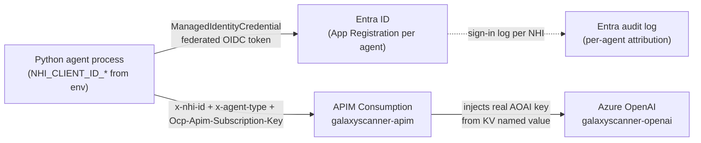

---

### 1.3 Governance middleware pipeline

Source: [`governance/middleware.py`](../governance/middleware.py)

`build_governance_stack()` returns `(middleware_list, pg_backend, audit_logger)`. The list is passed to MAF's `Agent(middleware=...)`.

**Execution order — guards 1–3 run before any toolkit middleware fires:**

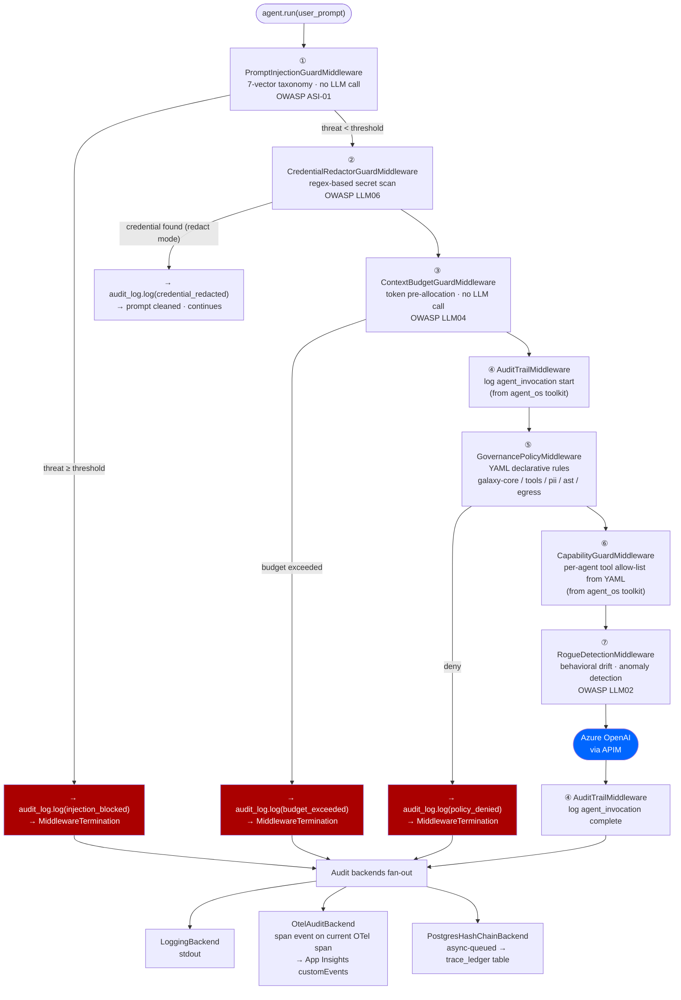

Guards 1–3 call `audit_log.log(...)` directly on block/redact, so all governance decisions are captured even when AuditTrailMiddleware (guard 4) never fires.

**Per-agent tuning** in `agents/config/<agent>.yaml`:

| Tunable | YAML key | Migration agents | Default |
|---|---|---|---|
| Token budget | `context_budget_tokens` | Analyzer 40k · Coder 64k · Tester 48k · Reviewer 64k · SecurityReviewer 48k | 8000 |
| Injection threshold | `prompt_injection_block_threshold` | `high` (all migration agents) | `medium` |
| Credential mode | `credential_mode` | `redact` (all agents) | `redact` |
| Tool allow-list | `allowed_tools` | Coder: [write_file, apply_patch, validate_bicep] · Tester: [run_tests] | none |

**YAML policy files** (loaded by `GovernancePolicyMiddleware`):

| File | Enforces |
|---|---|
| [`governance/policies/galaxy-core.yaml`](../governance/policies/galaxy-core.yaml) | Prompt-injection regex · oversized-prompt gate |
| [`governance/policies/galaxy-tools.yaml`](../governance/policies/galaxy-tools.yaml) | Per-agent tool allow-list |
| [`governance/policies/galaxy-pii.yaml`](../governance/policies/galaxy-pii.yaml) | PII rules placeholder (no-op until Presidio wired) |
| [`governance/policies/galaxy-ast.yaml`](../governance/policies/galaxy-ast.yaml) | AST-agent rules (deny outbound A2A from leaf) |
| [`governance/policies/galaxy-egress.yaml`](../governance/policies/galaxy-egress.yaml) | Outbound network egress rules |
| [`governance/configs/prompt-injection.yaml`](../governance/configs/prompt-injection.yaml) | Injection threat patterns + scoring thresholds |

---

### 1.4 A2A protocol

Source: [`a2a/envelope.py`](../a2a/envelope.py), [`a2a/dispatcher.py`](../a2a/dispatcher.py)

All inter-agent calls use typed `A2ARequest`/`A2AResponse` envelopes. No agent module imports another agent's class directly.

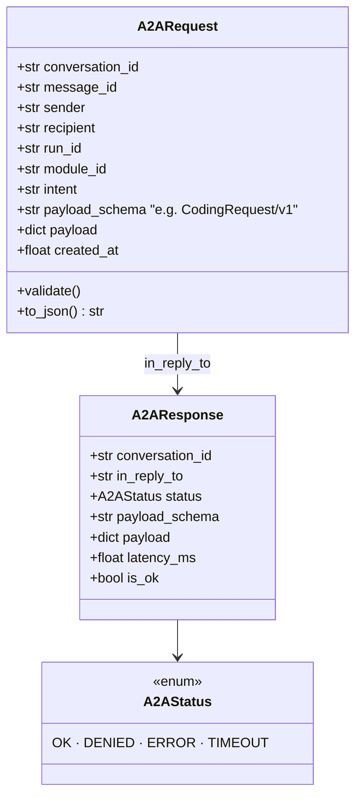

**Dispatch flow** (`a2a_call()` in [`a2a/dispatcher.py`](../a2a/dispatcher.py)):

1. `request.validate()` — schema + recipient allow-list check
2. `audit_log.log(a2a_dispatch)` — sender's audit trail records outbound
3. OTel child span `a2a.dispatch.<RecipientType>` started (attributes: envelope JSON truncated to 8 KB)
4. `await handler(request)` — recipient runs its own middleware stack inside
5. `audit_log.log(a2a_reply)` — status + latency recorded
6. Span closed with `a2a.status`, `a2a.latency_ms`

**Migration pipeline A2A schemas:**

| Phase | Request schema | Response schema |
|---|---|---|
| Analysis | `AnalysisRequest/v1` | `AnalysisReport/v1` |
| Code generation | `CodingRequest/v1` | `CodingReport/v1` |
| Test evaluation | `TestRequest/v1` | `TestReport/v1` |
| Code review | `ReviewRequest/v1` | `ReviewReport/v1` |
| Security review | `SecurityReviewRequest/v1` | `SecurityReviewReport/v1` |
| AST analysis | `ASTRequest/v1` | `ASTReport/v1` |

**Discovery pipeline A2A schemas:**

| Phase | Request schema | Response schema |
|---|---|---|
| Inventory scan | `DiscoveryScanRequest/v1` | `DiscoveryInventory/v1` |
| Dependency graph | `DiscoveryGraphRequest/v1` | `DiscoveryGraphResponse/v1` |
| BRD generation | `DiscoveryBRDRequest/v1` | `DiscoveryBRDResponse/v1` |
| Architecture design | `DiscoveryArchitectRequest/v1` | `DiscoveryArchitectResponse/v1` |
| Story generation | `DiscoveryStoriesRequest/v1` | `DiscoveryStoriesResponse/v1` |

---

### 1.5 OTel tracing → Application Insights

Source: [`core/run_tracer.py`](../core/run_tracer.py)

`configure_tracing()` is called once at process startup. Routing:
- `APPLICATIONINSIGHTS_CONNECTION_STRING` set → `AzureMonitorTraceExporter` (direct, no collector)
- `OTEL_EXPORTER_OTLP_ENDPOINT` set → gRPC OTLP exporter (collector sidecar / AKS)
- Neither → no-op (safe for unit tests)

**Root span:** `pipeline_span(run_id, module)` creates a single `pipeline.run` span. All MAF `AgentTelemetryLayer` child spans land under it — one `operation_Id` in App Insights covers the full agent chain.

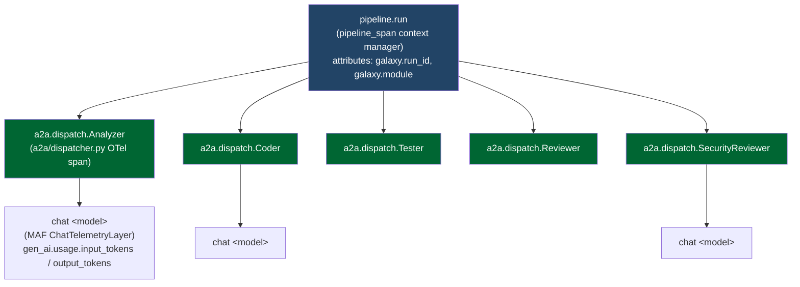

**Span attribute vocabulary** (queryable in App Insights `customDimensions`):

| Attribute key | Source | What it contains |
|---|---|---|
| `galaxy.run_id` | `pipeline_span()` root span | Pipeline run identifier |
| `galaxy.module` | `pipeline_span()` root span | Source module/repo name |
| `gen_ai.usage.input_tokens` | MAF `ChatTelemetryLayer` | Tokens consumed (input) |
| `gen_ai.usage.output_tokens` | MAF `ChatTelemetryLayer` | Tokens consumed (output) |
| `gen_ai.request.model` | MAF `ChatTelemetryLayer` | Model deployment name |
| `gen_ai.agent.name` | MAF `AgentTelemetryLayer` | Agent type |
| `a2a.sender` / `a2a.recipient` | `a2a/dispatcher.py` | Agent hop attribution |
| `a2a.intent` / `a2a.payload_schema` | `a2a/dispatcher.py` | A2A message metadata |
| `a2a.status` / `a2a.latency_ms` | `a2a/dispatcher.py` | Dispatch outcome |
| `governance.agent_id` | `OtelAuditBackend` → span event | NHI principal ID (e.g. `Coder-local-coder-nhi`) |
| `governance.event_type` | `OtelAuditBackend` → span event | e.g. `prompt_injection_blocked`, `credential_redacted` |
| `governance.decision` | `OtelAuditBackend` → span event | `allow` / `deny` / `audit` |
| `governance.reason` | `OtelAuditBackend` → span event | Human-readable guard reason |

**NHI attribution** (`governance.agent_id`) is on governance audit *span events*, not on span attributes. Query it from `customEvents` not `dependencies`:

```kql
-- All governance blocks in last 24h
customEvents
| where timestamp > ago(24h)
| where name == "governance.audit_entry"
| where customDimensions["governance.decision"] == "deny"
| project timestamp,
          customDimensions["governance.event_type"],
          customDimensions["governance.agent_id"],
          customDimensions["governance.reason"]
| order by timestamp desc
```

**Ingestion path:**

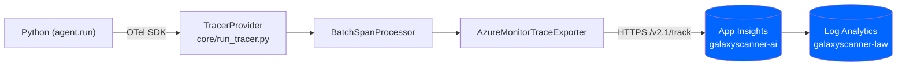

---

### 1.6 Hash-chained audit ledger

Source: [`core/trace_ledger.py`](../core/trace_ledger.py), [`governance/adapters/postgres_audit_backend.py`](../governance/adapters/postgres_audit_backend.py)

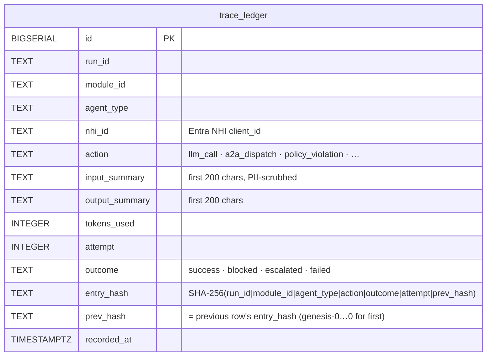

**Hash formula:** `entry_hash = SHA-256(run_id | module_id | agent_type | action | outcome | attempt | prev_hash)`

Each agent type has its own ledger chain keyed by `nhi_id`. Cross-agent correlation uses `run_id` + `conversation_id` — chains are never shared between agents.

**Current state:** `POSTGRES_DSN` unset → `PostgresHashChainBackend` operates in stdout mode (in-memory chain, logged to console). Chain logic is fully implemented; provisioning Postgres Flex Server activates it.

Schema: [`infra/ledger_schema.sql`](../infra/ledger_schema.sql)

---

### 1.7 Azure resource map

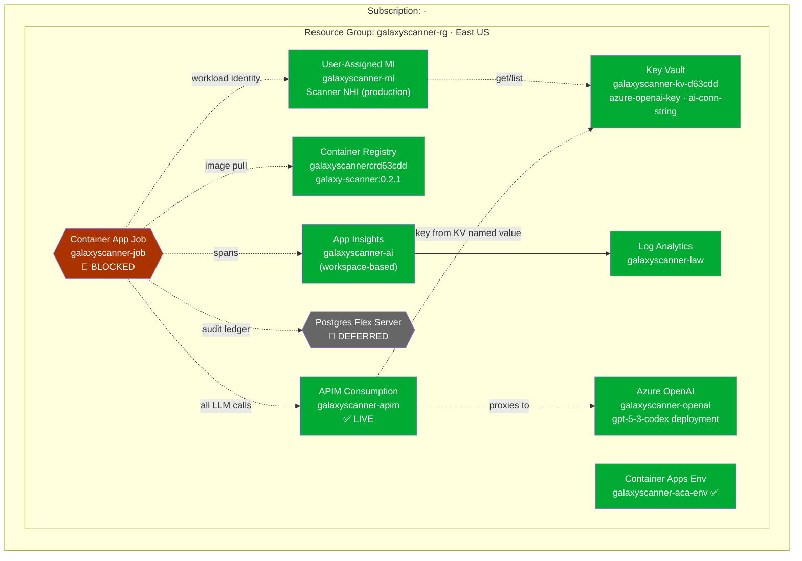

**APIM policy (live):**
- Validates `Ocp-Apim-Subscription-Key` (subscription-level auth)
- Rejects requests missing `x-agent-type` or `x-galaxy-run-id` (returns HTTP 400)
- Rate-limits at 100 RPM per subscription key
- Injects real AOAI key from Key Vault named value before forwarding
- Stub `validate-jwt` policy in place; JWT enforcement not yet activated
- Gateway: `https://galaxyscanner-apim.azure-api.net`; API path: `/openai`

Resource IDs and connection strings: [`docs/azure-resources.md`](azure-resources.md)

---

## Part 2 — Payload App

The payload app is the set of agents and orchestrators that run on top of the governance platform to deliver business value. It has two pipelines that share the same governance infrastructure.

---

### 2.1 Migration pipeline overview

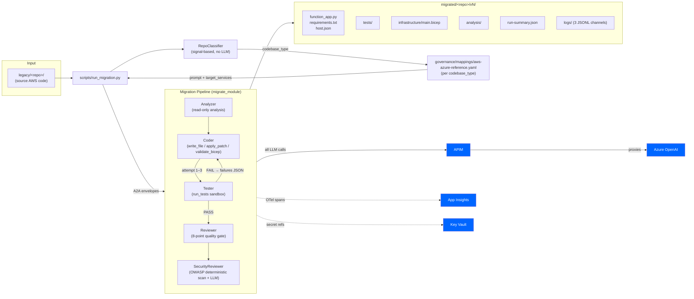

The **Scanner pipeline** (`scripts/run_scanner.py`) is a separate pre-migration discovery tool: Scanner walks the repo, then A2A-dispatches to ASTAnalyzer for tree-sitter extraction. Independent of the migration pipeline.

---

### 2.2 Code package map

#### Governance & core (Part 1 — shared by both pipelines)

| Module | Role | Key entry points |
|---|---|---|
| [`core/run_tracer.py`](../core/run_tracer.py) | OTel root span factory | `configure_tracing()`, `pipeline_span(run_id, module)` |
| [`core/token_provider.py`](../core/token_provider.py) | Key Vault / env-var credential provider (5-min TTL cache) | `TokenProvider.get_api_key()` |
| [`core/nhi_identity.py`](../core/nhi_identity.py) | NHI registry — 17 agent principals | `NHIRegistry.get(agent_type) → AgentIdentity` |
| [`core/trace_ledger.py`](../core/trace_ledger.py) | Hash-chained Postgres ledger | `TraceLedger.record()`, `verify_chain()` |
| [`core/discovery_artifacts.py`](../core/discovery_artifacts.py) | Pydantic models for discovery pipeline outputs | `Inventory`, `DependencyGraph`, `ModuleBRD`, `SystemBRD`, `Story`, `Backlog` |
| [`governance/middleware.py`](../governance/middleware.py) | Governance stack factory | `build_governance_stack(agent_id, run_id, ...)` |
| [`governance/adapters/otel_audit_backend.py`](../governance/adapters/otel_audit_backend.py) | OTel audit event emitter | `OtelAuditBackend.write()` |
| [`governance/adapters/postgres_audit_backend.py`](../governance/adapters/postgres_audit_backend.py) | Postgres hash-chain backend | `PostgresHashChainBackend.create()`, `verify_chain()` |
| [`a2a/envelope.py`](../a2a/envelope.py) | Typed A2A message envelopes | `A2ARequest.new()`, `A2AResponse.ok()` |
| [`a2a/dispatcher.py`](../a2a/dispatcher.py) | A2A dispatch with audit + OTel | `a2a_call(request, handler, sender_audit, allowed_recipients)` |

#### Agent factory

| Module | Role | Key entry points |
|---|---|---|
| [`agents/_base.py`](../agents/_base.py) | Universal MAF agent builder | `build_agent(config, tools, prompt_file_override) → AgentBundle` |
| [`agents/config.py`](../agents/config.py) | Pydantic v2 schema for agent YAML configs | `AgentConfigModel`, `load_agent_config_cached(name)` |

#### Migration pipeline agents

| Module | Role | A2A schemas |
|---|---|---|
| [`agents/scanner_agent.py`](../agents/scanner_agent.py) | Repo traversal + LLM analysis + A2A dispatch to ASTAnalyzer | (scanner pipeline only) |
| [`agents/ast_agent.py`](../agents/ast_agent.py) | tree-sitter AST extraction | `ASTRequest/v1` → `ASTReport/v1` |
| [`agents/analyzer_agent.py`](../agents/analyzer_agent.py) | Codebase-type-aware migration analysis | `AnalysisRequest/v1` → `AnalysisReport/v1` |
| [`agents/coder_agent.py`](../agents/coder_agent.py) | Stack-aware code generation; `write_file`, `apply_patch`, `validate_bicep` tools | `CodingRequest/v1` → `CodingReport/v1` |
| [`agents/tester_agent.py`](../agents/tester_agent.py) | Sandboxed pytest runner; 3-layer eval | `TestRequest/v1` → `TestReport/v1` |
| [`agents/reviewer_agent.py`](../agents/reviewer_agent.py) | 8-point quality gate review | `ReviewRequest/v1` → `ReviewReport/v1` |
| [`agents/security_reviewer_agent.py`](../agents/security_reviewer_agent.py) | OWASP deterministic scan + LLM deep analysis; BLOCKED aborts pipeline | `SecurityReviewRequest/v1` → `SecurityReviewReport/v1` |
| [`agents/lambda_analyzer_agent.py`](../agents/lambda_analyzer_agent.py) | Lambda-specific analyzer variant | `AnalysisRequest/v1` → `AnalysisReport/v1` |

#### Discovery pipeline agents

| Module | Role | A2A schemas |
|---|---|---|
| [`agents/discovery_scanner_agent.py`](../agents/discovery_scanner_agent.py) | File tree walk → LLM-interpreted module `Inventory` | `DiscoveryScanRequest/v1` → `DiscoveryInventory/v1` |
| [`agents/discovery_grapher_agent.py`](../agents/discovery_grapher_agent.py) | `Inventory` → `DependencyGraph` (edges: imports, reads, writes, invokes) | `DiscoveryGraphRequest/v1` → `DiscoveryGraphResponse/v1` |
| [`agents/discovery_brd_agent.py`](../agents/discovery_brd_agent.py) | Graph → `SystemBRD` + per-module `ModuleBRD` markdown | `DiscoveryBRDRequest/v1` → `DiscoveryBRDResponse/v1` |
| [`agents/discovery_architect_agent.py`](../agents/discovery_architect_agent.py) | BRD → target Azure architecture design per module | `DiscoveryArchitectRequest/v1` → `DiscoveryArchitectResponse/v1` |
| [`agents/discovery_stories_agent.py`](../agents/discovery_stories_agent.py) | Architecture → user stories + wave-scheduled `Backlog` | `DiscoveryStoriesRequest/v1` → `DiscoveryStoriesResponse/v1` |

#### Supporting libraries

| Module | Role |
|---|---|
| [`agents/_lib/repo_classifier.py`](../agents/_lib/repo_classifier.py) | Signal-based `codebase_type` detection — no LLM, < 100 ms |
| [`agents/_lib/run_logger.py`](../agents/_lib/run_logger.py) | Contextvar-based JSONL logger, 3 channels |
| [`agents/_lib/file_tools.py`](../agents/_lib/file_tools.py) | Closure-bound sandboxed `write_file`, `apply_patch` |
| [`agents/_lib/bicep_tool.py`](../agents/_lib/bicep_tool.py) | `validate_bicep` — calls `az bicep validate` |
| [`agents/_lib/test_runner.py`](../agents/_lib/test_runner.py) | Sandboxed pytest runner (cwd locked, env scrubbed, 120s timeout) |
| [`agents/_lib/security_scanner.py`](../agents/_lib/security_scanner.py) | Deterministic OWASP regex scanner — `scan_directory() → SecurityFinding[]` |
| [`agents/_lib/complexity_scorer.py`](../agents/_lib/complexity_scorer.py) | Heuristic migration difficulty scorer |
| [`agents/_lib/chunker.py`](../agents/_lib/chunker.py) | File chunker for large-source prompts |
| [`agents/_lib/wave_scheduler.py`](../agents/_lib/wave_scheduler.py) | Topological DAG scheduler for story wave ordering |

#### Orchestrator scripts

| Script | Purpose | Key CLI args |
|---|---|---|
| [`scripts/run_migration.py`](../scripts/run_migration.py) | Migration pipeline orchestrator | `--source-dir legacy/<repo>` `--run-id` `--codebase-type` (override) |
| [`scripts/run_scanner.py`](../scripts/run_scanner.py) | Scanner + ASTAnalyzer pipeline | `--repo` `--run-id` `--module-id` |

---

### 2.3 Migration pipeline sequence

Happy path of `python scripts/run_migration.py --source-dir legacy/aws_legacy`:

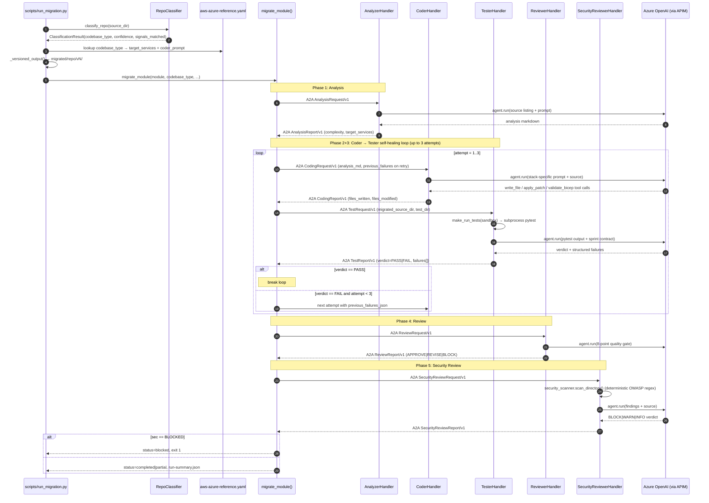

**SecurityReviewer two-phase design:** Phase 1 runs `scan_directory()` deterministically (OWASP regex → `SecurityFinding[]` graded BLOCK/WARN/INFO). Phase 2 sends findings to the LLM for deep analysis. The LLM **cannot downgrade a regex BLOCK to APPROVE** — the deterministic scan is authoritative. `credential_mode: redact` is intentional because SecurityReviewer legitimately analyzes legacy code containing hardcoded credentials.

---

### 2.4 codebase_type classification

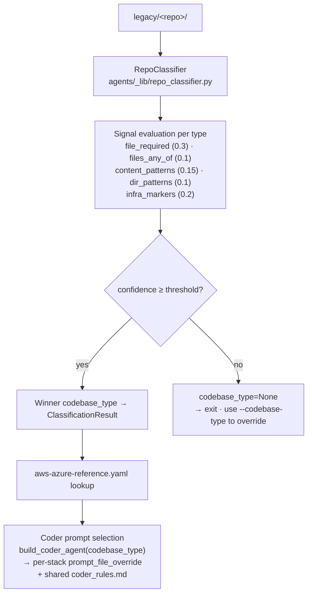

**Supported codebase types:**

| codebase_type | Detected by | Target stack |
|---|---|---|
| `python_serverless` | `lambda_handler`, boto3, `requirements.txt` | Azure Functions (Python) |
| `typescript_serverless` | `*.ts`, `tsconfig.json`, AWS SDK v3 | Azure Functions (TypeScript) |
| `node_serverless` | `*.js`, `package.json`, `handler.js` | Azure Functions (Node.js) |
| `java_serverless` | `Handler.java`, `pom.xml`, `aws-lambda-java-*` | Azure Functions (Java) |
| `java_spring_boot` | `@SpringBootApplication`, Spring `pom.xml` | Azure App Service (Spring) |
| `ecs_docker` | `task-definition.json`, `Dockerfile`, Fargate | Azure Container Apps |
| `dotnet_serverless` | `*.csproj`, `Function.cs`, `AWSLambda.*` | Azure Functions (.NET) |
| `php_web_app` | `*.php`, `composer.json`, Elastic Beanstalk | Azure App Service (PHP) |
| `frontend_spa` | `src/App.tsx`, `vite.config.js`, S3+CloudFront | Azure Static Web Apps |
| `iac_terraform` | `*.tf`, `provider "aws"`, modules | Bicep / Azure-native modules |

RepoClassifier runs in < 100 ms with no LLM call. Use `--codebase-type <type>` to override.

---

### 2.5 Discovery pipeline

The discovery pipeline precedes migration. It produces a structured understanding of the source estate — inventory, dependency graph, requirements, target architecture, and a wave-scheduled migration backlog.

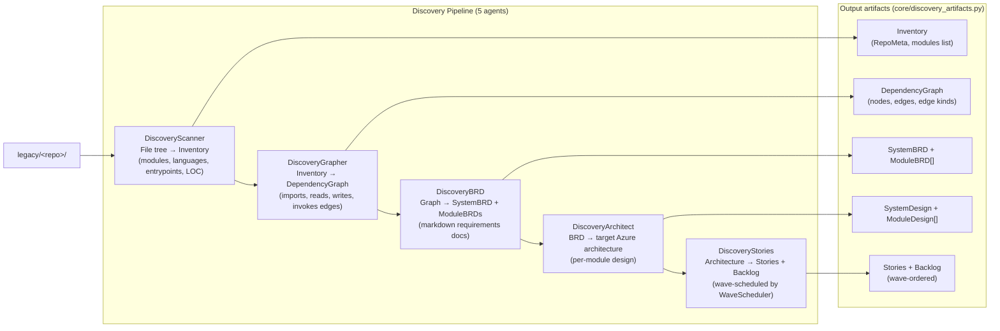

**Pydantic artifact models** (`core/discovery_artifacts.py`): `RepoMeta`, `Inventory`, `DependencyGraph`, `ModuleBRD`, `SystemBRD`, `Story`, `Epic`, `Backlog`, `BacklogItem`, `CriticReport`.

**Wave scheduler** (`agents/_lib/wave_scheduler.py`): topological sort of story `depends_on` / `blocks` relationships → assigns each story a `wave` number for sequential migration execution. Cycle detection included.

**Note:** An orchestrator script (`scripts/run_discovery.py`) does not yet exist. The agents are individually buildable and callable via `build_discovery_*_agent()`.

---

### 2.6 Structured logging (3 JSONL channels)

Source: [`agents/_lib/run_logger.py`](../agents/_lib/run_logger.py)

`RunLogger` is a contextvar-based, thread-safe JSONL writer. Initialised by the orchestrator, retrieved anywhere via `get_run_logger()`.

```
migrated/<repo>/vN/logs/<run_id>/
├── orchestration.jsonl   pipeline phase start/end events
├── agents.jsonl          per-LLM-call metrics (latency, tokens, cost_usd)
└── a2a.jsonl             A2A dispatch events (sender, recipient, intent, latency, status)
```

**Sample records:**

```json
// orchestration.jsonl
{"ts":"2026-05-15T10:12:01Z","event":"start","phase":"pipeline","module":"aws_legacy","codebase_type":"python_serverless"}
{"ts":"2026-05-15T10:12:25Z","event":"end",  "phase":"tester",  "module":"aws_legacy","attempt":1,"verdict":"PASS","failure_count":0}

// agents.jsonl
{"ts":"...","agent":"Coder","attempt":1,"latency_ms":8900,"tokens_in":22000,"tokens_out":4100,"cost_usd":0.096}

// a2a.jsonl
{"ts":"...","sender":"Orchestrator","recipient":"Tester","intent":"evaluate_module","latency_ms":6540,"status":"ok","payload_schema":"TestRequest/v1"}
```

Cost model: GPT-4o public list pricing (`$2.50/1M` input, `$10.00/1M` output). Token counts are authoritative; `cost_usd` is an estimate.

---

## Appendix A — Architectural rules

1. **Single LLM-egress per agent.** Every LLM call goes through `agent.run()` — middleware fires automatically. Never construct an `OpenAIChatClient` outside a MAF `Agent`.

2. **A2A is the only inter-agent path.** No agent module imports another agent's class. `a2a_call(...)` is the boundary; typed payload schemas (`*Request/v1`, `*Report/v1`) are the contract.

3. **Tunables in YAML, code in Python.** Timeouts, token budgets, max files, injection thresholds — all in `agents/config/<agent>.yaml`. Per-agent `allowed_tools` lives in YAML, not code.

4. **Sandbox at construction, not at call time.** `write_file`, `apply_patch`, and `run_tests` are closure-bound to `output_root` when the handler is built. The LLM cannot write outside `migrated/<repo>/vN/`.

5. **`codebase_type` drives everything downstream.** One string from `RepoClassifier` selects the YAML mapping, the Coder prompt variant, and the Bicep template pattern. Never hard-code a codebase type in orchestrator logic.

6. **Hash-chain integrity per agent.** Each NHI has its own ledger chain. Cross-agent correlation is by `run_id` + `conversation_id`. Do not share a `PostgresHashChainBackend` between agents.

7. **BLOCKED is terminal.** When `SecurityReviewer` returns `recommendation=BLOCKED`, the orchestrator must exit non-zero. No downstream agent is called.

8. **Versioned output is immutable.** Once `migrated/<repo>/vN/` is created, it is never overwritten. Each run increments N.

9. **Loud over silent.** Pydantic `extra="forbid"` on all config models; Postgres errors at ERROR not swallowed; missing required env vars fail at startup; classification failures print per-type scores.

10. **Use the framework.** No custom retry decorators, no custom span boilerplate, no custom OWASP regex when `security_scanner.py` already covers it.

---

## Appendix B — Status snapshot

| Area | Status | Where |
|---|---|---|
| Migration pipeline end-to-end | ✅ Working | `python scripts/run_migration.py --source-dir legacy/aws_legacy` |
| RepoClassifier (10 types) | ✅ Working | [`agents/_lib/repo_classifier.py`](../agents/_lib/repo_classifier.py) |
| Analyzer agent | ✅ Working | [`agents/analyzer_agent.py`](../agents/analyzer_agent.py) |
| Coder stack-aware prompt selection | ✅ Working | [`agents/coder_agent.py`](../agents/coder_agent.py) |
| Coder sandboxed tools (write_file, apply_patch, validate_bicep) | ✅ Working | [`agents/_lib/file_tools.py`](../agents/_lib/file_tools.py) |
| Tester sandboxed pytest runner | ✅ Working | [`agents/_lib/test_runner.py`](../agents/_lib/test_runner.py) |
| Coder → Tester self-healing retry loop | ✅ Working | [`scripts/run_migration.py`](../scripts/run_migration.py) |
| Reviewer 8-point quality gate | ✅ Working | [`agents/reviewer_agent.py`](../agents/reviewer_agent.py) |
| SecurityReviewer OWASP scan + LLM (two-phase) | ✅ Working | [`agents/security_reviewer_agent.py`](../agents/security_reviewer_agent.py) |
| BLOCKED verdict aborts pipeline | ✅ Working | [`scripts/run_migration.py:367-376`](../scripts/run_migration.py#L367-L376) |
| Scanner + ASTAnalyzer pipeline | ✅ Working | `python scripts/run_scanner.py` |
| Discovery pipeline agents (5 agents) | ✅ Working | `agents/discovery_*_agent.py` |
| Discovery orchestrator script | ⏸ Not yet created | `scripts/run_discovery.py` |
| Versioned output (migrated/v1…vN) | ✅ Working | auto-incremented per run |
| Structured JSONL logging (3 channels) | ✅ Working | [`agents/_lib/run_logger.py`](../agents/_lib/run_logger.py) |
| `build_agent()` factory | ✅ Working | [`agents/_base.py`](../agents/_base.py) |
| YAML policy enforcement (live deny verified) | ✅ Working | [`governance/middleware.py`](../governance/middleware.py) |
| OTel → Application Insights | ✅ Working | `AzureMonitorTraceExporter` direct export |
| Hash-chained audit logic | ✅ Working (stdout mode) | [`governance/adapters/postgres_audit_backend.py`](../governance/adapters/postgres_audit_backend.py) |
| APIM Consumption tier | ✅ Live | sub-key auth + galaxy-header guards + 100 RPM |
| NHI registry (17 agent types) | ✅ Working | [`core/nhi_identity.py`](../core/nhi_identity.py) |
| Postgres Flex Server + persistent ledger | 🔶 Deferred | unblocks persistent hash chain |
| ACA Job (private-registry creds) | 🔴 Blocked | Azure API InternalServerError |
| Cross-process A2A with workload-identity tokens | ⏸ Future | needed once A2A is networked |
| Per-agent rate limits at APIM | ⏸ Future | requires Consumption → Developer SKU upgrade |
| JWT enforcement at APIM gateway | ⏸ Future | stub policy exists; enforcement not activated |

---

*Update the status table when items unblock. Last updated: 2026-05-15.*
