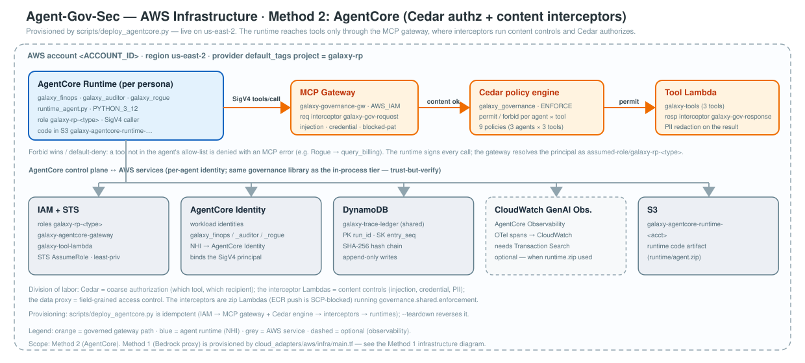
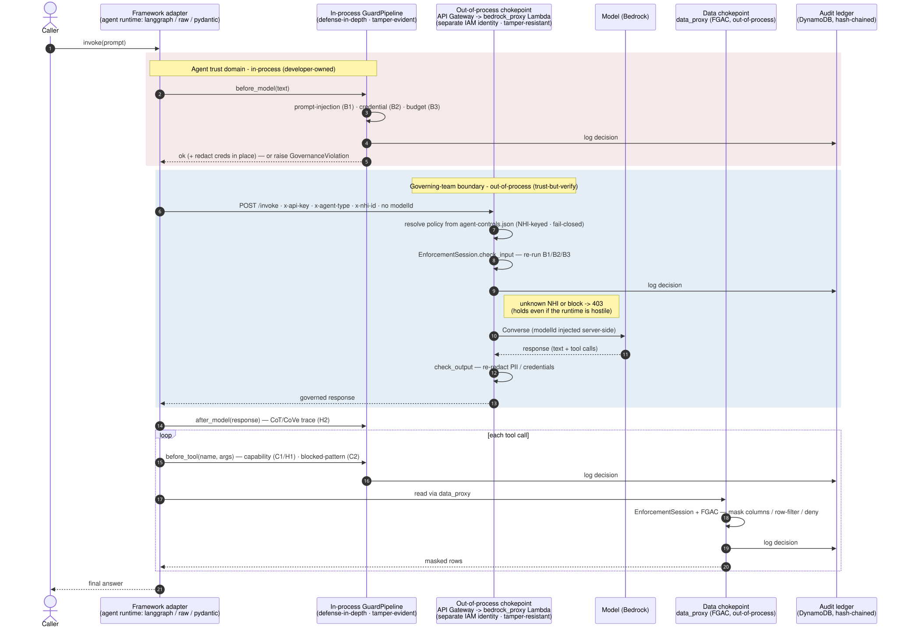
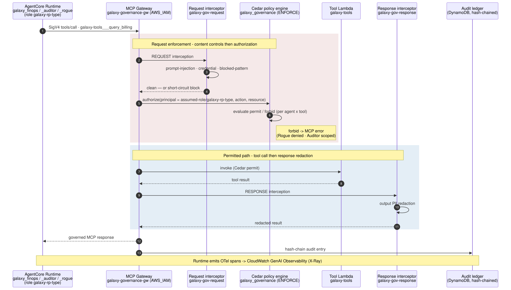

# Architecture — Galaxy Agentic Governance Platform on AWS

> AWS stack. Azure and GCP are separate doc stacks (`../azure/`, `../gcp/`), currently
> placeholders. Cloud-neutral platform reference is in `../shared/`.

This document is organized into eleven sections, each addressing a distinct aspect of the platform:

- Context
- Architecture principles
- The control catalogue
- The AWS reference-architecture mapping
- The logical architecture
- The components
- The run options
- The AWS deployment infrastructure
- The execution flows
- The demo results
- A glossary

---

## 1. Context

The Galaxy Agentic Governance Platform functions as a runtime governance and security
layer for multi-agent systems. The platform governs agents through a framework-neutral
`GuardPipeline`, reached by a per-framework adapter, and provides the following
capabilities:

- Per-agent identity
- A layered guard stack
- Agent-to-agent governance
- OTel tracing
- A hash-chained audit ledger

The platform is built on the Microsoft Agent Governance Toolkit (`agent_os`, `agent_sre`,
`agentmesh`). While the guard logic resides upstream, this repository supplies the
bindings and composition.

### 1.1 Why agentic security is a distinct problem

General security and AI/model security do not cover the agentic layer. The security
ecosystem comprises three concentric layers, each inheriting the one below and adding its
own threats and controls:


| Layer                   | Concerns                                                                                                                        |
| ----------------------- | ------------------------------------------------------------------------------------------------------------------------------- |
| General security        | Network · IAM · encryption · SIEM · DLP · patch management · zero trust                                                   |
| AI security             | Prompt security · model integrity · output filtering · training-data governance · bias · explainability                    |
| **Agentic AI security** | **Agent identity · tool/MCP control · memory security · inter-agent trust · behavioral monitoring · sandbox and rollback** |

The agentic layer presents greater difficulty because its properties multiply rather than
add. The following characteristics distinguish it:

- **Real actions.** Agents send email, write files, and call APIs. A hallucination becomes
  a wrong action, and every action is potentially irreversible.
- **Persistent memory.** Instructions injected now can remain dormant and activate later;
  there is no clean slate between sessions.
- **Dynamic agent graph.** Agents spawn agents at runtime, so the blast radius of one
  compromised node is unbounded by default.
- **Non-determinism.** The same input yields different outputs, so anomaly detection on a
  fixed baseline breaks down; intent analysis is required rather than pattern matching.
- **Language-based attacks.** A sentence in a document constitutes a sufficient attack
  vector, requiring no CVE and no exploit.
- **Runtime oversight is itself attackable.** The control plane can be saturated or
  trust-exploited, so the safety control can become the attack surface.

Galaxy targets the agentic-security layer specifically through the following mechanisms:

- Per-agent Non-Human Identity
- A guard stack at the model and tool boundaries
- FGAC at the data boundary
- A2A authorization between agents
- Behavioral-drift detection
- A tamper-evident audit ledger

### 1.2 Repo focus

This repository constitutes the governance platform. The agents under `payload_agents/`
serve as a minimal demonstration payload — three personas, sufficient to exercise the
stack end to end. The earlier multi-agent migration product has been archived and is not
part of this repository.

---

## 2. Architecture principles

1. **LLM-agnostic.** The model is reached only through a gateway. The platform pins and
   injects the model id server-side and does not bind to a specific model API in agent
   code.
2. **Agent-framework-agnostic.** The same governance wraps LangGraph, a raw provider
   loop, and Pydantic AI. The framework axis (`--framework`) is orthogonal to the rest of
   the platform, and selecting a framework does not change which controls run.
3. **Cloud-pluggable.** Every concrete dependency — secrets, identity, gateway, tracing,
   and audit — is reached through a Protocol in `core/interfaces.py`, resolved at runtime
   by `CLOUD_PROVIDER`. AWS is the documented binding, and this seam is what makes
   Azure and GCP possible.
4. **Composition, not reimplementation.** Guard detection logic comes from `agent_os` and
   `agent_sre`. This repository owns the seam, the bindings, the attribution, the A2A
   protocol, the ledger, and the gap modules, but not the detectors. The three-class
   delta below provides further detail.
5. **Authority separated from execution.** Guards run in-process for defense-in-depth,
   and the authoritative decision is re-made out-of-process at a chokepoint under a
   separate IAM identity. An agent that bypasses its in-process guards is still stopped.
6. **Fail-closed.** Unknown identities and missing policy resolve to denial: a 403 at the
   proxy and a Cedar forbid at the gateway.

### 2.1 What is built versus wired (the three-class delta)


The diagram distinguishes three classes:

- **Upstream (grey).** Every guard's detection and decision logic, supplied by `agent_os`
  and `agent_sre`.
- **Added capabilities (solid blue).** The Platform Core, comprising the Protocol seam,
  the NHI binding, the hash-chained ledger, the A2A protocol, and the single enforcement
  path. These are net-new constructs.
- **Wired and composed (light blue).** The Guard Library and Fleet Ops, which are upstream
  detectors that this repository wraps, configures, and composes, together with the FGAC
  enforcement (masking and Lake Formation pushdown). No detectors were reimplemented.

The full module-by-module (a)/(b)/(c) classification resides in
[`../shared/DELTA_OVER_AGENT_OS.md`](../shared/DELTA_OVER_AGENT_OS.md).

### 2.2 Status — live versus reference versus planned


| Element                                                          | Status.                                                                                                                                                                                                                                                                                                                                                                                                                                                                                                                                                                                                                                                                                                                                                                                                                                                                                                                                                                                                                                                                                                            |
| ---------------------------------------------------------------- | ------------------------------------------------------------------------------------------------------------------------------------------------------------------------------------------------------------------------------------------------------------------------------------------------------------------------------------------------------------------------------------------------------------------------------------------------------------------------------------------------------------------------------------------------------------------------------------------------------------------------------------------------------------------------------------------------------------------------------------------------------------------------------------------------------------------------------------------------------------------------------------------------------------------------------------------------------------------------------------------------------------------------------------------------------------------------------------------------------------------------------------------------------------------------------------------------------------------------------------------------------------------------------------------------------------------------------------------------------------------------------------------------------------------------------------------------------------------------------------------------------------------------------------------------------------------------------------------------------------------------------------------------------------------------ |
| AgentCore method (gateway, Cedar engine, interceptors, runtimes) | **Live** — account &lt;ACCOUNT_ID&gt;, us-east-2                                                                                                                                                                                                                                                                                                                                                                                                                                                                                                                                                                                                                                                                                                                                                                                                                                                                                                                                                                                                                                                                                                                                                                                                                                                                                                                                                                                                                                                                                                                                                                                                                              |
| In-process`GuardPipeline` + guard library + demo matrix          | **Live** — deterministic offline and live runs                                                                                                                                                                                                                                                                                                                                                                                                                                                                                                                                                                                                                                                                                                                                                                                                                                                                                                                                                                                                                                                                                                                                                                                                                                                                                                                                                                                                                                                                                                                                                                                                                          |
| Bedrock proxy method (Terraform`cloud_adapters/aws/infra/`)      | **Reference IaC** — applied per account                                                                                                                                                                                                                                                                                                                                                                                                                                                                                                                                                                                                                                                                                                                                                                                                                                                                                                                                                                                                                                                                                                                                                                                                                                                                                                                                                                                                                                                                                                                                                                                                                                 |
| Data-FGAC proxy (`data_proxy.py`)                                | **Built, not deployed**                                                                                                                                                                                                                                                                                                                                                                                                                                                                                                                                                                                                                                                                                                                                                                                                                                                                                                                                                                                                                                                                                                                                                                                                                                                                                                                                                                                                                                                                                                                                                                                                                                                  |
| Flag-gated controls (26)                                         | **Wired, off by default** (toggled per `GALAXY_GAP_*` / `GALAXY_OPS_*`)                                                                                                                                                                                                                                                                                                                                                                                                                                                                                                                                                                                                                                                                                                                                                                                                                                                                                                                                                                                                                                                                                                                                                                                                                                                                                                                                                                                                                                                                                                                                                                                                                                    |

---

## 3. Guardrails and controls

The platform ships **49 controls across 15 categories (A–O)** — 47 platform controls plus
2 AgentCore authorization controls. The platform controls run as **84 checks** (verified by
the offline demo); AgentCore adds **6 checks** when deployed, for **49 controls · 90 checks**
total — each on both a success and an intercept path. The catalogue and the standards crosswalk serve as the
authoritative references:

- [`../shared/extended-guardrails.md`](../shared/extended-guardrails.md)
- [`../shared/guardrails-inventory.md`](../shared/guardrails-inventory.md)
- [`../shared/standards-crosswalk.md`](../shared/standards-crosswalk.md)

### 3.1 Controls by phase


| Phase         | Hook / locus   | Controls                                                                                                            |
| ------------- | -------------- | ------------------------------------------------------------------------------------------------------------------- |
| Pre-LLM       | `before_model` | prompt-injection · credential redactor · context budget                                                           |
| Model output  | `after_model`  | reasoning trace (CoT/CoVe) + mandatory redaction · output-PII · content-quality                                   |
| Tool dispatch | `before_tool`  | capability allow-list · blocked-pattern · secure-codegen/exec · diff-policy · reversibility · constraint-graph |
| Data access   | data mediator  | FGAC — mask · row-filter · Lake Formation pushdown · deny                                                       |
| MCP channel   | tool transport | gateway · rate-limit · session · message-signing · tool-screen · response-scan                                 |
| Inter-agent   | A2A dispatcher | recipient allow-list · audited dispatch                                                                            |
| Egress / cost | gateway        | egress allow-list · circuit-breaker · cost-guard                                                                  |
| Audit         | ledger backend | hash-chained SHA-256 chain (+ tamper demo)                                                                          |
| Fleet ops     | out-of-band    | SLO · accuracy · eval-judge · golden-replay · SBOM · artifact-signing · certification · red-team             |

### 3.2 Control catalogue

Controls are grouped into feature **categories** with a single-letter prefix, and the
number restarts at 1 within each category (no cross-group gaps). The **Default** column
marks whether a control runs on every call (**On**) or is wired but off until its flag is
set (**Flag**, toggled by a `GALAXY_GAP_*` / `GALAXY_OPS_*` env var). The totals comprise
**47 platform controls (21 On · 26 Flag) across 14 categories · 84 checks**, plus **2
AgentCore authorization controls** (category O · 6 checks) when AgentCore is deployed —
**49 controls · 90 checks** total, each exercised on a success and an intercept path. Items marked *(ours)* are
net-new constructs (see §2.1); all others wrap the named upstream primitive.

| Code | Control | Default | Upstream primitive |
|---|---|---|---|
| **A — Identity & egress** | | | |
| A1 | NHI identity (per-agent IAM principal) | On | `core/nhi_registry` *(ours)* |
| A2 | LLM-egress chokepoint | On | cloud-adapter gateway *(ours)* |
| A3 | Egress policy / allow-list | On | `agent_os.egress_policy.EgressPolicy` |
| **B — Input guards (pre-LLM)** | | | |
| B1 | Prompt-injection | On | `agent_os.prompt_injection.PromptInjectionDetector` |
| B2 | Credential redactor | On | `agent_os.credential_redactor.CredentialRedactor` |
| B3 | Context-budget | On | `agent_os.context_budget.ContextScheduler` |
| B4 | Semantic policy | Flag | `agent_os.semantic_policy.SemanticPolicyEngine` |
| **C — Tool & code safety** | | | |
| C1 | Capability allow-list | On | `reasoning_guard` *(ours)* + allow-list |
| C2 | Blocked-pattern scan | On | pipeline tool-arg policy *(ours)* |
| C3 | Secure codegen | Flag | `agent_os.secure_codegen.CodeSecurityValidator` |
| C4 | Secure exec (sandbox) | Flag | `agent_os.sandbox.ExecutionSandbox` |
| C5 | Diff policy | Flag | `agent_os.diff_policy.DiffPolicy` |
| C6 | Reversibility | Flag | `agent_os.reversibility.ReversibilityChecker` |
| C7 | Constraint graph | Flag | `agent_os.constraint_graph.ConstraintGraph` |
| **D — Data access (FGAC)** | | | |
| D1 | ABAC allow | On | `agent_os.DataAccessEvaluator` |
| D2 | Classification masking | On | masking *(ours)* |
| D3 | Enforcement mask override | On | *(ours)* |
| D4 | Row-level filter | On | *(ours)* |
| D5 | Store-side pushdown | On | Lake Formation / Athena *(ours)* |
| D6 | Deny-all (no policy) | On | *(ours)* |
| **E — MCP security** | | | |
| E1 | MCP tool gateway | Flag | `agent_os.mcp_gateway.MCPGateway` |
| E2 | MCP rate limit | Flag | `agent_os.mcp_sliding_rate_limiter` |
| E3 | MCP session auth | Flag | `agent_os.mcp_session_auth` |
| E4 | MCP message signing | Flag | `agent_os.mcp_message_signer` |
| E5 | MCP tool-definition screen | Flag | `agent_os.mcp_security.MCPSecurityScanner` |
| E6 | MCP response scan | Flag | `agent_os.mcp_response_scanner` |
| **F — Output safety** | | | |
| F1 | Output PII redaction | Flag | `agent_os.credential_redactor` (PII) |
| F2 | Content quality | Flag | `agent_os.content_governance.ContentQualityEvaluator` |
| **G — Memory** | | | |
| G1 | Memory-write guard | Flag | `agent_os.memory_guard.MemoryGuard` |
| **H — Reasoning** | | | |
| H1 | Reasoning-step validator | On | `reasoning_guard` *(ours)* |
| H2 | CoT/CoVe trace + redaction | On | `reasoning_trace.py` *(ours)*; redaction via `agent_os.credential_redactor` |
| **I — Inter-agent (A2A)** | | | |
| I1 | Recipient allow-list | On | `core/a2a/dispatcher` *(ours)* |
| I2 | Audited dispatch | On | `agent_os` `GovernanceAuditLogger` |
| **J — Resilience & cost** | | | |
| J1 | Circuit breaker | Flag | `agent_os.circuit_breaker` / `agent_sre.cascade` |
| J2 | Cost guard | Flag | `agent_sre.cost.CostGuard` |
| **K — Behavioral monitoring** | | | |
| K1 | Data-access drift | On | `agent_sre.anomaly` |
| **L — Human oversight** | | | |
| L1 | HITL escalation | On | `agent_os.escalation.EscalationManager` |
| L2 | Transparency / disclosure | Flag | `agent_os.transparency.TransparencyInterceptor` |
| **M — Audit** | | | |
| M1 | Hash-chained ledger | On | `core/trace_ledger` *(ours)* + cloud audit backend |
| **N — Fleet ops** (`agent_sre`) | | | |
| N1 | SLO + error-budget | Flag | `agent_sre.slo` |
| N2 | Accuracy declaration | Flag | `agent_sre.accuracy_declaration` |
| N3 | Eval suite | Flag | `agent_sre.evals` |
| N4 | Golden-trace replay | Flag | `agent_sre.replay` |
| N5 | SBOM | Flag | `agent_sre.sbom` |
| N6 | Artifact signing | Flag | `agent_sre.signing` |
| N7 | Certification gate | Flag | `agent_sre.certification` |
| N8 | Adversarial red-team | Flag | `agent_os.adversarial` / `agent_sre.chaos` |
| **O — AgentCore authorization** (active when deployed) | | | |
| O1 | Cedar per-agent tool authz | On† | AgentCore policy engine (Cedar) |
| O2 | Cedar tool-list filtering | On† | AgentCore policy engine (Cedar) |

† O1/O2 run when the AgentCore method is deployed (us-east-2).

### 3.4 Standards alignment

The controls map to the regulatory and industry frameworks that apply to AI agents,
specifically the OWASP Agentic Top 10, NIST AI RMF 1.0, ISO/IEC 42001, the EU AI Act, and
MITRE ATLAS. The control → standard crosswalk is maintained in
[`../shared/standards-crosswalk.md`](../shared/standards-crosswalk.md). The platform
provides the artifacts those frameworks require of AI agents:

- Classification before deploy
- Human oversight (HITL escalation)
- Audit trails (the hash-chained ledger)
- Continuous control verification (the demo matrix)

---

## 4. Reference-architecture mapping (AWS)

The following resource presents the Virtusa agentic reference architecture, mapped to AWS
services and overlaid with the positions of Galaxy and its upstream toolkit:

**[reference-architecture-aws.html](reference-architecture-aws.html)** — open in a browser
(self-contained; importable as a slide image).

Galaxy does not re-implement the whole reference architecture. It owns the security and
governance spine, comprising the following elements:

- The **Security & Control Plane** (Layer 03)
- The **Governance** band
- The enforcement chokepoints in Layer 04
- The audit and telemetry slices of **Observe**

Layers 01, 02, and 05 are largely AWS-native (Bedrock, AgentCore runtime/memory/harness,
VPC, ECS/Fargate, and KMS); Galaxy supplies the governed personas, the policy registry,
and the bindings on top. The AgentCore policy engine (Cedar) functions as the AWS-native
authorization engine, and Cedar is also the basis of AWS Verified Permissions. `agent_os`
supplies the content-control detectors, and Galaxy composes them and wires the AWS
enforcement paths. The diagram's legend marks what is live (AgentCore on us-east-2), what
is reference IaC (the Bedrock proxy), and what is AWS-native and outside Galaxy's current
scope.

---

## 5. Logical architecture


The diagram is read top to bottom, following the sequence demonstration payload →
framework adapter → shared `GuardPipeline` → agnostic core → AWS adapter → AWS services.
The structural rule is that dependencies point downward only. The core never reaches up
into a framework or the AWS SDK; everything concrete is reached through a Protocol resolved
at runtime. The framework axis and the cloud axis are orthogonal, and both resolve to the
same `GuardPipeline`.

The cloud-neutral layered view and its design rationale reside in
[`../shared/architecture.md`](../shared/architecture.md).

---

## 6. Components

### 6.1 Actors and ownership model

Two human actors own different parts of the system. The split is enforced by CODEOWNERS
and a non-overridable runtime floor, as described in
[`../shared/governance-authority.md`](../shared/governance-authority.md).


| Actor                          | Owns                                                                                                            | Cannot                                                                                              |
| ------------------------------ | --------------------------------------------------------------------------------------------------------------- | --------------------------------------------------------------------------------------------------- |
| **Agent developer**            | The agent's tools, prompts, and framework wiring under`payload_agents/`. Requests capabilities and data scopes. | Weaken a control. The floor (`galaxy_gov/inprocess/floor.py`) clamps config stricter, never looser. |
| **Enterprise governance team** | The policy registry, the guard configuration, the floor, the out-of-process chokepoints.                        | — Owns the controls end to end (CODEOWNERS-gated).                                                 |

The agent *personas* used in the demo (FinOps, Auditor, Rogue) represent a separate
concept; they are governed workloads, covered in §10.

### 6.2 In-process components (developer trust domain)

The developer trust domain comprises the following components:

- **`GuardPipeline`** (`galaxy_gov/shared/enforcement/pipeline.py`) — provides the four
  hooks (`before_model`, `after_model`, `before_tool`, `after_tool`) and the guard
  library.
- **The floor** (`galaxy_gov/inprocess/floor.py`) — implements always-on controls that
  cannot be disabled by agent config.
- **Core seam** (`core/interfaces.py`, `provider_factory.py`, `nhi_registry.py`,
  `run_tracer.py`, `trace_ledger.py`) — comprises the Protocols, provider selection, NHI
  binding, tracing, and the hash-chain schema.
- **A2A** (`core/a2a/envelope.py`, `core/a2a/dispatcher.py`) — provides typed envelopes and audited
  dispatch with a recipient allow-list.

In-process guards are fast and inexpensive and catch most violations early, but they run
in the agent's own trust domain. They therefore constitute defense-in-depth rather than
the final authority.

### 6.3 Out-of-process components (governing-team boundary)

The governing-team boundary comprises the following components:

- **Bedrock proxy** (`cloud_adapters/aws/infra/lambda/bedrock_proxy.py`) — re-runs the
  `EnforcementSession` at the API Gateway boundary under a separate IAM identity.
- **Data proxy** (`cloud_adapters/aws/infra/lambda/data_proxy.py`) — enforces FGAC under
  its own role; agents never hold direct store access.
- **AgentCore gateway + interceptors + Cedar engine** — provides the Method 2 boundary,
  with content controls in the interceptor Lambdas and authorization in the Cedar policy
  engine.
- **`EnforcementSession`** (`galaxy_gov/remote/enforce.py`) — the single enforcement code
  path. The same object runs in-process and at the boundary, so the two cannot drift.

---

## 7. Deployment / run options

The platform runs on AWS in two ways. Both methods consume the same policy registry
(`galaxy_gov/policy_export.py`) and run the full matrix.


|                  | **Method 1 — Bedrock proxy**                                                             | **Method 2 — AgentCore**                                                       |
| ---------------- | ----------------------------------------------------------------------------------------- | ------------------------------------------------------------------------------- |
| Path             | API Gateway`galaxy-rp-bedrock-gw` → Lambda `galaxy-rp-bedrock-proxy` → Bedrock Converse | Per-persona AgentCore Runtime → MCP Gateway`galaxy-governance-gw`              |
| Authorization    | policy registry →`enforce.session_for()` (fail-closed 403)                               | Cedar policy engine`galaxy_governance` (ENFORCE; permit/forbid per agent×tool) |
| Content controls | `bedrock_proxy.handler` — input guards, tool-plan, output redaction                      | interceptor Lambdas`galaxy-gov-request` / `galaxy-gov-response`                 |
| Identity         | `AwsIdentityProvider` → STS assume `galaxy-rp-<type>`                                    | runtime execution role`galaxy-rp-<type>`                                        |
| Provisioning     | Terraform`cloud_adapters/aws/infra/` (reference)                                          | `scripts/deploy_agentcore.py` (live, us-east-2)                                 |
| Status           | reference IaC                                                                             | live                                                                            |

Neither option allows the agent to hold Bedrock credentials; the model id is injected
server-side. The division of labor and the rationale reside in
[`agentcore-comparison.md`](agentcore-comparison.md).

---

## 8. AWS deployment infrastructure

This section covers both deployment options and the AWS services they share.



The slide-ready layered topology resides in
**[deployment-topology.html](deployment-topology.html)**.

### 8.1 Method 1 — Bedrock proxy (Terraform `cloud_adapters/aws/infra/`)


This method comprises the following resources:

- Per-agent IAM roles `galaxy-rp-{finops,auditor,rogue}` (least-privilege inline policies)
- REST API `galaxy-rp-bedrock-gw` (`POST /invoke`, `x-api-key`, usage plan 20 req/s)
- Lambda `galaxy-rp-bedrock-proxy` (container image, handler `bedrock_proxy.handler`, model
  `us.anthropic.claude-sonnet-4-6` injected server-side)
- DynamoDB `galaxy-trace-ledger` (partition `run_id`, sort `entry_seq`)
- Secrets Manager `galaxy/bedrock-gateway-key`
- S3 run bucket
- ECR `galaxy-rp-gov-proxy`

### 8.2 Method 2 — AgentCore (`scripts/deploy_agentcore.py`, live us-east-2)



This method comprises the following resources:

- MCP Gateway `galaxy-governance-gw` (AWS_IAM)
- Cedar policy engine `galaxy_governance` (ENFORCE, 3 agents × 3 tools = 9 policies; tools
  `query_billing`, `summarize_costs`, `query_dataset`)
- Interceptor zip Lambdas `galaxy-gov-request` / `galaxy-gov-response` (ECR is SCP-blocked,
  so zip is used)
- Per-persona runtimes `galaxy_finops` / `galaxy_auditor` / `galaxy_rogue` (PYTHON_3_12,
  `runtime_agent.py`)
- Supporting roles `galaxy-agentcore-gateway`, `galaxy-tool-lambda`
- Stub tool Lambda `galaxy-tools`

Provisioning is idempotent, and `--teardown` reverses it.

Resource inventory and env vars: [`services-and-tech.md`](services-and-tech.md).

---

## 9. Execution flows

**Guard hooks and order.** The platform applies a fixed `before_model` → `after_model` →
`before_tool` → `after_tool` sequence around the model and tool calls, with `after_tool`
running the data-access drift check:


**Method 1 — trust-but-verify.** The same `EnforcementSession` runs in-process (pink) and
again at the Lambda boundary (blue), and the boundary run is authoritative:



**Method 2 — AgentCore enforcement.** The flow proceeds runtime → SigV4 `tools/call` →
request interceptor (content controls) → Cedar (permit/forbid) → tool Lambda → response
interceptor (redaction):



---

## 10. Demo and verification

`scripts/demo_agents.py` runs the full matrix over the three personas on both AWS options
and all three frameworks. The personas are as follows:

- **FinOps** — scoped reader; exercises the success path and masking.
- **Auditor** — privileged cross-dataset access; acts as the A2A callee.
- **Rogue** — untrusted; trips every guard on the denial path.

```bash
.venv/bin/python scripts/demo_agents.py --aws --extended        # Method 1, live Bedrock
.venv/bin/python scripts/demo_agents.py --agentcore --extended  # Method 2, AgentCore runtimes
.venv/bin/python scripts/demo_agents.py --fake --extended       # deterministic, offline (CI)
.venv/bin/python scripts/demo_agents.py --aws --extended --html report.html
```

The run produces three verdicts:

- `PASS` — the control fired as expected.
- `N/A` — a model-discretion scenario the agent did not enter; this is not a failure.
- `FAIL` — a control misbehaved, producing a non-zero exit.

The AgentCore Cedar decisions appear as rows **O1** (tools/call allow-vs-deny — FinOps
allowed, Auditor/Rogue denied) and **O2** (tools/list filtering).

The committed live AWS run is presented as a self-contained, self-describing table:
**[guardrail-report.html](guardrail-report.html)** (every row carries control · input ·
output · verdict). The observability walkthrough resides in
[`observability-governance-showcase.md`](observability-governance-showcase.md).

---

## 11. Glossary


| Term                                 | Meaning                                                                                                                                                                       |
| ------------------------------------ | ----------------------------------------------------------------------------------------------------------------------------------------------------------------------------- |
| **A2A**                              | Agent-to-agent. Typed request/response envelopes with a recipient allow-list and audited dispatch (`core/a2a/`).                                                                   |
| **ABAC**                             | Attribute-based access control. Clearance + attribute rules that drive FGAC decisions.                                                                                        |
| **ADOT**                             | AWS Distro for OpenTelemetry. The collector that forwards OTel spans to X-Ray / CloudWatch.                                                                                   |
| **AgentCore**                        | Amazon Bedrock AgentCore. Hosts the per-persona runtimes, MCP gateway, Cedar policy engine, and interceptors (Method 2).                                                      |
| **Cedar**                            | The policy language the AgentCore policy engine enforces (also the basis of AWS Verified Permissions). Expresses coarse authorization — one permit/forbid per agent × tool. |
| **EnforcementSession**               | The single enforcement code path (`galaxy_gov/remote/enforce.py`) run both in-process and at the chokepoint.                                                                  |
| **FGAC**                             | Field-grained access control. Column masking, row filtering, Lake Formation pushdown, and deny at the data boundary.                                                          |
| **GuardPipeline**                    | The framework-neutral guard orchestration (`galaxy_gov/shared/enforcement/pipeline.py`); four hooks around model and tool calls.                                              |
| **Floor**                            | The non-overridable governance baseline (`galaxy_gov/inprocess/floor.py`); clamps config stricter, never looser.                                                              |
| **Hash-chained ledger**              | Tamper-evident SHA-256 audit chain; each entry hashes the previous. Persisted to DynamoDB`galaxy-trace-ledger`.                                                               |
| **Interceptor**                      | An AgentCore gateway Lambda that runs content controls on the request (`galaxy-gov-request`) or response (`galaxy-gov-response`).                                             |
| **MCP**                              | Model Context Protocol. The tool transport AgentCore's gateway speaks; Galaxy adds gateway/session/signing/screen/response controls.                                          |
| **NHI**                              | Non-Human Identity. A per-agent identity bound to an AWS IAM role (`galaxy-rp-<type>`), resolved from the NHI registry.                                                       |
| **Policy registry**                  | The exported per-agent`ControlPolicy` (`galaxy_gov/policy_export.py`); the single source of truth both methods consume.                                                       |
| **agent_os / agent_sre / agentmesh** | The Microsoft Agent Governance Toolkit — the upstream guard logic Galaxy composes.                                                                                           |

---

> Companion docs: [`README.md`](README.md) (this stack), [`deck.md`](deck.md) /
> [`narrative.md`](narrative.md) (presentation), [`agentcore-comparison.md`](agentcore-comparison.md)
> (AgentCore-native vs platform enforcement), [`user-guide.md`](user-guide.md) (how-to),
> and `../shared/` (cloud-neutral platform reference).
