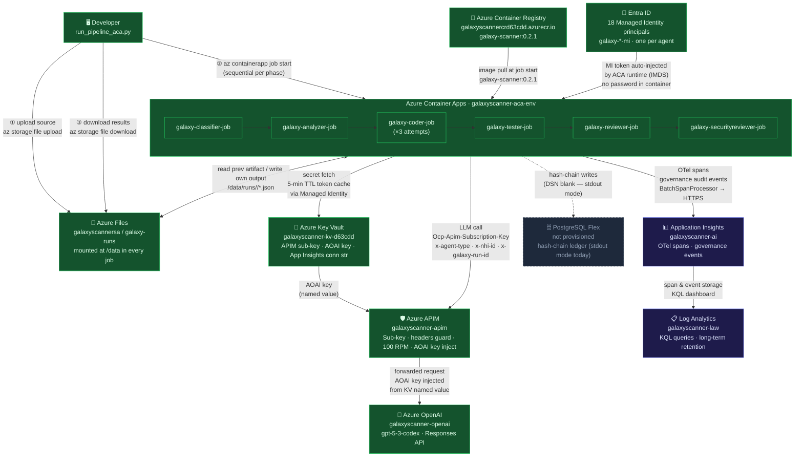

# Galaxy SDLC — Infrastructure Connections

How every Azure component connects to every other. Verified against the live resource group `galaxyscanner-rg`.

---

## Full connection map



---

## What each connection carries

| From | To | What travels |
|---|---|---|
| Developer | Azure Files | Source repo files (uploaded before pipeline starts) |
| Developer | ACA Jobs | `az containerapp job start` CLI trigger with `RUN_ID`, `MODULE_ID` env vars |
| Azure Files | Developer | Completed artifacts downloaded after SecurityReviewer finishes |
| ACR | ACA Jobs | Container image (`galaxy-scanner:0.2.1`) pulled at job start |
| Entra ID | ACA Jobs | Managed Identity OIDC token, injected by ACA runtime via IMDS — no password ever stored |
| ACA Jobs | Azure Files | Each job reads the previous job's JSON artifact, writes its own output to `/data/runs/<run_id>/` |
| ACA Jobs | APIM | Every LLM call — carries `Ocp-Apim-Subscription-Key`, `x-agent-type`, `x-nhi-id`, `x-galaxy-run-id` headers |
| Key Vault | APIM | AOAI API key injected as a named value — key never leaves Azure control plane |
| ACA Jobs | Key Vault | Secret fetches (App Insights conn str, APIM sub-key) via Managed Identity — 5-min TTL cache |
| APIM | Azure OpenAI | Forwarded Responses API request with AOAI key injected |
| ACA Jobs | App Insights | OTel spans (`pipeline.run`, `a2a.dispatch.*`) + governance audit events — direct HTTPS, bypasses APIM |
| App Insights | Log Analytics | Span and event storage — queryable via KQL |
| ACA Jobs | PostgreSQL | Hash-chain audit writes — **inactive today** (DSN blank, falls through to stdout) |

---

## What APIM does and does NOT see

```
LLM traffic:   ACA Jobs → APIM → Azure OpenAI   ✅ APIM sees every token
OTel traffic:  ACA Jobs → App Insights (direct HTTPS)   ✅ bypasses APIM — this is intentional
Secret fetches: ACA Jobs → Key Vault (direct, via MI)   ✅ bypasses APIM — also intentional
```

APIM is the **sole LLM egress path** — no agent has a direct Azure OpenAI endpoint or key.
Everything else (telemetry, secrets) goes direct to avoid latency and unnecessary gateway coupling.

---

*Last verified: 2026-05-22 against live `galaxyscanner-rg` resources*
```
